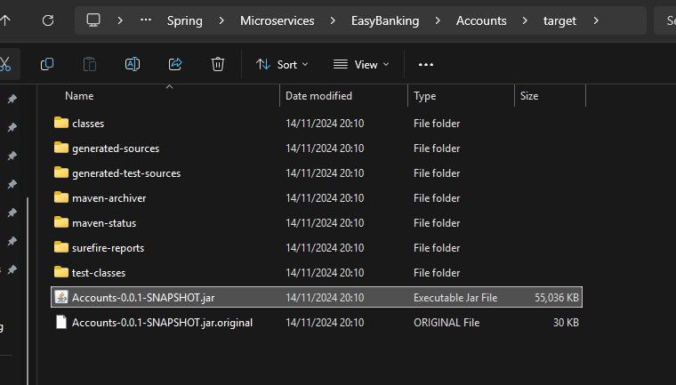

```text
mvn clean install
```
- This command will tell to my maven to compile my spring boot application base on pom.xml.
- This command will also do a small basic unit testing, and if the unit testing is successful, it is going to generate a jar.
*NOTE*: Make sure you already have installed maven on your machine.
, This file name is based on pom.xml file.


All the dependencies related to accounts microservice is going to be available inside this jar except Java runtime (include embedded server from `spring-boot-starter-web`) 


**RUN A JAR WITH THE HELP OF MAVEN**
`mvn spring-boot:run` on command line will start the application.
Because I have a plugin with the name `spring-boot-maven-plugin` in pom.xml, this plugin is looking for a jar inside my target folder and using the same jar.
It is going to start my web application


**RUN A JAR WITH THE HELP OF JAVA**
`java -jar target/accounts-0.0.1-SNAPSHOT.jar`


**BUILD A DOCKER IMAGE**
```text
docker build . -t baotuyloan1/accounts:241114
```


**RUN ACCOUNTS MIRCOSERVICES AS A DOCKER CONTAINER**
- By default, all docker containers are going start inside their own isolated network and we can't access the services inside your Docker network because it is deployed inside its own private network.
- So that's why not to get them access from the external network, like from your local system or from any other system, you need to expose them explicitly with the help of this port mapping.
```text
docker run -d -p 8080:8080 baotuyloan1/accounts:241114 
```
- (first 8080): is my local port and (second 8080): is the port inside my container
- I'm telling to my DOcker server is my Docker container is going to start at a port 8080. First port, docker exposes the container to the outside of Docker network at the port (8080). So anyone who wants to communicate with this container from outside the Docker network, they have to use a port which is 8080.


```text
docker ps
```
- This command will show you all the running containers in your Docker network
```text
docker ps -a 
```
- This command will show you all the containers (including the stopped containers) in your Docker network

```text
docker start <container_id>
```
- This command will start a stopped container
```text
docker stop <container_id>
```
- This command will stop a running container

**PORT MAPPING IN DOCKER**
By default, containers are connected to an isolated network within the Docker host. TO access a container from your local network,
you need to configure port mapping explicitly. For instance, when running the accounts Service application, we can provide the port mapping as an argument in the docker run command:
`-p 8081:8080` (where the first value represents the external port and the second value represents the container port).
Below diagram demonstrates the functionality of this configuration


**RUNNING A SPRING BOOT APP AS A CONTAINER USING DOCKERFILE**
Steps to be followed:
1. Run the maven command, "mvn clean install" from the location where pom.xml is present to generate the jar file inside target folder.
2. Write instructions to Docker inside a file with the name Dockerfile to generate a Docker image. Sample instructions are mentioned below.

3. Execute the docker command "docker build . -t baotuyloan1/accounts:241114"from the location where Dockerfile is present. This will generate the docker image based on the tag name provided.
4. Execute the docker command "docker run -p 8080:8080 baotuyloan1/accounts:241114" to start the container. This will start the docker container based on the docker image name and port mapping provided

**DISADVANTAGE OF Docker file**
- the very first disadvantage is in order to write a Docker file, you need to be an expert of Docker concepts. Right now we have very basic Docker file where I have given very basic Docker instructions.
- But in real projects, if your application is large, this simple Docker file may not work for you. So to convert your microservices a Docker image, you need to learn a lot of Docker concepts
- And at the same time, apart from learning the concepts of Docker, you should also follow the best practices when you try to generate a Docker image. The best practices like your Docker image should be as small as possible.
- And apart from these standards, we should also not ignore any security related concept. We should make sure our Docker image is perfectly secured and there are no security vulnerabilities inside our Docker image. 

=> So there is a lot of standards that you need to follow.

- And in order to implement all these standards and in order to follow all these best practices, you need to put a lot of efforts, you need to learn Docker concept, you need to learn Docker best practices,  post that only you can implement all of them inside a Docker file.
- If you have 100 different microservices, you need to maintain 100 different Docker files for them. And maintaining all these Docker files is another nightmare and there will be other challenges like versioning.
- So there are many challenges that you are going to face with this approach. => Buildpacks and Google Job came into picture.