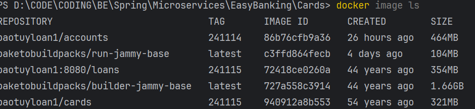
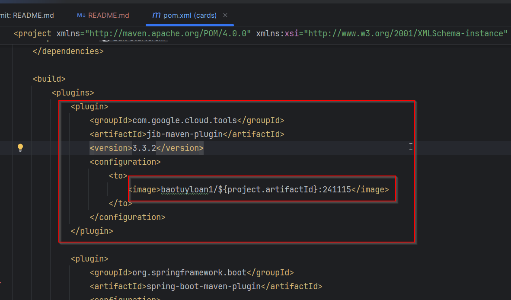

References:
- https://github.com/GoogleContainerTools/jib
- https://github.com/GoogleContainerTools/jib/tree/master/jib-maven-plugin  
- Jib is going to work only for Java applications, whereas Buildpacks is going to work for many other famous languages like Python, Ruby, NodeJS.

In your Maven Java project, add the plugin to your pom.xml:

```xml
<project>
  ...
  <build>
    <plugins>
      ...
        <plugin>
            <groupId>com.google.cloud.tools</groupId>
            <artifactId>jib-maven-plugin</artifactId>
            <version>3.3.2</version>
            <configuration>
                <to>
                    <image>baotuyloan1/${project.artifactId}:250130</image>
                </to>
            </configuration>
        </plugin>
      ...
    </plugins>
  </build>
  ...
</project>
```

```command
mvn compile jib:dockerBuild
```

This will use your local Docker server setup to generate a Docker image. It will scan all the details inside my pom.xml and it is going to generate a Docker image for my cards microservice. And this jib is going to be faster than Buildpacks.

I'm able to get my Docker image within 11 seconds, whereas Buildpacks is going to take lot of time.

we got a new Docker image with the name cards and this also is having a size of 322 MB, which is very similar to build a pack, but far better than the image size that we have for the accounts.


There is a created value, which is like 43 years ago or 53 years ago.  
Is this a bug inside this build packs and jib ?  
No, this is not a bug. It is a feature.
If you use the same inputs (builder, stack, application source code), you will always get exactly the same output, no matter when or where you build it.

**Advantage of Google Job compared to Buildpacks**
- Whenever we are using Jib, we can generate a Docker image, even if you don't have Docker installed inside your system. That's the beauty of Jib.
- So if you don't want to install Docker inside your local system, but at the same time you want to convert our application to a Docker image, then you can use a command which is
  - ```command
    mvn compile jib:build
  
  - So when you try to use this build command, it is going to generate a Docker image from your application and the same will be pushed into the remote repository. Because if you are not running a docker inside a local system, that means there is no place for your jib to generate the Docker image. That's why it will look for the remote repository details where it has to store.

**Running a Spring Boot app as a container using Google Jib**
Steps to be followed:
1. Add the configurations like mentioned inside the pom.xml. Make sure to pass the image name details

2. Run the maven command "mvn compile jib:dockerBuild" from the location where pom.xml is present to generate the docker image without the need of Dockerfile
3. Execute the command "docker run -p 9000:9000 baotuyloan1/cards:241115" to run the application as a container