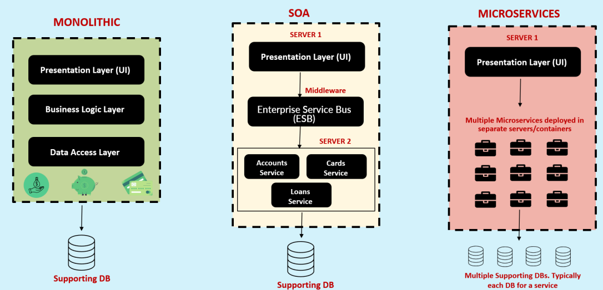
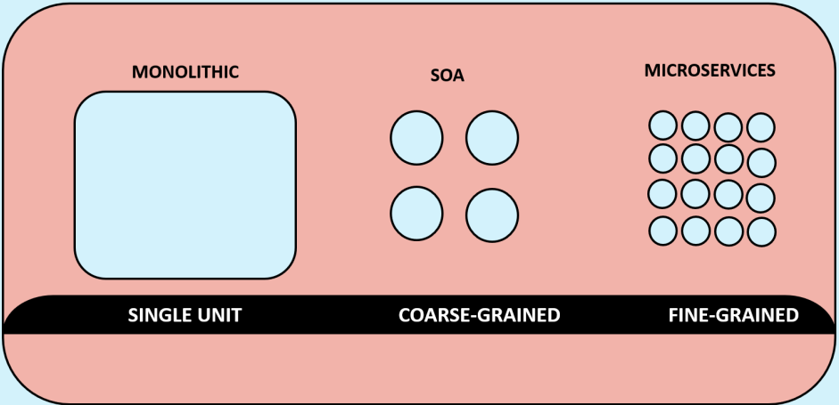
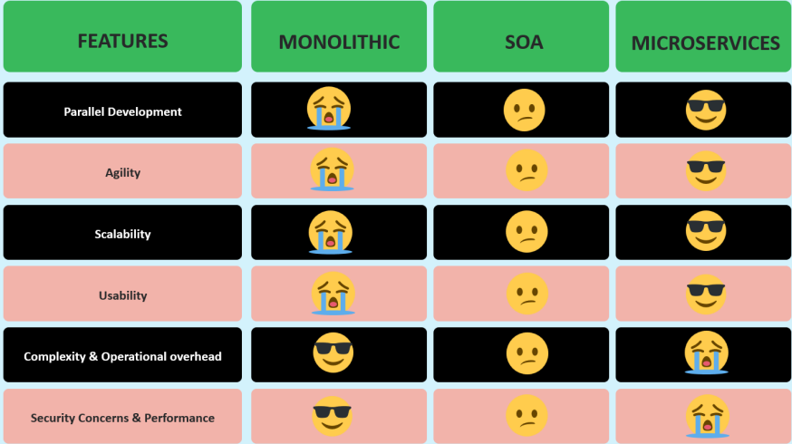

- Monolithic is a signle unit
- SOA is a coarse-grained
  - We are separating our backend services, but it is not going to give a lot of flexibility in terms of multiple database, multiple codebase.
  - With that reason, we cannot really separate our services or code based around the business domains.
- Microservices are fine-grained
  - They are going to have separate code base, separate development and deployment lifecycle.

Comparisons:

**Definition of Microservice**

Microservices is an approach to developing a single application as a suite of small services, each running in its own process and communicating with lightweight mechanisms (like rest,...),
build around business capabilities and independently deployable by fully automated deployment machinery