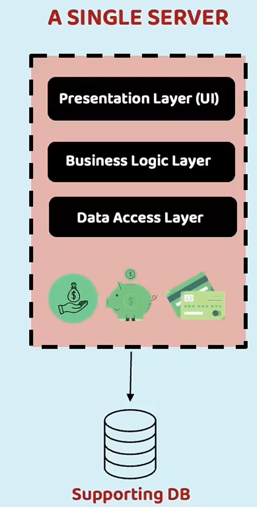
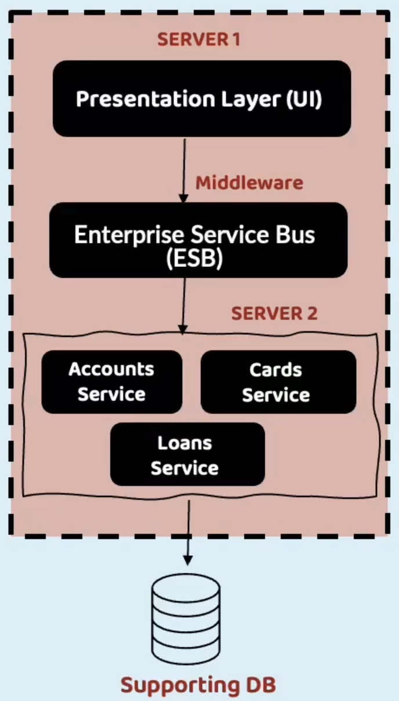
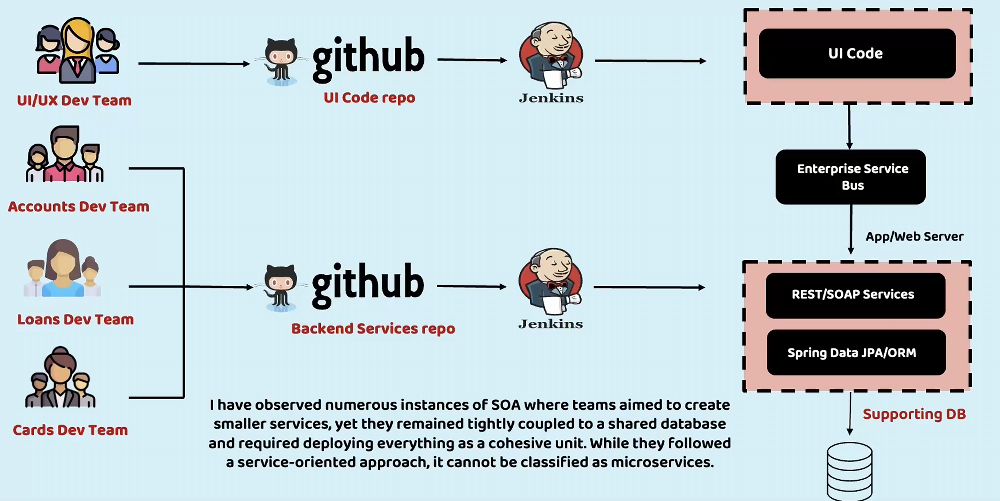
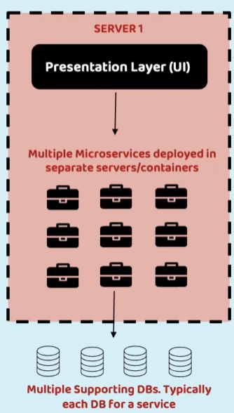
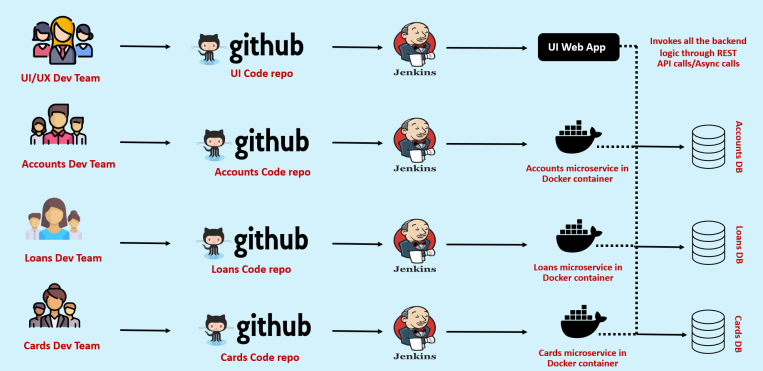

**What are Microservices?**

We can call these microservices as one of the architecture style that we can consider to build our web applications.

To understand microservices, let's imagine a bank called EazyBank
Typically, banks comprise various departments, including Accounts, Cards, and Loans.
For these EasyBank, in order to build a web application, there are multiple architecture patterns available inside the industry.

The very first are traditional approach that we have to build web application is Monolith

**The Monolith**

All the applications used to be deployed as a Single unit where all functionality deployed together inside a single server.
We call this architecture approach as *Monolith*.

*Props*:

- Simpler development and deployment for smaller teams and applications.
- Fewer cross-cutting concerns (all your non-functional requirements like security, auditing, logging). This is going to be simple inside monolithic because all your code deployed inside a single server as a web application.
- Better performance due to no network latency. Because all the code is deployed inside a single server. If accounts business logic want to communicate with cards or loans, it is just going to be a method call inside the same server.

*Cons*:

- Difficult to adopt new technologies. Whenever I want to enhance my web application with the new frameworks or with the new languages or new technology, either I have to update my entire codebase or I need to continue with the old technology.
- Limited agility. You decided to move to a framework or a new language today. And you can't do that immediately in a week or a month time. It is going to take a lot of time to upgrade your monolithic application because entire your code tightly couple.
- Single code base and difficult to maintain
- Not fault tolerance
- Tiny update and feature development always need a full deployment.

We have various forms of Monolithic with the names like *Single-Process Monolith, Modular Monolith, Distributed Monolith*

Example with Banks application:
- Accounts Dev Team, Loans Dev Team, Cards Dev Team and UI/UX Dev Team inside monolithic applications. All these developers, they are going to work on a single code base. We are going to deploy the entire our web application into web server or application server with the help of CI/CD tools like Jenkins.
- Typically, we will package all our code into a war(*Web application ARchive*) format or an ear(*Enterprise ARchive*) format deploy into a single web application.
- This single web application is going to be supported by a single database.

**The SOA(Service-Oriented Architecture)**

SOA emerged as an approach to combat the challenges of large, monolithic applications. It is an architectural style that focuses on organizing software systems as a collection of loosely coupled, interoperable services.
It provides a way to design and develop large scale applications by decomposing them into smaller, modular services that can be independently developed, deployed and managed.

Deploy the presentation layer or UI logic into a server one.
Inside the server 2, I'm going deploy all my logic related to accounts, cards, and loans with the help of web services.
With this pattern, at least I'm able to separate the tight coupling between UI and backend logic.
For these UI to communicate with the backend services, we should use a middleware component which is enterprise service bus.
So whenever a request comes to these ESB, this ESB is going to redirect that request to the corresponding service, like whether the UI application is trying to fetch the accounts information, cards information or loans information.
Accordingly, it is going to redirect the request to the one of the web service inside the server 2.
So we are able to separate the UI logic and backend logic into two different servers.
But this architecture also has its own advantages and disadvantages.

*Props*:

- Reusability of services, better maintainability, higher reliability and parallel development.
- Like all your accounts related logic is going to be stay inside the account service.
- Similarly, for loans and card service and coming to the UI code, it is going to be separated into a separate code base and  it is going to be deployed into a separate server as well.

*Cons*:

- The communication is going to happen with the complex protocols like SOAP.
- SOAP is very complex in nature and heavy in nature.
- We have a middleware component which is ESB, and to set up that ESB, we need to put a lot of investment because these are not open source.
- These products are like commercial products like Oracle has an ESB product which is costly in nature.

Why should we maintain a separate component just for communicating between UI and backend services?
So in the initial days projects they use this architecture and to some extent they got the benefits like parallel development, reusability of services and better maintainability.
But slowly industry felt that this architecture pattern also very complex to maintain, and it involves higher investment cost.
So with all these reasons, everyone started looking for a better architecture style which will overcome the challenges of SOA and Monolithic.
That's where we landed onto a new architecture style, which is microservices.
Before I try to go to microservices, let's try to understand how SOA is going look like.

So initially, we are going to have UI, UX dev team, accounts dev team, loans dev team, and  cards development team.
Inside SOA like you can see, UI team are going to have separate code repo and all the backend team.
They are going to have separate backend repo and using these two separate code repos.
We are going to have a separate deployments into separate web servers
But the communication between the UI server and backend server is going to happen only with the help of a middleware component, which is enterprise service bus.
So, to some extent, it has the advantages of parallel development and independent deployments between UI team and backend team.

**The GREAT MICROSERVICES**:

Microservices are independently releasable services that are modeled around a business domain.
A service encapsulates functionality and makes it accessible to other services via networks.
One microservice might represent Accounts, another Cards, and yet another Loans, but together they might constitute an entire bank system.

We are going to develop many services that are modeled around a business domain.
I can have separate small microservice focusing entirely on accounts, logic and similarly for cards and loans.
This way based upon separate, separate business domain logic, I can segregate them into separate services and all these microservices, they are going to have their own database.
They are going to be deployed into their own servers or own containers.
We can create any number of microservices that can be deployed into separate servers and containers and all these services they are going to have their own supporting database.

**Props**:

- It is easy to develop, test and deploy
    - because you loosely coupled all your business logic. All your accounts related logic is going to be stayed inside a small component.
- Increase the agility inside your organization:
    - If you want to enhance accounts microservice with a new language or new framework, you can happily do that because it's entire separate component which will have its own development lifecycle, deployment lifecycle.
- Parallel development:
    -  Since there is no tight coupling between your microservices or services, all the developments can have their own enhancement lifecycle,, they can have their own discussions, they can have their own deployment lifecycle.
- Modeled around a business domain:
    - Example: Inside the bank we have accounts, loans and cards. SO you can have three microservices focusing these three different business domains.
    - It is also going to provide you a flexibility where you can scale horizontally and independently.
        - For example: if your accounts microservice is going to receive higher traffic compared to loans and cards, you can scale only accounts microservice independently.

*NOTE*: Microservices is not always a silver bullet for all your problems inside the web application. Don't always jump into microservices because it is unnecessary for smaller applications or smaller companies.

**Cons**:

- It has complexity:
    - When you have so many independent containers deployed separately in different servers and clusters.
    - Definitely, connecting them and making sure they are able to communicate properly always is going to be a complex task,
- Infrastructure overhead inside monolithic and SOA.
    - If you only have 1 or 2 servers to monitor, but inside microservices you are going to deploy your microservices into number of servers and containers
    - With that, you need to monitor all of them
- Security concern
    - Because previously any communication between your code used to happen with the help of method calls and a web service call from UI to backend.
    - But now with microservice, even your backend services, they need to communicate with web service like rest based services.
    - This increases security concerns inside your web application.

Off course, we have various approaches to overcome these challenges inside microservices architecture.
Whenever you're deploying your own microservice, you are not going to have any dependency on other microservices.
With this primary advantage, all other numerous benefits will naturally emerge inside your microservices web application.

There are four different development teams. Inside microservices architecture pattern, all of them are going to have a separate code base.
From these separate code base, they are going to have separate development lifecycles with help of Jenkins or any other CI/CD tool, and post the deployment all of them, they are deployed into multiple servers or containers and each of the service is going to have their own supporting database.
And apart from these independent deployment and parallel deployment, the other advantage that we have with microservices is, accounts microservice team they can have an SQL database and loans microservice they can have a NoSQL database. So they can choose their own database based upon their requirements.
We can have accounts microservice built with the help of Python, loans microservice build with the help of Java and cards microservice built with the help of go language
At the end of the day, it is going to super freedom to your company and to the developers.
They are free to explore because they are not bounded to a single codebase or to a single server.
