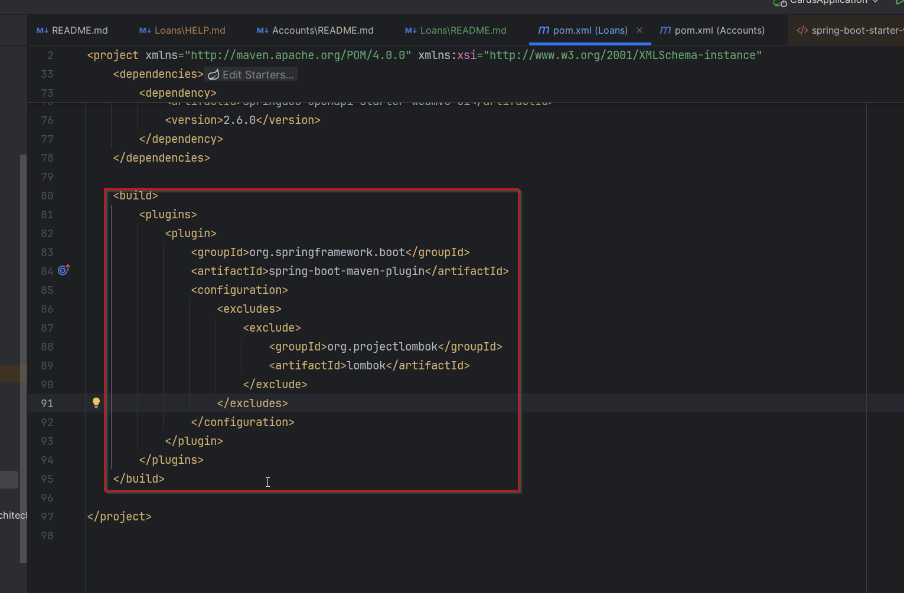
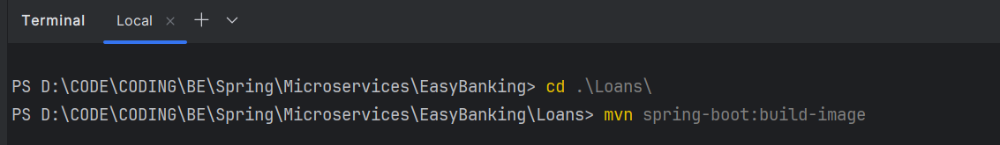
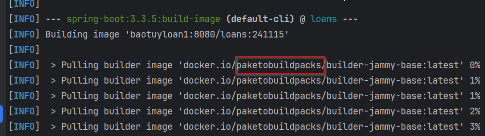
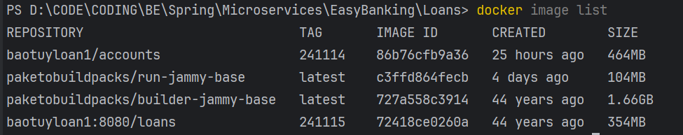
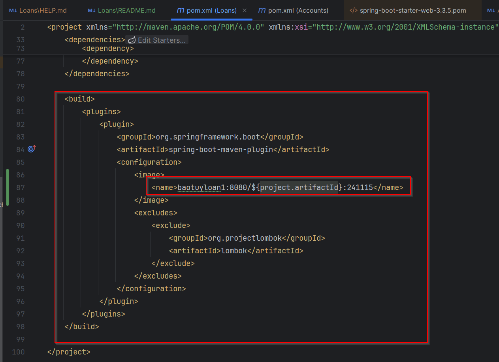

Cloud Native Buildpacks offer an alternative approach to Dockerfiles, prioritizing consistency, security, performance, and governance.
With Buildpacks, developers can automatically generate production-ready OCI images from their application source code without the need to write a Dockerfile.
**BUILD DOCKER IMAGE WITH BUILDPACKS**
- References: https://buildpacks.io/
  - https://paketo.io/    

- We can transform our application source code into a Docker image that can run on any cloud.
- There is no need of writing low level instructions with the help of Docker file.
- this buildpacks is developed by Heroku.

Paketo Buildpacks is an implementation of Buildpacks ecosystem.
Make sure you have a plugin related to the maven inside your pom.xml



With the help of this Spring boot Maven plugin. We can generate a Docker image and behind the scenes this Spring Boot Maven plugin is going to leverage Buildpacks and Paquito to generate a production ready Docker image.

```command
mvn spring-boot:build-image
```




So based upon all the details and dependencies that we have mentioned inside the pom.xml, it is going to scan for all the dependencies. And by considering all these behind the scenes it is going to generate a Docker image.



If you see for accounts microservice, we have used the Docker file and the size of the accounts Docker image is 456 MB because we don't know how to follow the best standards,  how to cache multiple layers, how to compress our multiple components inside Docker image.
We don't know about all those standards and the Docker concept, but with the help of Buildpacks, you can see there is a lot of improvement in terms of the size of our Docker image. It reduced from 456 MB to 311 MB.
So this is one of the great advantage if you use the products like Buildpacks.

**Running a Spring Boot App as a container using Buildpacks**
1. Add the configurations like mentioned inside the pom.xml. Make sure to pass the image name details


2. Run the maven command, "mvn spring-boot:build-image" from the location where pom.xml is present to generate the docker image without the need of Dockerfile.
3. Execute the docker command "docker run -p 8090:8090 baotuyloan1/loans:241114" to start the container. This will start the docker container based on the docker image name and port mapping provided.