The reason is microservices architecture makes applications easier to scale, faster to develop, enable innovation and it is also going to help organizations by accelerating the time to take their new enhancements to the market.
With all these reasons, microservice is going to be a demanding skill set for next few years.

AGENDA:
- Welcome to the world of Microservices
- Building microservices business lgoic using Spring Boot
- How to we right size our microservices & identify boundaries.
- How to containerize our microservices using Docker
- Configurations Management in microservices using Spring Cloud config
- Service Discovery & Service Registration in microservices using Eureka
- Building an edge server for microservices using Spring Cloud Gateway.
- Making Microservices Resilient using Resiliency4j patterns.
- Observability and monitoring of microservices using Grafana, Prometheus ...
- Securing microservice using OAuth2/OpenID, Spring Security
- Event Driven microservices using RabbitMQ, Spring Cloud Functions & Stream
- Event Driven microservices using Kafka, Spring Cloud Functions & Stream
- Container Orchestration using Kubernates
- Deep dive on Helm (kubernates package manager)
- Deploying microservices into cloud kubernates cluster
- Many best practices, techniques followed by real time microservice developers.


[EvolutionOfMicroServicesArchitecture.md](Accounts%2FEvolutionOfMicroServicesArchitecture.md)

We need to build REST Services.
Using REST services, we can establish synchronous communication between multiple APIS or multiple services or multiple web applications.
Synchronous communication means when a request comes from an external application to my microservice
The external application is going to wait for my response so that it can proceed to the next request.
Off course, synchronous communication is not the only option that we have to build microservices.
This is the mostly commonly used approach in this project.

**Implementing REST Services**

REST(Representational state transfer)services are one of the most often encountered ways to implement communication between two web apps.
REST offers access to functionality the server exposes through endpoints a client can call.

**SWAGGER API:**
Accounts : http://localhost:8080/swagger-ui/index.html
Loans:  http://localhost:8090/swagger-ui/index.html
Cards:  http://localhost:9000/swagger-ui/index.html

**IMPORTANT ANNOTATIONS AND CLASSES that supports building REST Services**
- @RestController - can be used to put on top of a call. This expose your methods as REST APIs. Developers can also use @Controller + @ResponseBody for same behavior.
- @ResponseBody - can be used on top of a method to build a Rest API when we are using @Controller on top of a Jav class
- @ControllerAdvice - is used to mark the class as a REST controller advice. Along with @ExceptionHandler, this can be used to handle exceptions globally inside app. We have another annotation @RestControllerAdvice which is same as @ControllerAdvice + @ResponseBody

*Classes*
- RequestEntity<T> - Allows developers to receive the request body, header in a HTTP request.
- ResponseEntity<T> - Allow developers to send response body, status, and headers on the HTTP response
- @RequestHeader & @RequestBody - is used to receive the request body and header individually.


**BUILDING MICROSERVICES**

One of the most challenging aspects of building a successful microservices system is the identification of proper microservice boundaries and defining the size of each microservice.
Below are the mose common followed approaches in the industry:
- Domain-Driven Sizing: Since many of our modifications or enhancements driven by the business needs, we can size/define boundaries of our microservices that are closely aligned with Domain-Driven design & Business capabilities. But this process takes lot of time and need good domain knowledge
  - Disadvantage: it's time-consuming and it also needs a lot of people who has good understanding on the business and domain to overcome these challenges
  - Advantage: 
- Event Storming Sizing: conducting an interactive fun session among various stake holder to identify the list of important evens in the system like 'Completed Payment', 'Search for a Product' etc. Base on the events we can identify 'Commands', ' Reactions' and can try to group them to a domain-driven services.
  - Advantage: Fast, straightforward, Engaging,Effective
    - reference: https://www.lucidchart.com/blog/ddd-event-storming

  
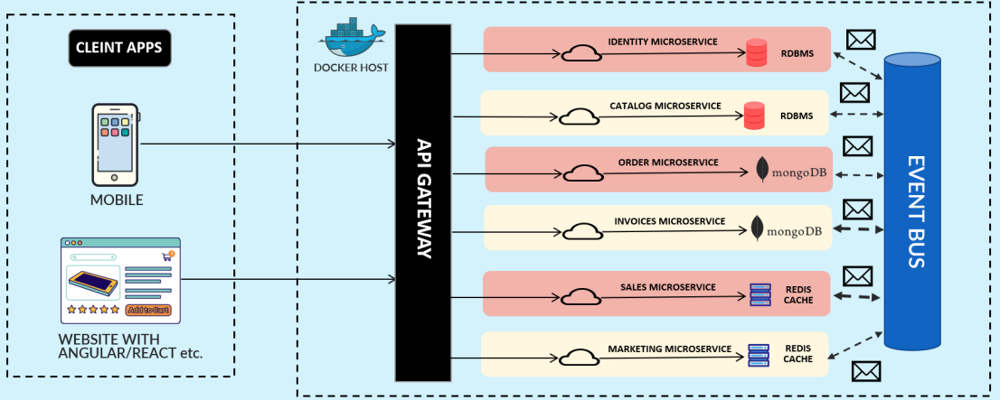

- Anyone who wants to communicate with my microservice, first they need to talk with my API gateway.
- Using API gateway, my client application, they can invoke my rest APIs or microservices
- All these microservices, including API gateway is deployed as a Docker containers inside a Kubernetes cluster.
- Each microservice, they can have their own supporting database. They can follow their own programming language or framework.
- Can also implement event streaming with the help of Event Bus like Kafka, RabbitMQ.
- Whenever an authentication trying to happen, you can trigger an SMS to the customer for his OTP, so that you can do asynchronously with the help of event streaming. Similarly, whenever an order is confirmed, you can send an SMS or email to the customer asynchronously with the help of event streaming.

*GENERATE DOCKER IMAGES*
- Dockerfile -> accounts - [README.md](Accounts%2FREADME.md)
- Buildpacks (maven using Buildpacks) -> loans - [README.md](Loans%2FREADME.md)
  - Buildpacks is a project initiated and developed by Heroku and Pivotal based upon the best practices
- Google Jib (open source with Java Tool, and with the Maven plugin command) ->cards -[README.md](Cards%2FREADME.md)


**Compare Dockerfile, Buildpacks, Jib approaches**
- Docker file:
  - Disadvantages: 
    - You need to be an expert to write a Docker file
    - You need to follow all the production standards and best practices by yourself
    - The Docker files have to be maintained for all your microservices
  - Advantages:
    - This Dockerfile will give a lot of flexibility to you. If you have any custom requirements while you are generating a Docker image, you can achieve all of them with the help of Docker file approach.
- Buildpacks:
  - Disadvantages:
    - You have to accept what they are supporting
  - Advantages:
    - Advanced Caching
    - Bill-of-Materials
    - Multi-language
    - Modular/Pluggable
    - Multi-process...
- Jib:
  - Disadvantages:
    - You have to accept what they are 
  - Advantages: 
    - Take very less time to generate a Docker image.
    - Take less memory inside my system

=> If  you have any such custom requirements, you can always follow these Docker file approach.

- To push docker image to repository (docker hub), you can use the command 
```command
docker image push docker.io/baotuyloan1/loans:241115
```

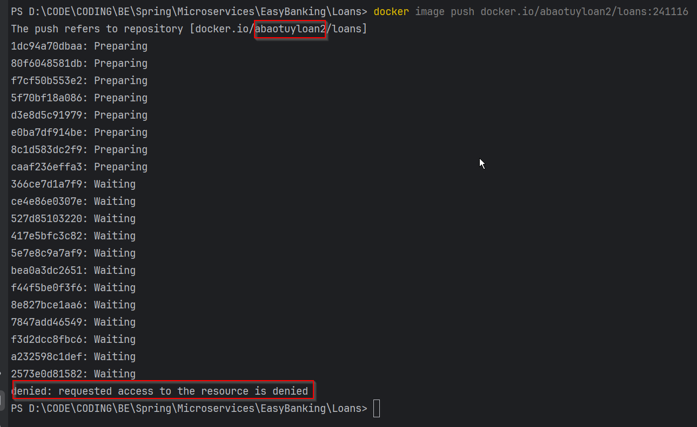

make sure the link image is correct with username of docker desktop (docker hub). Your image name should have your username followed by your application name.

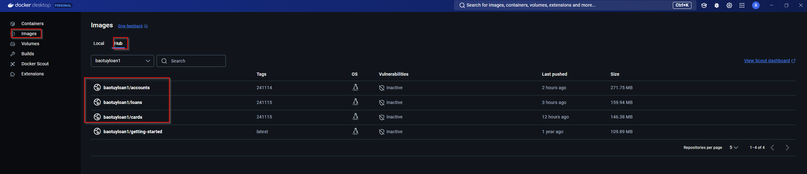

```command
docker compose up
```
or 
```command
docker compose up -d
```
-d for detach mode

stop docker containers
```command
docker compose stop
```

stop and remove containers
```command
docker compose down
```

**Important Docker Commands**

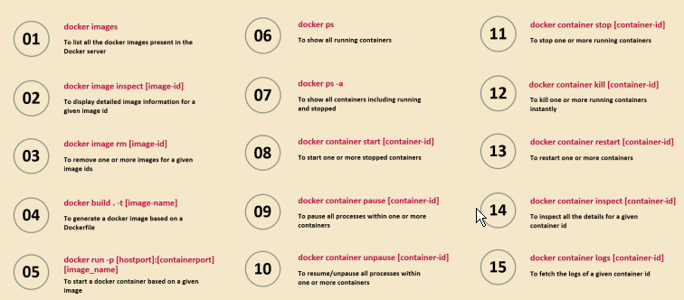
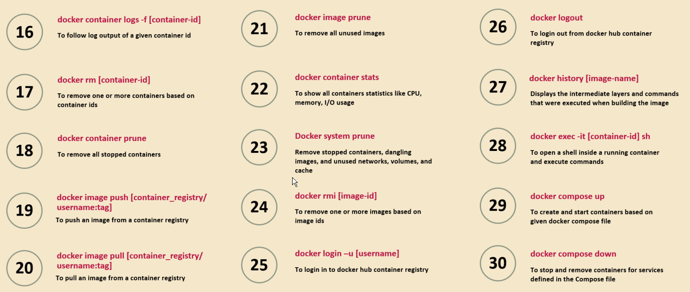


*Power Plugin in Docker Desktop*
- Logs Explorer


**What are cloud native applications**

*The layman(non-technical person) definition:*
- Cloud-native applications are software applications designed specifically to leverage cloud computing principles and take full advantage of cloud-native technologies and services. These applications are built and optimized to run in cloud environments, utilizing the scalability, elasticity.
- In simple words, cloud native applications are built for cloud environments so that the organizations can take complete advantage of cloud provider services and technologies.

*The Cloud Native Computing Foundation (CNCF) definition:*
- Cloud native technologies empower organizations to build and run scalable applications in modern, dynamic environments such as public, private, and hybrid clouds.
- These techniques enable loosely coupled systems that are resilient, manageable, and observable. Combined with robust automation, they allow engineers to make high impact changes frequently and predictably with minimal toil.


**Important characteristics of cloud native applications**
- Microservices: often built using a microservices architecture, where the application is broken down into smaller, loosely coupled services that can be developed, deployed and scaled independently.
- Containers: Typically, packaged and deployed using containers, such as DOcker containers. Containers provide a lightweight and consistent environment for running applications, making them highly portable across different cloud platforms and infrastructures.
- Scalability & Elasticity: Designed to scale horizontally, allowing them to handle increased loads by adding more instances of services. They can also automatically scale up or down based on demand.
- DevOps Practices: Embrace DevOps principles, promoting collaboration between development and operations teams. They often incorporate continuous integration, continuous delivery, and automated deployment pipelines to streamline the software development and deployment processes.
- Resilience & Fault Tolerance: designed to be resilient in the face of failures. They utilize techniques such as distributed, architecture, load balancing, and automated failure recovery to ensure high availability and fault tolerance.
- Cloud-Native Services: Take advantage of cloud-native services provided by cloud platform, such as managed databases, messaging queues, caching systems, and identify services. This allows developers to focus more on application logic and less on manging infrastructure components.

**15-Factor methodology**
- One code base,one application: Each application has a dedicated codebase. Shared code managed separately as a library, allowing it to be utilized as a dependency or as a standalone service, serving as a backing service for other applications. It is possible to track each codebase in its own repository, providing flexibility and organization.
- API first: Adopting an API-first approach during the designed phase of a cloud-native application encourages a mindset aligned with distributed systems and promotes the division of work among multiple teams.
- Dependency management: It is crucial to explicitly declare all dependencies of an application in a manifest and ensure that they are accessible to the dependency manager, which can download them from a central repository such as (Maven, Gradle, ...)
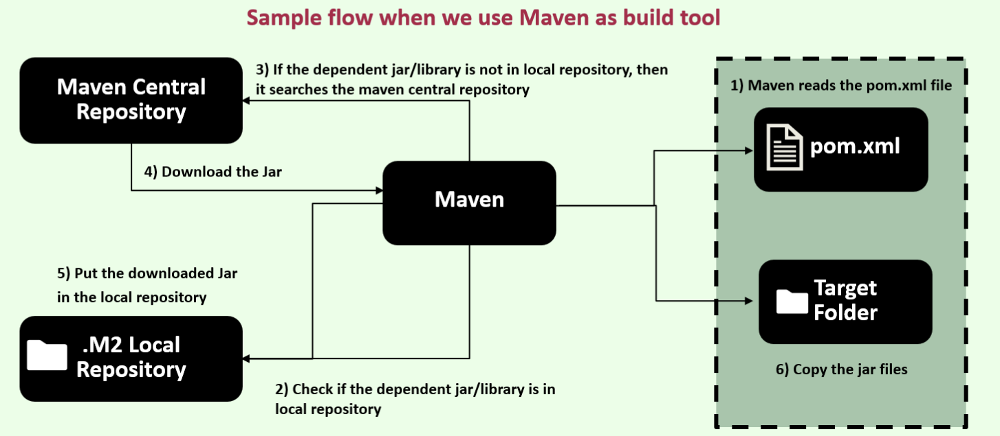
- Design, build, release, run: Codebase progression from design to production deployment involves belows stages:
  - Design stage: 
    - Determine technologies, dependencies, and tools for specific application features. It also includes the development and unit testing. Once the design, development and testing is completed, we need to move on to the build stage.
  - Build stage: 
    - We need to compile and package the code base with the required dependencies, creating an immutable artifact(build). Every built artifact should have its own unique identification number, like how we maintain version like 1.0.1, or 1.0.2.
    - Once the build stage is completed, you should not do any modifications inside the code, at the runtime, inside your release stage or run stage. After this build stage, your code base package is going to be ready for the release stage.
  - Release stage:  
    - We need to combine the code base package with the deployment configurations based upon the environment. Suppose if you're trying to release this build package into a production environment, definitely you should combine your code base with the production related configurations like database credentials, folder structure, any server related properties or microservice related properties.
    - Each release is immutable and uniquely identifiable, such as through semantic versioning (e.g., 6.1.5) or timestamp (e.g., 2024-11-17_20:04). Central repository storage facilitates easy access, including rollbacks if needed. Once is release stage is completed, our application along with the configuration is ready to be deployed and run as an microservice or as an application
  - Run state: 
    - We need to run the application in the designated environment using a specific release. We need to make sure that all these stages, they are maintaining strict separation. We should not try to club them .
- Configuration, credentials & code :
  - Configuration are the elements that are prone to change between the deployments.
    - If there is a property that is going to differ from one environment to environment, we call all these kind of properties or elements as configurations.
    - We should never club these configurations with our code base. We should have an ability to modify application configurations independently or without the need to rebuild the application for every environment.
    - Examples: your database properties or your message system properties, credentials for accessing third party APIs are feature flags, so all these kind of configurations they are confidential in nature and at the same time they're going to be differed from one environment to other environment. If you take your database username and password, it is a confidential and at the same time the database credentials for dev, environment and QA environment and production environment is not going to be same.
    - All such type of configurations, we need to make sure we are maintaining all of them in a separate codebase and at the same time we need to make sure we are not exposing any sensitive information while maintaining all these configurations in a separate codebase.
    - If needed, we need to provide all the sensitive configurations by following some externalization standards.
    - Your configuration should not be embedded within the code or tracked in the same code base except for the default configurations
    - Always the default configurations can be bundled within the application. But anything that is going to change from environment to environment, we should not embed within our code base. If you try to embed it along with the code, then you need to generate the Docker image or the code base package for every environment which is against to this 15 factor methodologies.
- Logs: 
  - Log routing and storage are not the application's concern. The application will simply redirect the logs to the standard output, treating them sequentially ordered events based upon the time.
  - The responsibility of the log storage and the rotation should be shifted to an external tool called log aggregator. This tool retrieves, gathers and provides access to the logs for the debugging purpose.
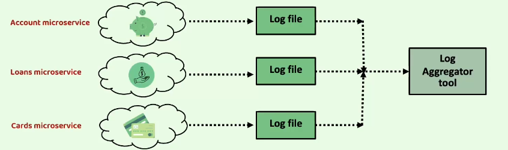
- Disposability:
  - If a particular microservice or a cloud native application becomes unresponsive or unavailable, it can be terminated and replaced with a new instance by platforms like Kubernetes automatically and at the same time , during the high load periods or during high load traffic, additional instances of the applications can be spin up to handle the increased workload.
  - This concept of shutting down and creating new instances automatically is called application disposability where the applications can be started or stopped as needed.
  - The fast startup enables systems elasticity and ensuring robustness and resilience and resilience
  - Whenever a graceful shutdown ís being involved for an application, the application should be capable of not accepting any new request and at the same time anny ongoing requests should be processed successfully and then only it should exit.
  - This processing is going to be pretty straightforward for a web applications.
  - For worker process or any other type of process ,it involves returning any pending jobs to the worker queues before exiting.
  - This conveys that always graceful shutdown is also important. We should not ignore the existing requests that are being processed by a particular instance or a microservice that we are trying to shut down.
  - When we use Docker container along with a orchestrator Kubernetes, they are going to inherently satisfy these disposable requirement.
- Backing services:
  - Your microservices may have dependency on many other external resources like database, SMTP servers, FTP servers, caching systems, message brokers,... All these external resource dependencies, we call them as backing resources.
  - We should always treat these backing resources as attached resources so that we can modify or replace them without needing to make any changes inside your application code.
  - Whenever you want to change to your different database, instead doing it in the same code base, you need to provide these URL information, user information and password information form an external configuration
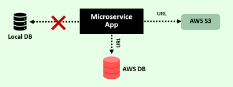
- Environment parity:
  - Minimize the differences between various environments of your application
  - This environment parity recommends to make sure all your environments are looking exactly as much as possible
  - There are three gaps that this factor addresses:
    - Time gap: This methodology encourages automation and continuous deployment to reduce the time between code development to production deployment (for example using CI/CD)
    - People gap: Developers create applications, while operators handle their deployment in production. To bridge this gap, a DevOps culture promotes collaboration between developers and operators, fostering the "you build it, you run it" philosophy
    - Tools gap: for example: You shouldn't use H2 on development and PostgresSQL on production. You should use the same database for both development and production environments.
- Administrative processes:
  - Management tasks required to support applications, such as database migrations, batch jobs, or maintenance tasks, should be treated as isolated processes. 
  - The code for these administrative or management task should be versioned control and packaged along with the application and executed within the same environment. 
- Port binding:
  - Using that port binding, we are exposing the microservice to external network
  - Once this application is exposed at a specific port, then any other service or any clients they can invoke my microservice.
  - Many applications are many microservices they want to communicate with each other.
- Stateless processes:
- Concurrency
- Telemetry
- Authentication and authorization

**CONFIGURATION MANAGEMENT IN MICROSERVICES**
- Separation of configs/properties: How do we separate the configurations/properties from the microservices so that same Docker image can be deployed in multiple environments.
- Inject configs/properties: How do we inject configurations/properties that microservice needed during start up of the service.
- Maintain Configs/properties: How do we maintain configurations/properties in a centralized repository along with versioning of them.


**How CONFIGURATIONS work in SpringBoot**
There are all the most commonly used approaches to provide the configurations inside SpringBoot applications:
- Properties present inside files like (application.properties, application.yaml, ...). They will have the lowest priority or lowest preference.
- Operating system environment variables
- Java System properties (System.getProperties())
- JNDI attributes from java:comp/env
- ServletContext init parameters
- ServletConfig init parameters
- Command line arguments

*Priority*
- Command line arguments is going to have the highest priority
- Whereas the properties that you have mentioned inside the application.properties is going to have the lowest priority


**How to READ Properties IN SpringBoot apps**

- Using @Value Annotation: You can use the @Value annotation to inject properties into your beans. This approach is suitable for injecting individual properties into specific fields.
  - For example: @Value("${property.name}) private String propertyValue; Once you mention what is property key name with the format like this, during the start up of the application, SpringBoot will look for the property value inside all the places like application.properties, environment variables, system properties, JNDI attributes, servlet init parameters, command line arguments...
- Using Environment: The Environment interface provides methods to access properties from the application's environment. You can autowire the Environment bean and use its methods to retrieve property values. This approach is more flexible and allows accessing properties programmatically. For example:
```java
@Autowired
private Environment env;

public String getProperty() {
    String propertyValue = env.getProperty("property.name");
}
```

- Using ConfigurationProperties @ConfigurationProperties. (Recommended this approach as it avoids hard coding the property keys)
  - If you have many properties configured for you application, then using this approach
  - You need to define all your properties inside your property file with a prefix value.
  - The @ConfigurationProperties annotation enables binding of entire groups of properties to a bean. You define a configuration class with annotated fields matching the properties, and Spring Boot automatically maps the properties to the corresponding fields.
```java
@ConfigurationProperties(prefix = "prefix")
public class MyConfig{
    private String propertyValue;
    
    //getters and setters
}
```
In this case, properties with the prefix "prefix" will be mapped to the fields of the MyConfig class.


**Profiles in SpringBoot**
- The default profile is always active
- We can create another profiles by creating property files like below:
  - application_prod.properties  -> for prod profile
  - application_qa.properties -> for QA profile
- We can activate a specific profile using spring.profile.active property like below
  - ``` spring.profiles.active=prod```


**How to externalize configurations using command-line arguments**

Spring Boot automatically converts command-line arguments into key/value pairs and adds them to the Environment object.
In a production application, this becomes the property source with the highest precedence. You can customize the application configuration by specifying command-line arguments when running the JAR you built earlier.
```text
java -jar accounts-service-0.0.1-SNAPSHOT.jar --spring.profiles.active="prod" --build.version="1.1"
```
The command-line argument follows the same naming convention as corresponding Spring property, with the --prefix for CLI arguments.

**How to externalize configurations using JVM system properties**

JVM system property, similar to command-line arguments, can override Spring properties with a lower priority.
This approach allows for externalizing the configuration without the need to rebuild the JAR artifact.
The JVM system property follows the same naming convention as corresponding Spring property, prefixed with -D for JVM arguments.
In application, the message defined as a JVM system property will be utilized, taking precedence over property files.

```text
java -Dbuild.version="1.2 -jar accounts-service-0.0.1-SNAPSHOT.jar
```

**How to externalize configurations using environment variables**

Environment variables are widely used for externalizing configurations as they offer portability across operating systems, they are universally supported.
Most programming languages, including Java, provide mechanisms to access environment variables, such as System.getenv() method.

To map a Spring property key to an environment variable, you need to convert all letters to uppercase and replace any dots or dashes with underscores.
Spring Boot will handle this mapping correctly internally. For example, an environment variable named BUILD_VERSION will be recognized as the property build.version.
This feature is known as relaxed binding.

Windows
```text
env:BUILD_VERSION="1.3"; java -jar accounts-service-0.0.1-SNAPSHOT.jar
```

Linux based OS
```text
BUILD_VERSION="1.3" java -jar accounts-service-0.0.1-SNAPSHOT.jar
```


Activating the profile using command-line, JVM & environment options.
- Command-line argument:
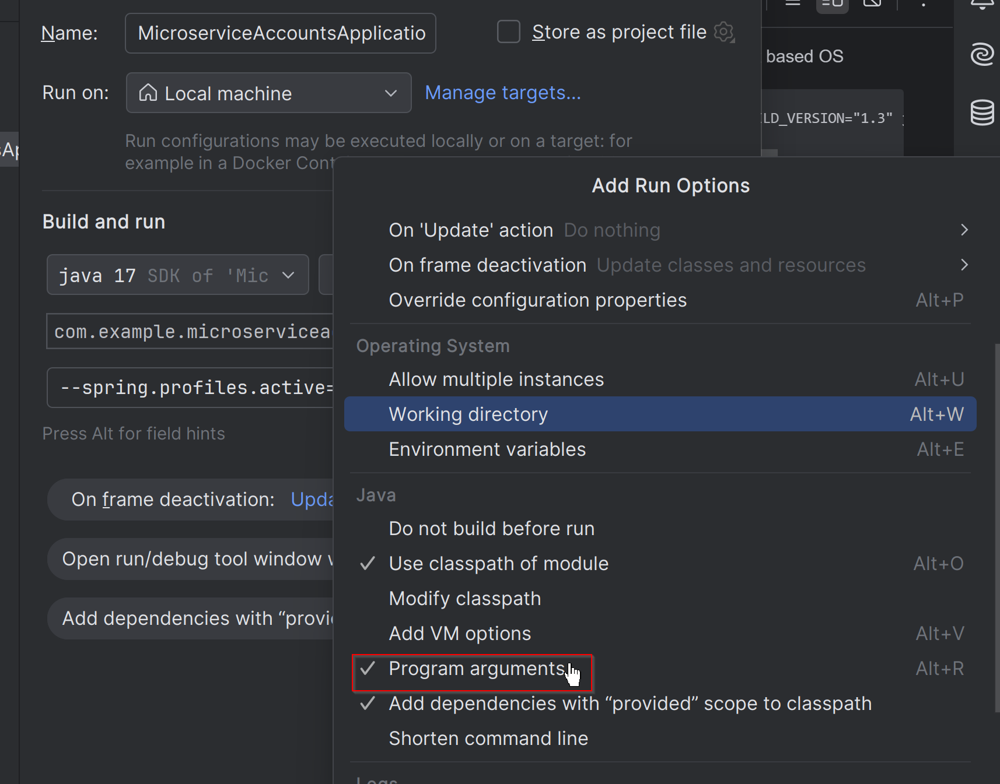
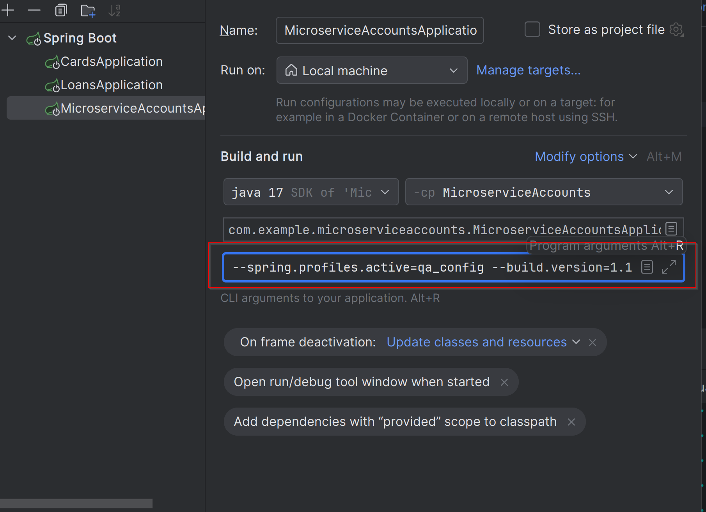
```text
--spring.profiles.active=qa_config --build.version=1.1
```

- JVM argument:
```text
-Dspring.profiles.active=prod -Dbuild.version=1.2
```
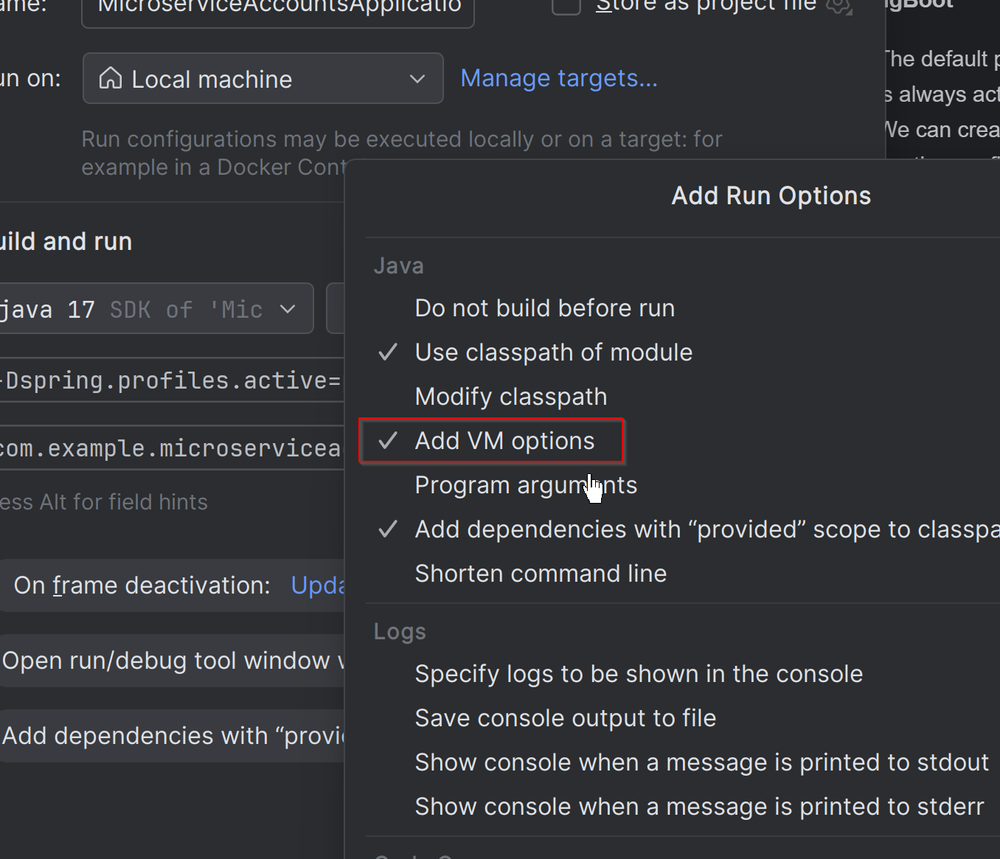
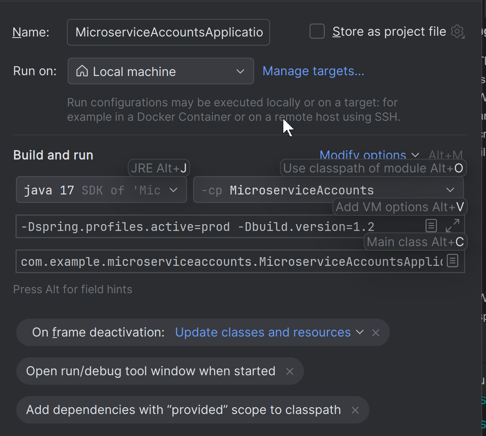

- Environment variables:
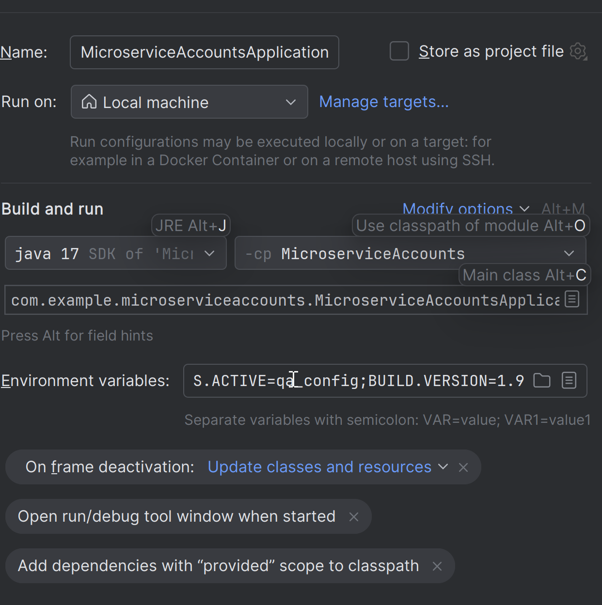
```text
SPRING.PROFILES.ACTIVE=qa_config;BUILD.VERSION=1.9
```


**Spring Cloud Config**
- Spring Boot can manage the configuration alone, but it has a lot of disadvantages.
  - Using CLI arguments, JVM properties, and environment variables often involves executing separate commands and manually setting up the application, which can introduce potential errors during deployment.
  - Sensitive information is stored in plain text.
  - If you need to change the configuration, you need to restart the application...
  
=> Spring Cloud Config.

Inside the spring ecosystem, there is a project with the name spring cloud config just to handle configurations inside any cloud.

Centralized Configuration revolves two core elements:
- You are free to store all your configurations or property files inside any location (like you can store inside a GitHub repository or inside a file system or inside a database).
- A server that oversees the configuration data withing the data store, facilitating its management and distributing to multiple applications like microservices.

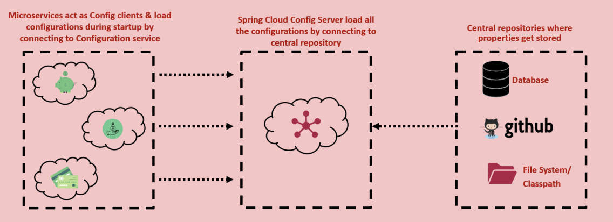

**What is Spring Cloud**

Spring Cloud provides frameworks for developers to quickly build some of the common patterns of Microservices.
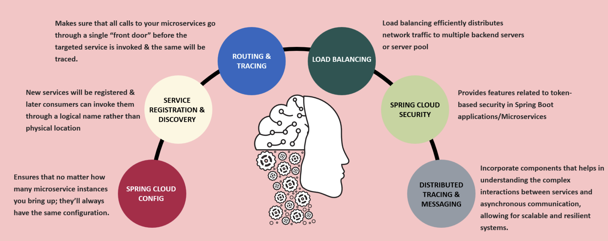

- reading configurations from classpath
- reading configurations from a file system location
- reading configurations from a GitHub repository


**Refresh configurations at runtime using refresh actuator path**
- make sure dependency actuator is added to pom.xml in every microservice instance.
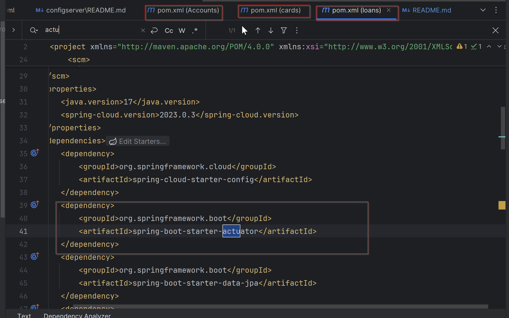


- Spring Cloud Config Server: by default, it will refresh the configurations at runtime.
- Spring Cloud Config Client: by default, will not refresh the configurations at runtime we need to use actuator path to refresh the configurations at runtime.


Make sure config like this before using actuator. Because by default, this endpoint is not exposed, so you need to explicitly enable it in the application.yml file using below config:
```yaml
management:
  endpoints:
    web:
      exposure:
        # spring boot actuator will enable and expose all management endpoint and inside these endpoints only we are also going to have refresh related endpoint.
        include: "*"
```

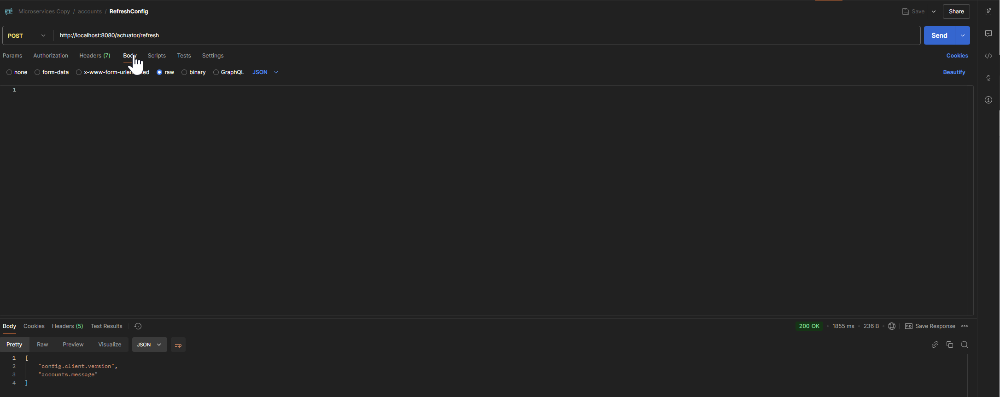
```text
--view all endpoints--
localhost:8080/actuator
localhost:8090/actuator
localhost:9000/actuator


localhost:8080/actuator/refresh
localhost:8090/actuator/refresh
localhost:9000/actuator/refresh

```

call api refresh will refresh the configurations after call the api instead of restarting the microservice instance.


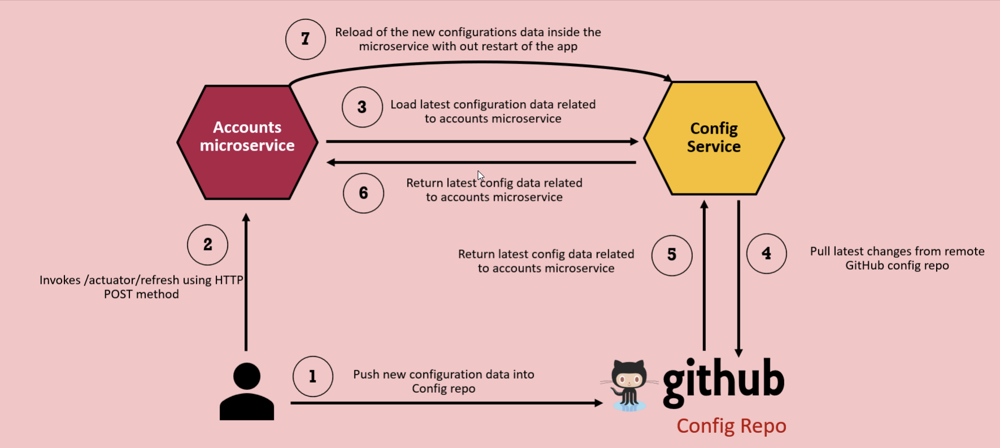


**Spring Cloud Bus**
- We have to invoke the refresh API for each microservice instance. Whenever we are trying to refresh the configurations at runtime without restart.

=> Use Spring Cloud Bus to avoid this.

Spring Cloud Bus links nodes of a distributed system with a lightweight message broker like RabbitMQ or Kafka.


and add this dependency

```xml
      <dependency>
            <groupId>org.springframework.cloud</groupId>
            <artifactId>spring-cloud-starter-bus-amqp</artifactId>
        </dependency>
```

for accounts, loans, cards and configserver.

call api

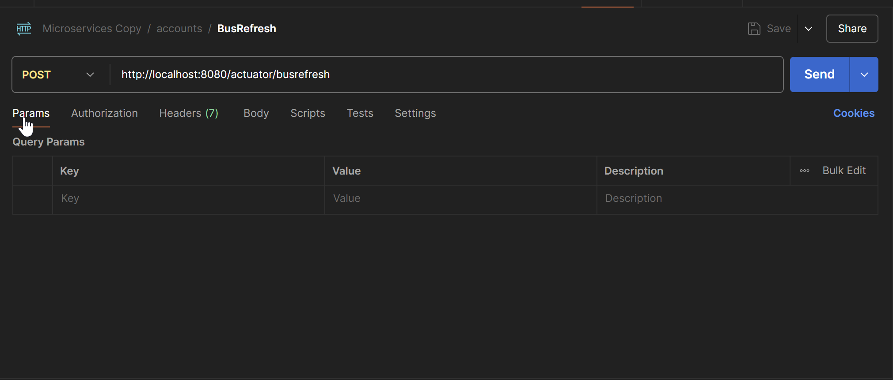

My spring cloud bus since it detected a change happened on the config server version.
It will communicate the same to all the microservices instances that are registered with the rabbitmq.
Since the loans and cards microservices are already registered with the rabbitmq, the change might have communicated to them and they might have refreshed the properties without the restart of the application and without invoking these bus refresh or refresh endpoints.

*Summary step to refresh configurations at runtime using Spring Cloud Bus*
1. Add actuator dependency in the Config server & Client server. Add Spring Boot Actuator dependency in pom.xml of the individual microservices like accounts, loans, and cards to expose the /busrefresh
2. Enable /busrefresh API: The Spring Boot Actuator library provides a configuration endpoint called "/actuator/busrefresh" that can trigger a refresh event. By default, this endpoint is not exposed, so you need to explicitly enable it in the application.yml file using below config:
   - management:
      endpoints:
        web:
          exposure:
            include: "busrefresh"
   - 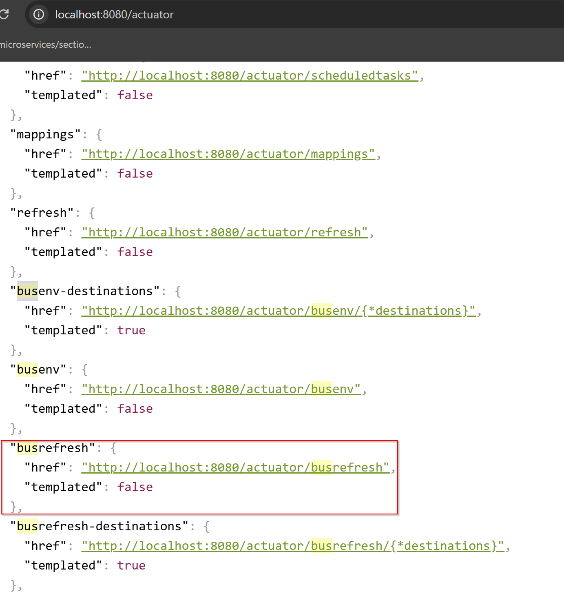
3. Add Spring Cloud Bus dependency in Config Server & Client Server. Add Spring Cloud Bus dependency (spring-cloud-starter-bus-amqp) inside pom.xml of the individual microservices like accounts, loans, cards and Configserver.
4. Set up a RabbitMQ: Using Docker, setup RabbitMQ service. By default, Spring Boot smart enough to connect to the RabbitMQ service without explicitly specifying the default configuration. If the service is not started with default values, then configure the rabbitmq connection details in the application.yml file of all the individual microservices and config server.

```text
docker run -it --rm --name rabbitmq -p 5672:5672 -p 15672:15672 rabbitmq:4.0-management
```

5. Call one API like this:
  ```text
    http://localhost:8080/actuator/busrefresh
  ```

*Flow refresh configurations at runtime using Spring Cloud Bus*
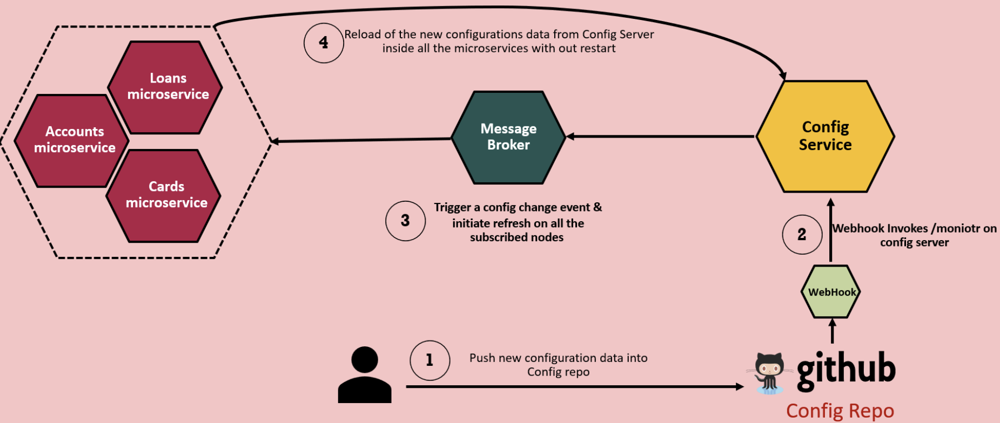


*Refresh config at runtime using Spring Cloud Bus & Spring Cloud Config monitor **
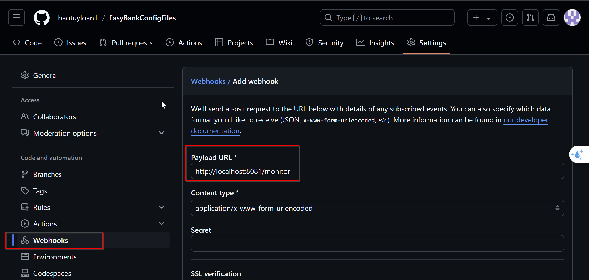
Webhook will call the URL when repository have some changes.
By default, we can input an url in this field. But GitHub can't understand what is localhost ??
So we need to overcome this challenge by using https://console.hookdeck.com/


run this command on powershell:
requirements:

Install the Hookdeck CLI on your device
```command
scoop bucket add hookdeck https://github.com/hookdeck/scoop-hookdeck-cli.git

scoop install hookdeck
```
**HOW TO REFRESH CONFIGURATIONS AT RUNTIME USING SPRING CLOUD BUS & SPRING CLOUD CONFIG MONITOR**

Step 1

Add actuator dependency in the Config Server & Client services:
```xml
	<dependency>
			<groupId>org.springframework.boot</groupId>
			<artifactId>spring-boot-starter-actuator</artifactId>
		</dependency>
```

Step 2

Enable /busrefresh API:
```yaml
management:
  endpoints:
    web:
      exposure:
        include: "busrefresh"
```

Step 3

Add Spring Cloud Bus dependency in Config Server & Client Server:
```xml
	<dependency>
			<groupId>org.springframework.cloud</groupId>
			<artifactId>spring-cloud-starter-bus-amqp</artifactId>
		</dependency>
```

Step 4

Add Spring Cloud CConfig monitor dependency in Config Server
```xml
<dependency>
			<groupId>org.springframework.cloud</groupId>
			<artifactId>spring-cloud-config-monitor</artifactId>
		</dependency>
```

Step 5

Set up a RabbitMQ:
```text
docker run -it --rm --name rabbitmq -p 5672:5672 -p 15672:15672 rabbitmq:4.0-management
```

Login and start the CLI with those commands

Step 6

Set up a Webhooks in Github:

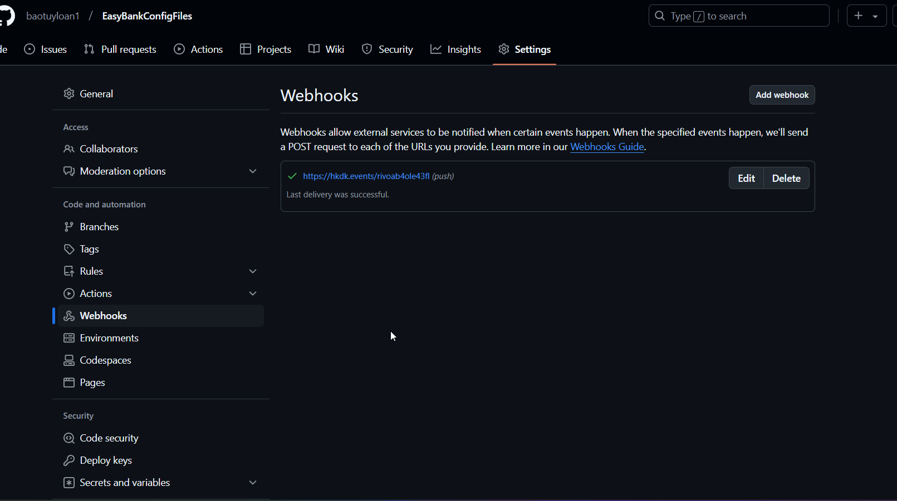

Step 7

Set up hookdeck (only for local)

*Config Hookdeck like this*
*https://dashboard.hookdeck.com/connections*


```command

hookdeck login

hookdeck listen 8071 source --cli-path /monitor


```


Webhook URL which has some domain name and this url perfectly match inside GitHub repository. 
Whenever a webhook request receives from the GitHub repo to this webhook URL, it is going to redirect that into my local system, which is at the path monitor.


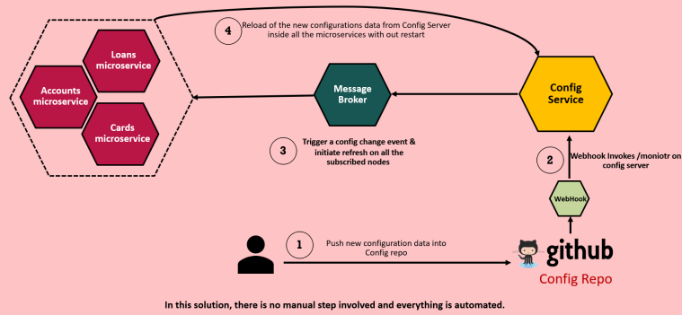


**Liveness and Readliness probes**
- Check whether my container is running properly. If not, they will try to make some corrective steps like maybe they will try to restart the container.
- Even after restarting container, if the health probes are not working properly, they will try to create a new container by deleting the existing one and the same


*Liveness*
A liveness probe sends a signal that the container or application is either alive(passing) or dead(failing). If the container is alive, then no action is required because the current state is good. If the container is dead, then an attempt should be made to heal the application by restarting it.
In simple words, liveness answers a true or false question: "Is the container alive?".

*Readiness*
A readiness probe used to know whether the container or app being probed is ready to start receiving network traffic. If your container enters a state where it is still alive but cannot handle incoming network traffic(a common scenario during startup), you want to the readiness probe to fail.
So that, traffic will not be sent to a container which isn't ready for it.

If someone prematurely send network traffic to the container, it could cause the load balancer(or router) to return a 502 error to client and terminate the request. The client would get a "connection refused" error message.
In simple words, liveness answers a true or a false questions "Is this container ready to receive network traffic?"

Inside Spring Boot apps, actuator gathers the "Liveness" and "Readiness" information from the ApplicationAvailability interface and uses that information in dedicated health indicators: LivenessStateHealthIndicator and ReadinessStateHealthIndicator.
These indicators are shown on the global health endpoint ("/actuator/health"). They are also exposed as separate HTTP probes by using health groups: "/actuator/health/liveness" and "/actuator/health/readiness".


*Dependency Condition Types*
| **Point**                         | **`service_completed_successfully`**                                      | **`service_healthy`**                                                | **`service_started`**                                                |
|-----------------------------------|---------------------------------------------------------------------------|---------------------------------------------------------------------|----------------------------------------------------------------------|
| **Purpose**                       | Ensure that the dependent service completes without errors (exit code = 0). | Ensure that the dependent service has passed health checks and is stable. | Ensure that the dependent service has started (without requiring health checks). |
| **Activation Condition**          | The dependent service must exit successfully (exit code = 0).              | The dependent service must be in a "healthy" state (passed health checks). | The dependent service must have successfully started.                 |
| **When to Use**                   | When you need a task to be completed before proceeding (e.g., initializing a database). | When you want to ensure the service is ready and can communicate (e.g., database, API). | When you only need the service to start without health checks.        |
| **Health Check Requirement**      | No health checks required.                                                | Health checks must be configured for the dependent service.         | No health checks required.                                            |
| **Dependent Service State**       | The dependent service can stop running after completing the task (exit code = 0). | The dependent service must maintain a "healthy" state.              | The dependent service only needs to start without requiring a "healthy" state. |
| **Usage Example**                 | Run a one-time task such as configuration or data initialization.          | Services that need to maintain a "healthy" state, such as databases or APIs. | Services that need to be started, such as a web service or API.       |

*Create MYSQL DB containers for microservices*

```command
docker run -p 3306:3306 --name accountsdb -e MYSQL_ROOT_PASSWORD=root -e MYSQL_DATABASE=accountsdb -d mysql

docker run -p 3307:3306 --name loansdb -e MYSQL_ROOT_PASSWORD=root -e MYSQL_DATABASE=loansdb -d mysql

docker run -p 3308:3306 --name cardsdb -e MYSQL_ROOT_PASSWORD=root -e MYSQL_DATABASE=cardsdb -d mysql
```
- d : detached mode
- e : environment variable
- msql: docker image name
- name accountdb: container name

To connect to this database, we need some client [sqlectron]. https://sqlectron.github.io/


# Microservices traffic
- Deploy all microservices into a common microservice network.

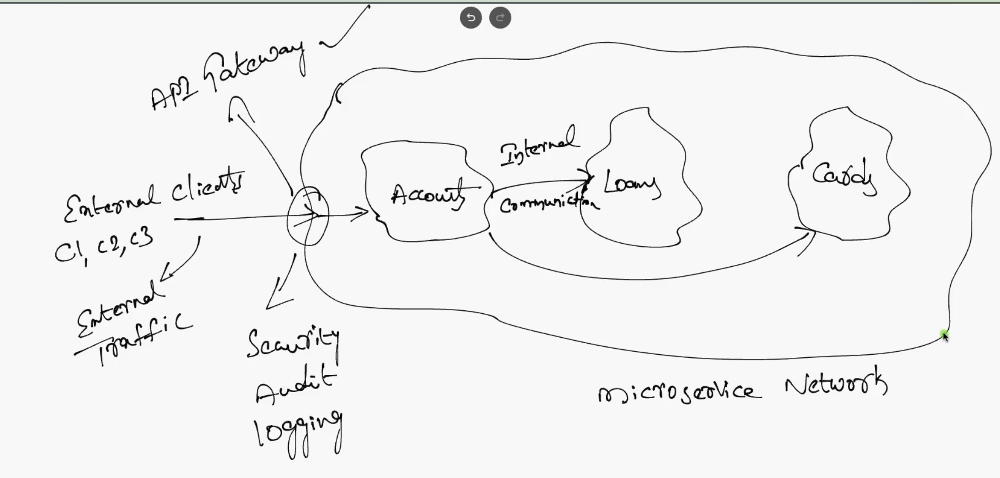

- We need to maintain a single entry point, it will allow us to perform any checks related to security and auditing, logging.

# Service Discovery & Registration in microservices.
1. Service Discovery
   - For cloud native applications, *service discovery* is the perfect solution. It involves tracking and storing information about all running service instances in a *service registry.*
   - Whenever a new instance is created, it should be registered in the registry, and when it is terminated, it should be appropriately removed automatically.
   
   **a.** Client-side service discovery and load balancing:
   - Client-side service discovery, applications are responsible for registering themselves with a service registry during startu and unregistering when shutting down. 
   When an application needs to communicate with a backing service, it queries the service registry for the associated IP address. If multiple instances of the service are available, the registry returns a list of IP addresses.
   The client application then selects one based on its own defined load-balancing strategy.
   - 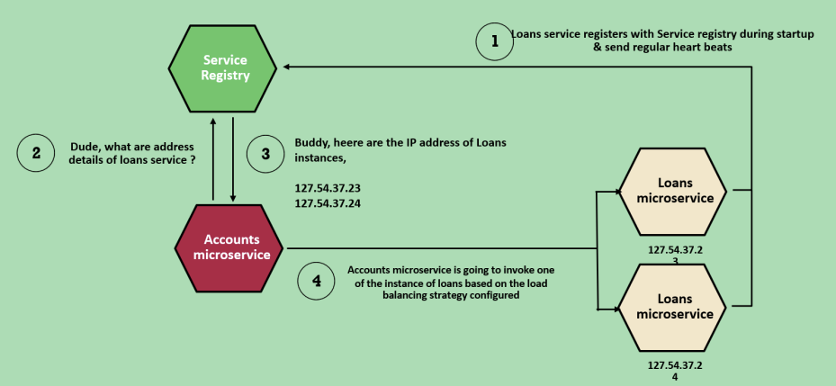
2. Service Registration
3. Load balancing

# Client-side service discovery and load balancing
Client-side service discovery is an architectural pattern where client applications are responsible for locating and connecting to services they depend on.
In this approach, the client application communicates directly with a service registry to discover available service instances and obtain the necessary information to establish connections.

Here are the key aspects of client-side service discovery:
1. Service Registration: Client applications register themselves with the service registry upon startup. They provide essential information about their location, such as IP address, port, and metadata, which helps identify and categorize the service.
2. Service Discovery: When a client application need to communicate with a specific service, it queries the service registry for available instances of that service.The registry responds with the necessary information, such as IP addresses and connection details.
3. Load Balancing: Client-side service discovery often involves load balancing to distribute the workload across multiple service instances. The client application can implement a load-balancing strategy so select a specific instance based on factors like round-robin, weighted distribution, or latency.

The major advantage of client-side service discovery is load balancing can be implemented using various algorithms, such as round-robin, weighted round-robin, lleast connections, or even custom algorithms.
A drawback is that client service discovery assigns more responsibility to developers. Also, it results in one more service to deploy and maintain (the service registry).
Server-side discovery solutions solve these issues.

*The Spring Cloud project provides several alternatives for incorporating client-side service discovery in our Spring Boot based microservices*

# How loadbalancing works in Client-side service discovery ?
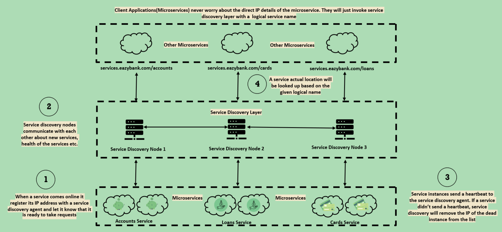
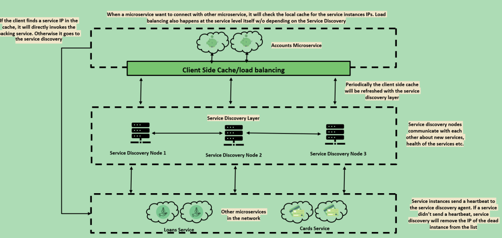

# Spring Cloud support for Client-side service discovery
Spring Cloud porject makes Service Discovery & Registration setup trivial
- Spring Cloud Netflix's Eureka service which will act as a service discovery agent.
- Spring Cloud Load Balancer library for client-side loading balancing.
- Nextflix Feign client to look up for a service b/w microservices.

But apart from these components, we also have other projects inside the industry. For example, instead of Eureka, we can also use other products like Etcd, Consul and Apache Zookeeper.
In some old projects or in some projects where they are using the older verions of Spring Boot you may see they are using Netflix Ribbon for client side load balancing.

# Steps to build Eureka Server
1. Set up a new Spring Boot project. Include the *spring-cloud-starter-netflix-eureka-server* maven dependency.
2. Configure the properties: In the application properties or YAML file, add the following configurations
```yaml
server:
  port: 8070

eureka:
  instance:
    hostname: localhost
  client:
    # Eureka server doesn't fetch the register details of other microservices
    fetchRegistry: false
    # No register Eureka server, and don't expose details into the registry of the service Discovery. Eureka server doesn't register with itself.
    registerWithEureka: false
    serviceUrl:
      # Eureka will expose functionality and other microservices they can try to connect to register their details or to discover other service details.
      defaultZone: http://${eureka.instance.hostname}:${server.port}/eureka/
```
3. Add the Eureka Server annotation: In the main class of your project, annotate it with @EnableEurekaServer. This annotation configures the application to act as a Eureka Server.
4. Build and run the Eureka Server: Build your project and run it as a Spring Boot application. Open a web browser and navigate to http://localhost:8070.


# EUREKA SELF-PRESERVATION TO AVOID TRAPS IN NETWORK

In a distributed system using Eureka, each service instance periodically sends a heartbeat signal to the Eureka server to indicate that it is still alive and functioning.
If the Eureka server does not receiver a heartbeat from a service instance within a certain timeframe, it assumes that the instance has become unresponsive or has crashed.
In normal scenarios, this behavior helps the Eureka server maintain an up-to-date view of t he registered service instances.

However, in certain situations, network glitches or temporary system delays may cause the Eureka server to miss a few heartbeats, leading to false expiration of service instances.
This can result in unnecessary evictions of healthy service instances from the registry, causing instability and disruption in the system.

To mitigate this issue, Eureka enters into *Self-Preservation Mode*. When Self-Preservation mode is active, the existing registry entries will not be removed even if it stops receiving heartbeats from some the service instances.
This prevents the Eureka server from evicting all the instances due to temporary network glitches or delays.

In self-Preservation mode, the Eureka server continues to server the registered instances to client application, even if it suspects that some instances are no longer available. 
This helps maintain the stability and availability of the service registry, ensuring that clients can still discover and interact with the available instances.

Self-Preservation mode never expires, until and unless the down microservices are brought back or the network glitch is resolved. 
This is because eureka will not expire the instances till it is above the threshold limit.

*Eureka Server will not panic when it is not receiving heartbeats from the majority of the instances, instead it will be clam and enters into Self-preservation mode.
This feature is a savior where the networks glitches are common and help us to handle false-positive alarms.*

# Configurations which will directly or indirectly impact self-preservation behavior of eureka.

1. Indicates the frequency the client sends heartbeats to server to indicate that it is still alive:
   - ```eureka.instance.lease-renewal-interval-in-seconds = 30```
2. Indicates the duration the server waits since it received the last heartbeat before it can evict an instance.
   - ```eureka.instance.lease-expiration-duration-in-seconds = 90```
3. A scheduler(EvictionTask) is run at this frequency which will evict instances from the registry if the lease of instances is expired as configured by lease-expiration-duration-in-seconds.
It will also check whether the system has reached self-preservation mode (by comparing actual and expected heartbeats) before evicting.
   - ```eureka.server.eviction-inter val-timer-in-ms = 60 * 1000```
4. This value is used to calculate the expected % of heartbeats per minute eureka expecting.
   - ```eureka.server.renewal-percent-threshold = 0.85```
5. A scheduler is run at this frequency which calculates the expected heartbeats per minute.
   - ```eureka.server.renewal-threshold-update-interval-ms = 15 * 60 * 1000```
6. By default self-preservation mode is enabled but if you need to disable it you can change it to 'false'.
   - ```eureka.server.enable-self-preservation = true``` 

# ROUTING, CROSS CUTTING CONCERNS IN MICROSERVICES.
 
In a scenario where multiple clients directly connect with various services, several challenges arise.
For instance, clients must be aware of the URLs of all the services, and enforcing common requirements such as security, auditing, logging, and routing becomes a repetitive task across all services.
To address these challenges, it becomes necessary to establish a signle gateway as the entrypoint to the microservices network.

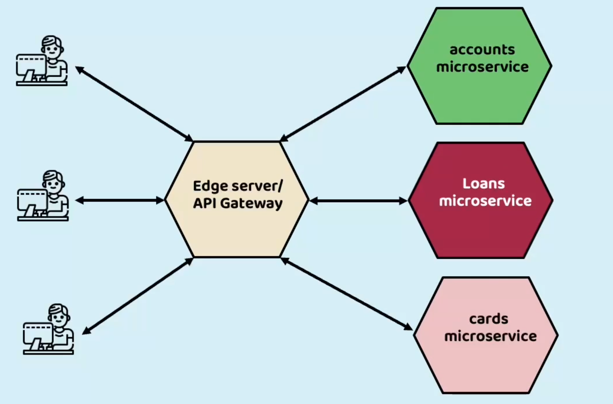

Edge servers are applications positioned at edge of a system, responsible for implementing functionalities such as API gateways, handling cross-cutting concerns.
By using edge servers, it becomes possible to prevent cascading failures when invoking downstream services, allowing for the specification of reties and timeouts for all internal service calls.
Additionally, these servers enable control over ingress traffic, empowering the enforcement of quota policies.
Furthermore, authentication and authorization mechanisms can be implemented at the edge, enabling the passing of tokens to downstream services for secure communication and access control.

### Few important tasks that API gateways does

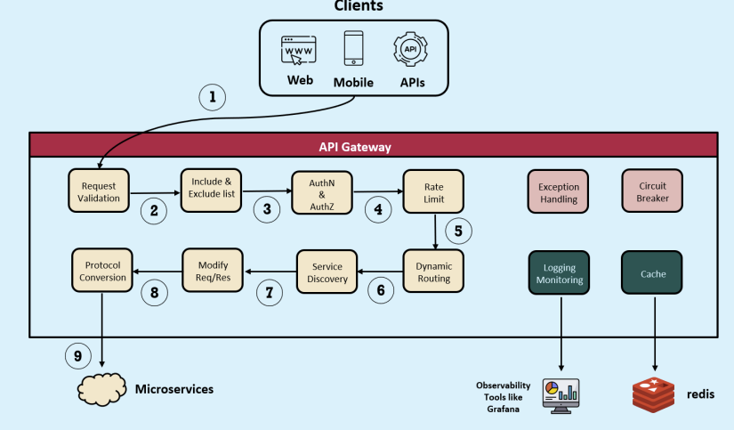

There is no mandatory that you need to implement all these components inside your API gateway.
This is not the full exhaustive list on what the API gateway is capable of.
Apart from these regular positive scenarios, we can also handle negative scenarios like implementing the exception handling, circuit breaker to make our microservices fault-tolerant and resilient.
Apart from these positive and negative scenarios, your API gateway is also capable of sending all the logging and monitoring related information to a tools like Grafana.
If needed, we can also integrate our API gateway with a Redis cache, which means you can write some business logic by leveraging the cache that you can store inside this Redis component. 

# Spring Cloud Gateway

Spring Cloud Gateway streamlines the creation of edge services by emphasizing ease and efficiency.
Moreover, due to its utilization of a reactive framework, it can seamlessly expand to handle significant workload that typically arises in the system's edge while maintaining optimal scalability.

### The key aspects of Spring Cloud Gateway:

- The service gateway sits as the gatekeeper for all inbound traffic to microservice calls within the application. 
With a service gateway in place, the service clients never directly call the URL of an individual service, but instead place all calls to the service gateway.
- Spring Cloud Gateway is a library for building an API gateway, so it looks like any another Spring Boot application. If you're a Spring developer, you'll find it's easy to get started with Spring Cloud Gateway with just a few lines of code.
- Spring Cloud Gate is intended to sit between a requester and a resource that's being requested, where it intercepts, analyzes, and modifies every request. 
That means you can route requests based on their context. Did a request include a header indicating an API version? We can route that request to the appropriately versioned backend.
Does the request require sticky sessions? The gateway can keep track of each user's session.

Spring Cloud Gateway is the preferred API gateway compared to zuul. Because Spring Cloud Gateway built on Spring Reactor & Spring WebFlux, provides a circuit breaker integration, service discovery with Eureka, non-blocking in nature, has a superior performance compared to that of Zuul.

*The service gateway sits between all calls from the client to the individual services & acts as a central Policy Enforcement Point (PEP) like below*
- Routing (Both Static and Dynamic)
- Security (Authentication & Authorization)
- Logging, Auditing and Metrics collection

# Spring Cloud Gateway Internal Architecture

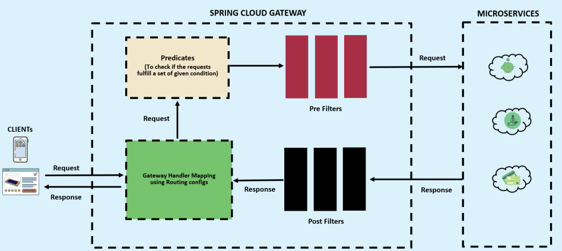

A predicate is a logic that will return a boolean value. You can define some conditions to your spring cloud gateway, saying that if a particular condition is met, then only forward the request to the microservices.

Pre-Filters configured by developers. Inside these Pre-Filter we can execute any business logic like you can do some request validations, you can do some auditing, logging, you can modify the request, you can perform some security checks.

Pass the predicate → pass the Pre-Filters → This request will be forwarded to the actual microservice.

Once my microservice processes the request, it is going to send the response and the response will be intercepted by the post-filters.

# Steps to create Spring Cloud Gateway

1. Set up a new Spring Boot project. Include the *spring-cloud-starter-gateway*, *spring-cloud-starter-config*, *spring-cloud-starter-nextflix-eureka-client* maven dependencies.
2. Configure the properties: in the application properties or YAML file, add the following configurations
    ```yaml
    eureka:
      instance:
        prefer-ip-address: true
        instance-id: ${spring.application.name}:${spring.application.instance_id:${random.value}}
      client:
        registerWithEureka: true
        fetchRegistry: true
        serviceUrl:
          defaultZone: http://localhost:8070/eureka/
    
    spring:
      cloud:
        gateway:
          discovery:
            locator:
              enabled: true
              lowerCaseServiceId: true
    ```
3. Configure the routing config: Make routing configurations using RouteLocatorBuilder like shown below:
    ```java
    @Bean
    public RouteLocator easyBankRouteConfig(RouteLocatorBuilder routeLocatorBuilder){
      return routeLocatorBuilder.routes()
              .route(p -> p
    //						 predicate - path predicate.
                      .path("/easybank/accounts/**")
    //						pre-defined filter
                      .filters(f -> f.rewritePath("/easybank/accounts/(?<remaining>.*)", "/${remaining}")
                              .addResponseHeader("X-Response-Time", LocalDateTime.now().toString()))
    //						forward the request to the actual microservice.
                      .uri("lb://ACCOUNTS"))
              .route(p -> p
                      .path("/easybank/cards/**")
                      .filters(f -> f.rewritePath("/easybank/cards/(?<remaining>.*)", "/${remaining}")
                              .addResponseHeader("X-Response-Time", LocalDateTime.now().toString()))
                      .uri("lb://CARDS"))
              .route(p -> p
                      .path("/easybank/loans/**")
                      .filters(f -> f.rewritePath("/easybank/loans/(?<remaining>.*)", "/${remaining}")
                              .addResponseHeader("X-Response-Time", LocalDateTime.now().toString()))
                      .uri("lb://LOANS"))
              .build();
    }
    ```
4. Build and Run the application

## API Gateway Pattern

Actural part in microservices design, offering a unified entry point for multiple microservices. It acts as a gateway between the external clients (e.g., web apps, mobile apps) and the internal microservices, helping streamline communication, security and routing.
This pattern is essential when managing the complexities of microservice-based applications.

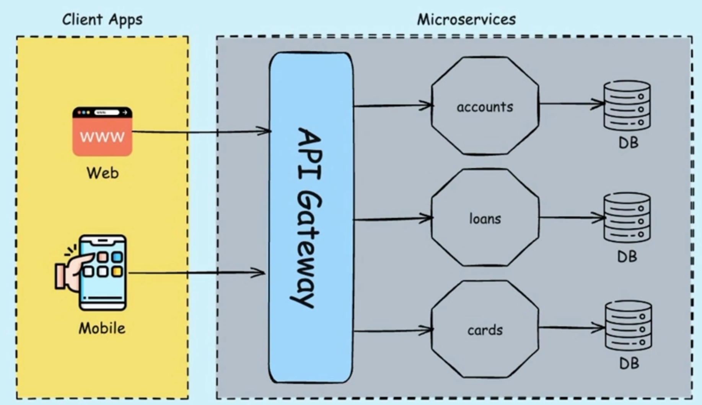

## Gateway Routing pattern

The Gateway Routing pattern is a design pattern used in microservices architectures where an API Gateway routes incoming client requests to the appropriate backend microservices based on various factors like URL, headers or request parameters.

## Gateway offloading Pattern

The Gateway Offloading Pattern is an architectural pattern used in microservices to offload certain cross-cutting concerns-such as security, caching, rate limiting and monitoring from individual microservices to the API Gateway.
This pattern helps centralize and simplify the implementation of these concerns, allowing the microservices to focus solely on business logic.

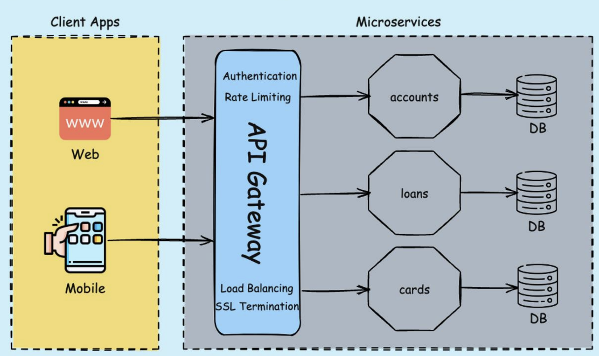

The Edge server is offloading the cross-cutting concerns from the individual microservices.

We can't offload the business logic of accounts to the gateway because it will defeat the whole purpose of microservices.
Only the cross-cutting-concerns will be offloading.

## Backend for Frontend (BFF) Pattern

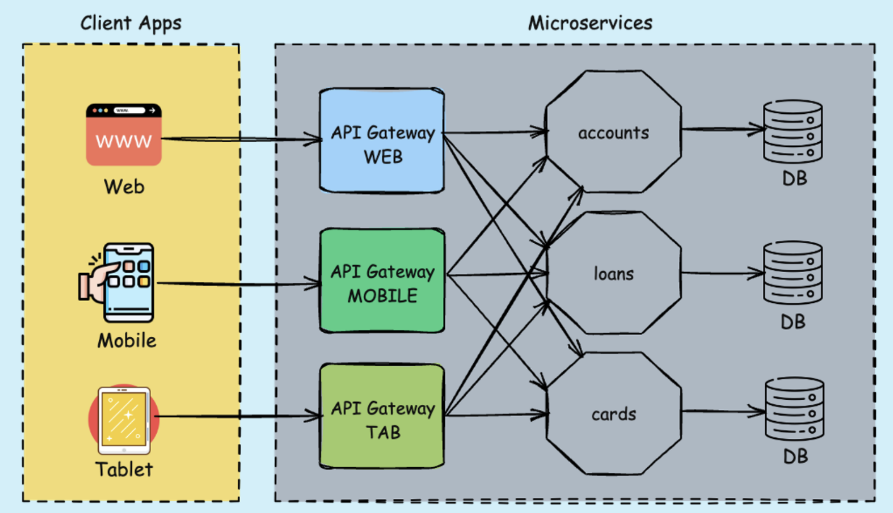

The Backend for Frontend (BFF) Pattern is a design pattern used in microservices architectures where a separate backend service is created for each client (e.g., web, mobile, tablet). Each frontend(client) has its own specialized backend to optimize communication between the frontend and the microservices, providing a tailored experience for different clients.

Example:
- The Web has a lot of space for displaying content, so the response for web will be details.
- The Mobile and Tablet have a smaller space for displaying content, so the response for mobile will be summary.

## Gateway Aggregator/Composition pattern

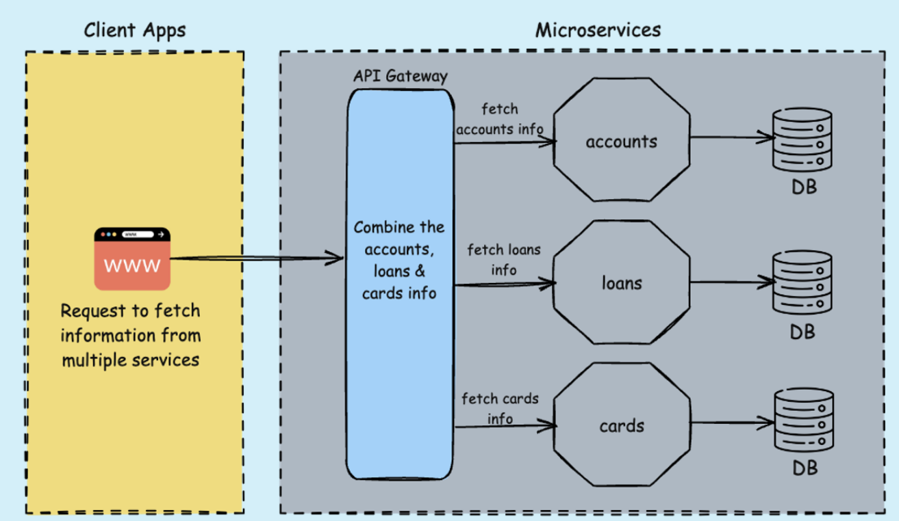

In microservices architecture, a Gateway Aggregator or Gateway Composition pattern is used when a request from a client needs to retrieve or process data from multiple backend microservices. 
Instead of having the client make multiple calls to various microservices, the API Gateway consolidates the requests into a single response.

# RESILIENCY IN MICROSERVICES

1. How do we avoid cascading failures?
   - One failed or slow service should not have a ripple effect on the other microservices. Like in the scenarios of multiple microservices are communicating, we need to make sure that the entire chain of microservices doesn't fail with the failure of a single microservice.
2. How do we handle failures gracefully with fallbacks?
   - In a chain of multiple microservices, how do we build a fallback mechanism if one of the microservices is not working. Like returning a default value or return values from cache or call another service/DB to fetch the results etc.
3. How to make our services self-healing capable?
   - In the case of slow performing services, how do we we configure timeouts, retries and give time for a failed services to recover itself.

*Solution:*
- Long back inside the Java ecosystem, we used to have a library called Hystrix. This is a library developed by Netflix team itself.
It used to be widely used for implementing resiliency patterns inside any web application or inside microservices. 
However, Hystrix entered maintenance mode in 2018 and is no longer beging actively developed.


- To address this, Resilience4J provides a lot of resilient related patterns which we can choose to base upon our requirements.
  - There are the patterns with the name like :
    - circuit breaker: used to stop making requests when a service invoked is falling.
    - fallback: alternative paths to failing requests
    - retry: used to make retries when a service has temporarily failed.
    - rate limit: Limits the number of calls that a service receives in a time.
    - bulkhead: limits the number of outgoing concurrent requests to a service to avoid overloading.

# CIRCUIT BREAKER PATTERN
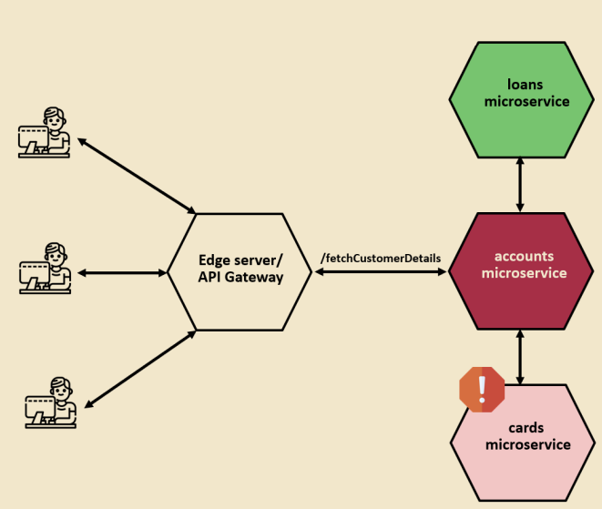

When a microservice responds slowly or fails to function, it can lead to the depletion of resource threads on the Edge server and intermediate services.
This has a negative impact on the overall performance of the microservice network.
→ To handle this kind of scenario, we can use the Circuit Breaker pattern.

The advantages with circuit breaker pattern are:
- Fail fast
- Fail gracefully
- Recover seamlessly.

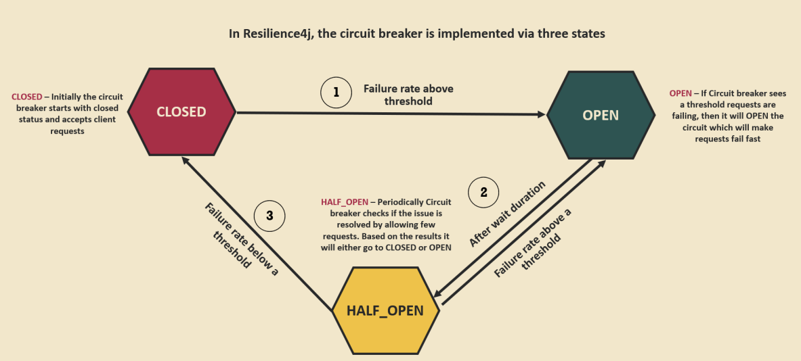


Whenever we activate the circuit breaker pattern on any microservice, it is going to control the flow of traffic towards the microservice by using three different states.
- Closed: Initially, when the application starts by default, your circuit breaker will be in this closed state.
Inside this closed status, it is going to accept all the requests coming towards your particular microservice.
- Open: If the Circuit breaker sees a threshold requests are failing, then it will OPEN the circuit which will make requests fail fast.
- Half open: After wait duration (depending on the circuit breaker configuration) the open circuit will be half-opened. Periodically the Circuit breaker checks if the issue is resolved by allowing few requests. 
Based on the results, it will either go to CLOSED or OPEN status. Failure rate above a threshold goes to OPEN. The Failure rate below the threshold goes to CLOSED.

*Some URL*: 
- See analytics about all the circuit breakers: http://192.168.149.1:8072/actuator/circuitbreakers
  - ```json
    {
      "circuitBreakers": {
        "accountsCircuitBreaker": {
        "failureRate": "-1.0%",
        "slowCallRate": "-1.0%",
        "failureRateThreshold": "50.0%",
        "slowCallRateThreshold": "100.0%",
        "bufferedCalls": 3,
        "failedCalls": 0,
        "slowCalls": 0,
        "slowFailedCalls": 0,
        "notPermittedCalls": 0,
        "state": "CLOSED"
        }
      }
    }
    ``` 
    - bufferedCalls: the number of calls to the perspective circuit breaker.

- See logs about the respective circuit breaker: http://localhost:8072/actuator/circuitbreakerevents?name=accountsCircuitBreaker

### *NOTE* :
The steps to build a circuit breaker pattern using Spring Cloud Gateway Filter:

1. Add maven dependency: add spring-cloud-starter-circuitbreaker-reactor-resilience4j maven dependency inside pom.xml.
2. Add circuit breaker filter: Inside the method where we are creating a bean of RouteLocator, add a filter of circuit breaker like below and create a REST API handling the fallback uri /contactSupport
   ```java
       @Bean
           public RouteLocator easyBankRouteConfig(RouteLocatorBuilder routeLocatorBuilder) {
           return routeLocatorBuilder.routes()
                   .route(p -> p
       //						 predicate - path predicate.
                           .path("/easybank/accounts/**")
       //						pre-defined filter
                           .filters(f -> f.rewritePath("/easybank/accounts/(?<remaining>.*)", "/${remaining}")
                                   .addResponseHeader("X-Response-Time", LocalDateTime.now().toString())
                                   .circuitBreaker(config -> config.setName("accountsCircuitBreaker")
       //										Whenever there is an exception happens, please invoke this fallback by forwarding the request to the contact support.
                                           .setFallbackUri("forward:/contactSupport")))
       //						forward the request to the actual microservice.
                           .uri("lb://ACCOUNTS")).build();
       }
       
        @RequestMapping("/contactSupport")
        public Mono<String> contactSupport(){
            return Mono.just("An error occurred. Please try after some time or contact support team!!!");
        }
    ```

3. Add properties:
  ```yaml
  resilience4j.circuitbreaker:
    configs:
      #    By using the default, that means these properties are applicable to all kinds of circuit breakers that you are going to create inside the microservices.
      #    replace the CircuitBreaker name which is defined the circuitBreaker ... setName("accountsCircuitBreaker")
      default:
        #      how many requests it has to initially monitor before it tries to change the status from close to open. In other words, at least 10 requests coming towards the accounts microservice.
        #      after monitoring 10 requests, you can take the decision whether to continue with the close status or to move to the open status.
        slidingWindowSize: 10
        #     The number of requests that are allowed in the half-open state. Based upon how these two requests are processed, it can decide whether to go back to the open state or move to the closed state.
        permittedNumberOfCallsInHalfOpenState: 2
        #      if at least 50% of my requests are failed, then my circuit breaker pattern can move to the open state from the close state
        failureRateThreshold: 50
        #      The circuit breaker pattern going to wait 10 seconds (block all requests) to the microservice and response immediately. After 10 seconds, it will try to move to the half-open state from the open state.
        waitDurationInOpenState: 10000
  ```

The steps to build a circuit breaker pattern using normal Spring Boot serivce (AccountsMicroservice):

1. Add maven dependency: add spring-cloud-starter-circuitbreaker-resilience4j maven dependency inside pom.xml.
2. Add circuit breaker related changes in Feign Client interfaces like shown below:
```java
@FeignClient(name = "cards", fallback = CardsFallback.class)
public interface CardsFeignClient {
    // Omitted code
}

@Component
public class CardsFallback implements CardsFeignClient {
  /**
   * can choose whatever name inside this FeignClient interface, but please make sure the method signature like input parameters,
   * return parameters along with the method access type should be same as what we have defined inside the actual microservice.
   *
   * @param correlationId
   * @param mobileNumber
   * @return
   */
  @Override
  public ResponseEntity<CardsDto> fetchCardDetailsCustom(String correlationId, String mobileNumber) {
    return null;
  }
}

```

3. Add properties: 
```yaml
spring:
  cloud:
    openfeign:
      circuitbreaker:
        enabled: true
resilience4j.circuitbreaker:
  configs:
    default:
      slidingWindowSize: 5
      permittedNumberOfCallsInHalfOpenState: 2
      failureRateThreshold: 50
      waitDurationInOpenState: 10000
```

# RETRY PATTERN

The retry pattern will make configured multiple retry attempts when a service has temporarily failed. 
This pattern is very helpful in the scanarios like network disruption where the client request may be successful after a retry attempt.

- Retry Logic: Determine when and how many times to retry an operation. This can be based on factors such as error codes, exceptions, response status.
- Backoff strategy: Define a strategy for delaying retries to avoid overwhelming the system or exacerbating the underlying issue.
This strategy can involve gradually increasing the delay between each retry, known as exponential backoff.
- Circuit Breaker Integration: Consider combining the Retry pattern with a Circuit Breaker pattern. If a certain number of retries fail consecutively,
the Circuit can be opened to prevent further attempts and preserve system resources
- Idempotent Operations: Ensure that the retried operation is idempotent, meaning it produces the same result regardless of how may time it is invoked. 
This prevents unintended side effects or duplicate operations. (API of type idempotent) 

## The steps to build a retry pattern using Spring Cloud Gateway Filter

1. Add Retry Filter: Inside the method where we are creating a bean of RouteLocator, add a filter of retry

```java
@Bean
public RouteLocator easyBankRouteConfig(RouteLocatorBuilder routeLocatorBuilder) {
    return routeLocatorBuilder.routes()
            .route(p -> p
//						 predicate - path predicate.
                    .path("/easybank/loans/**")
//						pre-defined filter
                    .filters(f -> f.rewritePath("/easybank/loans/(?<remaining>.*)", "/${remaining}")
                                    .addResponseHeader("X-Response-Time", LocalDateTime.now().toString())
                                    .retry(retryConfig ->
//									the number of retries
                                                    retryConfig.setRetries(3)
//											only retries for get operation, because won't be any side effects whenever we are trying to invoke the get operation multiple times.
                                                            .setMethods(HttpMethod.GET)
//											spring cloud gateway will wait for 100 milliseconds whenever it is trying to initiate the very first retry operation.
//											based factor, but it will not be higher than 1000 milliseconds
//											spring cloud gateway will apply the factor value on the previous backoff number to calculate the next backoff time but not higher than 1000 milliseconds
                                                            .setBackoff(Duration.ofMillis(100), Duration.ofMillis(1000), 2, true)
                                    )
                    )
                    .uri("lb://ACCOUNTS")).build();
}
```

## Retry pattern in a microservice:
- We can config a fallback mechanism to a Retry pattern in a microservice, which can't be done in a gateway microservice. This is the limitation of Spring Cloud Gateway.
- In Gateway, it considers the very initial request not under the retry attempts. However, in microservice, it considers the very initial request under the retry attempts.
So when we config 3 retries in gateway, it will be four retries. With microservice, it will be three retries.

Steps to build a retry pattern using normal Spring Boot serivce:

1. Add Retry pattern annotation: Choose a method and mention retry pattern related annotation along with the below configs. Post that create a fallback method maching the same method signature.

```java
    @GetMapping("/build-info")
    public ResponseEntity<String> getBuildInfo() throws TimeoutException {
        logger.debug("getBuildInfo() method called");
        return ResponseEntity.status(HttpStatus.OK).body(buildVersion);
    }

//    this method will be called when already finished retry getBuildInfo.
    public ResponseEntity<String>  getBuildInfoFallback(Throwable throwable){
        logger.debug("getBuildInfoFallback() method called");
        return ResponseEntity.status(HttpStatus.OK).body("0.9");
    }
```

2. Add properties: 
```yaml
resilience4j:
  retry:
    configs:
      default:
#        try to retry 3 times before go to the callback method.
        max-attempts: 3
        wait-duration: 1000
        enable-exponential-backoff: true
#       backoff factor
        exponential-backoff-multiplier: 2
#        don't retry the request, it throws the below exceptions.
#        but it still runs the callback method.
#        ignore-exceptions:
#          - java.lang.NullPointerException
#        the retry will happen only for these kinds of exceptions, all the remaining exceptions will be ignored by the resilience4j. Don't have to mention ignore-exceptions above.
        retry-exceptions:
          - java.util.concurrent.TimeoutException
```

# RATE LIMITER PATTERN

The Rate Limiter pattern in microservices is a design pattern that helps control and limit the rate of incoming request to a service or API.
It is used to prevent abuse, protect system resources, and ensure fair usage of the service.

If we configure this rate limiter pattern inside our microservices, it is simply going to return a 429 HTTP status code, which is too many requests and it can't accept more requests from the client.
This will indicates to clients that they can try to invoke the service after few seconds or minutes.

We can enforce this limitation based upon like:
- Limit the request based upon the session.
- Limit the request based upon an IP address.
- Limit the request based upon the logged user.
- Limit the request based upon the tenant.
- Limit the request based upon a server.
- Additionally, we can also use this rate limiter pattern to provide services to users based upon their subscription tiers (basic user, premier user, enterprise user).

### The Redis RateLimiter

- replenishRate: This property defines how many requests per second to allow. This is the rate at which the token backed is filled.
  - if you define 100, that means for every one second behind the scenes, 100 tokens will be added to your bucket.
  - every bucket is assigned to a user or any other criteria based upon how you have defined KeyResolver.

-  burstCapacity: This property is the maximum number of requests a user is allowed in a single second. This is the number of tokens the token bucket can hold. Setting this value to zero blocks all requests.

- requestedToken: This property is how many tokens a request costs. This is the number of tokens taken from the bucket for each request and defaults to 1.

```cmd
docker run -p 6379:6379 --name easyredis -d redis
```

- install Apache HTTP server benchmarking tool

send 10 requests will be sent.
send 2 concurrent requests every time.
-v indicates verbose. Value 3 indicates to print the detailed report in the output
```cmd
ab -n 10 -c 2 -v 3 http://localhost:8072/easybank/cards/api/contact-info
``` 


# IMPLEMENTING RATELIMITER PATTERN IN ACCOUNTS

- We Want a particular low priority API to process lower number of requests, so other high priority APIs they can process without any issues.


# BULKHEAD PATTERN

The Bulkhead pattern is a design pattern that aims to improve the resilience and isolation of components or services within a system.
It draws inspiration from the concept of bulkheads in ships, which are physical partitions that prevent the flooding of one compartment from affecting others, enhancing the overall stability and safety of the vessel.

In the context of software systems, the Bulkhead pattern is used to isolate and limit the impact of failures or high loads in a component from spearing to other components.
It helps ensure that a failure or heavy load in one part of the system does not bring down the entire system, enabling other components to continue functioning independently.

Bulkhead Pattern helps us to allocate limit the resources which can be used for specific services. So that resource exhaustion can be reduced.

The Bulkhead pattern is particularly useful in systems that require high availability, fault tolerance, and isolation between components.
By compartmentalizing components and enforcing resource boundaries, the Bulkhead pattern enhances the resilience and stability of the system, ensuring that failures or heavy loads in one area do not bring down the entire system.


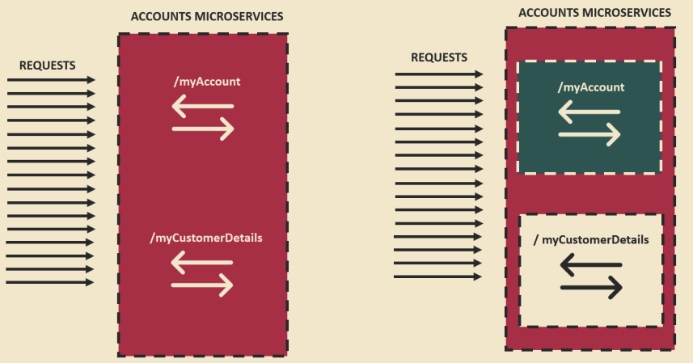

- Without Bulkhead, /myCustomerDetails will start eating all the threads, resources avaiable which will effect the performance of /myAccount
- With Bulkhead, /myCustomerDetails and /myAccount will have their own resources, threads pool defined.

# Aspect Order of Resilience patterns:

The Resilience4j Aspects order is following:
- Retry ( CircuitBreaer (RateLimiter (TimeLimiter (Bulkhead (Function)))))

But we can change this default order.

```text
- resilience4j.retry.retryAspectOrder
- resilience4j.circuitbreaker.circuitBreakerAspectOrder
- resilience4j.ratelimiter.lateLimiterAspectOrder
- resilience4j.timelimiter.timeLimiterAspectOrder
- resilience4j.bulkhead.bulkheadAspectOrder
```

```yaml
resilience4j:
  circuitbreaker:
    circuitBreakerAspectOrder: 1
  retry:
    retryAspectOrder: 2
  ratelimiter:
    rateLimiterAspectOrder: 3
```

# OBSERVABILITY AND MONITORING OF MICROSERVICES

## DEBUGGING A PROBLEM IN MICROSERVICES?

## MONITORING PERFORMANCE OF SERVICE CALLS?

## MONITORING SERVICES METRICS & HEALTH?

### WHAT IS OBSERVABILITY?

Observability is the ability to understand the internal state of a system by observing its outputs. 
In the context of microservices, observability is achieved by collecting and analyzing data from a variety of sources, such as metrics, logs, and traces.

The three pillars of observability are:

- Metrics: Metrics are quantitative measurements of the health of a system. They can be used to track things like CPU, memory usage, and response times.

- Logs: Logs are a record of events that occur inside a system. They can be used to track things like errors, exceptions or other unexpected events.

- Traces: Traces are a record of the path that a request takes through a system. They can be used to track the performance of a request to identify.

### WHAT IS MONITORING?

Monitoring in microservices involves checking the telemetry data available for the application and defining alerts for known failure states.
This process collects and analyzes data a system to identify and troubleshoot problems, as well as track the health of individual microservices and the overall health of the microservices network.

Monitoring in microservices is important because it allows you to:

- Identify and troubleshoot problems: By collecting and analyzing data from your microservices, you can identify problems before they cause outages or other disruptions.
- Track the health of your microservices: Monitoring can help you to track the health of your microservices, so you can identify any microservices that are underperforming or that are experiencing problems.
- Optimize your microservices: By monitoring your microservices, you can identify areas where you can optimize your microservices to improve performance and reliability.


In other words, monitoring is about collecting data and observability is about understanding data.

Monitory is reacting to problems while observability is fixing them in real time.

#### Logging

Logs are discrete records of events that happen in software applications over time. They contain a timestamp that indicates when the event happened, as well as information about the event and its context.
This information can be used to answer questions like "What happened at this time?", which thread of processing the event?, or "which user/tenant was in the context?".

Logs are essential tools for troubleshooting and debugging tasks. They can be used to reconstruct what happened at a specific point in time in a single application instance.
Logs are typically categorized according to the type or severity of the event, such as trace, debug, info, warn, and error. 
This allows us to log only the most severe events in production, while still giving us the chance to change the log level temporarily during debugging.

#### Managing Logs wih Grafana, Loki & Promta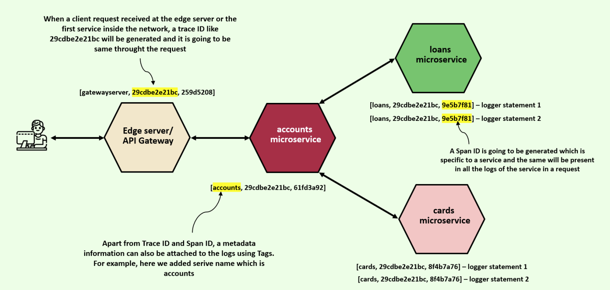il

Grafana is an open-source analytics and interactive visualization web application. It provides charts, graphs, and alerts for the web when connected to supported data sources.
It can be easily installed using Docker and Docker Compose.

Grafana is a popular tool for visualizing metrics, logs, and traces from a variety of sources. It is used by organizations of all sizes to monitor their applications and infrastructure.

Grafana Loki is a horizontally scalable, highly available, and cost-effective log aggregation system. It is designed to be easy to use and to scale to meet the needs of even the most demanding applications.

Promtail is a lightweight log agent that ships logs from your containers to Grafana Loki. It is easy to configure and can be used to collect logs from a wide variety of sources.

Together, Grafana Loki and Promtail provide a powerful logging solution that can help you to understand and troubleshoot your applications.

Grafana provides visualization of the log lines captured within Loki.

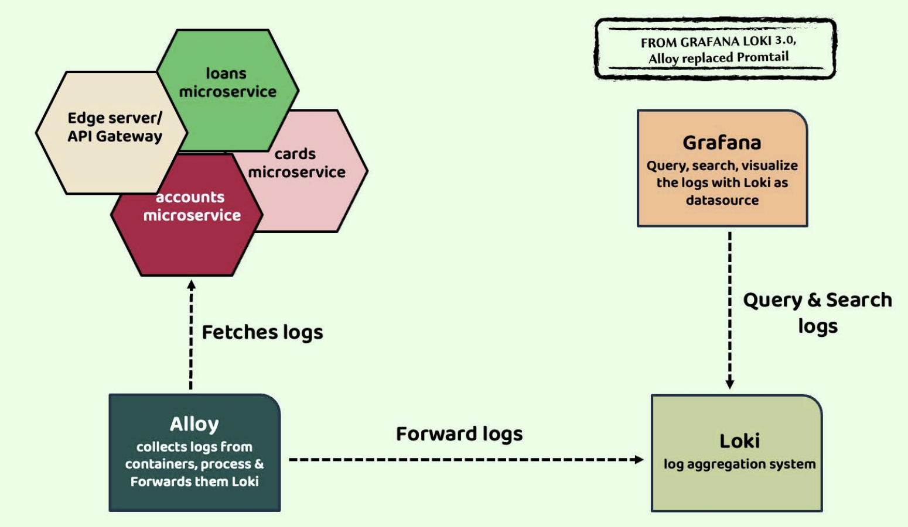

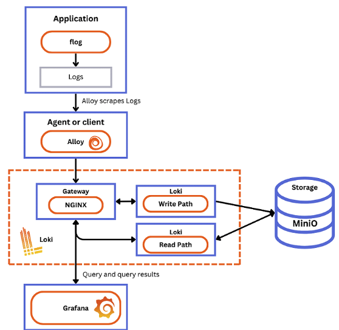

#### METRICS & MONITORING WITH SPRING BOOT ACTUATOR, MICROMETER, PROMETHEUS & GRAFANA

1. Actuator is mainly used to expose operational information about the running application— health, metrics, info, dump, env, etc. It uses HTTP endpoints or JMX beans to enable us to interact with it.
2. Micrometer automatically exposes /actuator/metrics data into something your monitoring system can understand. All you need to do is include that vendor-specific micrometer dependency in your application.
3. The most common format for exporting metrics is the one used by Prometheus, which is "an open-source systems monitoring and alerting toolkit." Just as Loki aggregates and stores event logs, Prometheus does the same with metrics.
4. Grafana is a visualization tool that can be used to create dashboards and charts from Prometheus data.


### Distributed tracing in microservices


- Format pattern: Metadata Information, Trace id, Span id

1. OpenTelemetry:
Using OpenTelemetry, generate traces and spans automatically. 
OpenTelemetry is also known as Otel for short, is a vendor-neutral open-source.
Observability framework for instrumenting, generating, collecting, and exporting telemetry data such as traces, metrics, and logs.

2. Tempo:
Index the tracing information using Grafana Tempo.
Tempo is an open-source, highly scalable, and cost-effective distributed tracing backend designed for observability in cloud-native environments.
It is a part of the Grafana observability stack and provides a dedicated solution for efficient storage, retrieval, and analysis of trace data.

3. Grafana:
Using Grafana, we can connect to Tempo as a datasource and see the distributed tracing in action with the help of visuals.
We can integrate Loki and Tempo as well, so that we can jump to tracing details directly from logs inside Loki.

*Two approaches to link Loki to Tempo (with TractID)*
1. Regex Derived fields(create a link from values in Loki to Tempo)
    \[.+,(.+),.+\]
    
    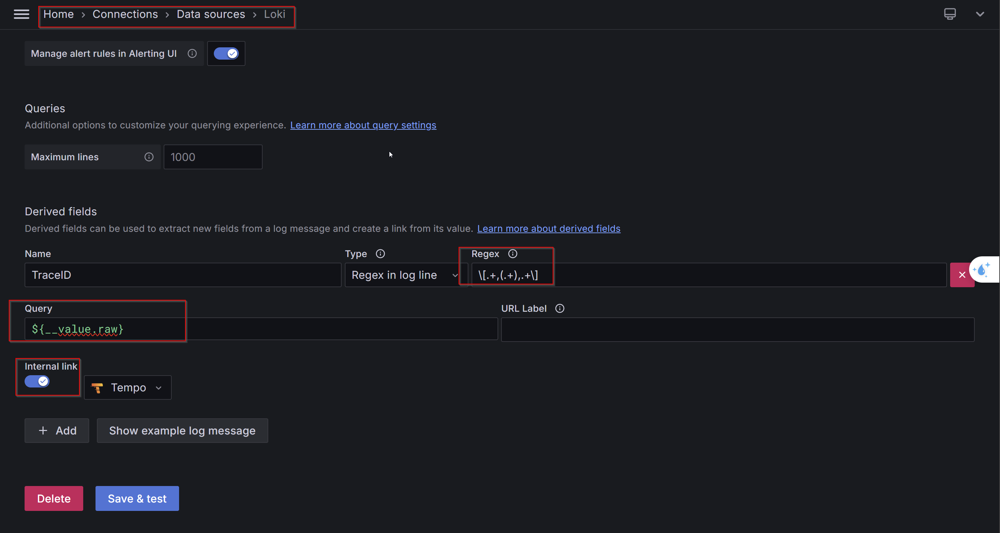

2. 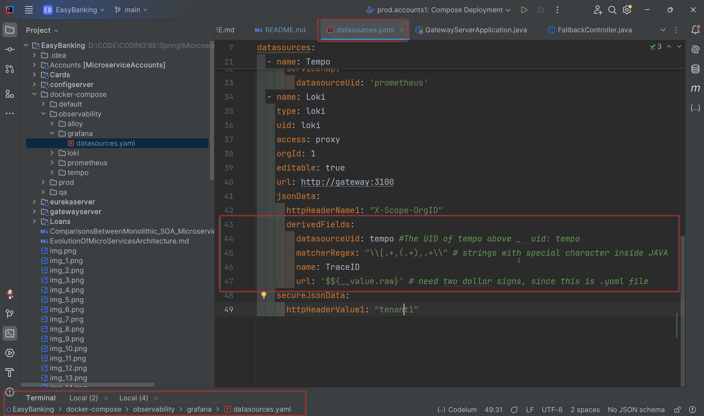


# MICROSERVICES SECURITY

- Using OAuth2/OpenID Connect, KeyCloak (IAM), Spring Security

Oauth2 is a security standard or a security specification that any organization can follow to secure their web applications, mobile applications, or microservices regardless of what is type of application that an organization develops,
they can leverage these Oauth2 specifications to secure their applications.

## PROBLEM THAT OAUTH2 SOLVES

2 problems that OAuth2 solves:

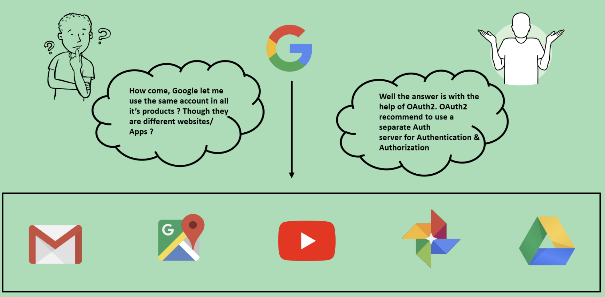

- Temporary access tokens like login Stack Overflow by the GitHub approach.

## INTRODUCTION TO OAUTH2

OAuth stands for Open Authorization. It's a free and open protocol, built on IETF standards and licenses from the Open Web Foundation.
OAuth 2.1 is a security standard where you give one application permission to access your data in another application.
The steps to grant permission, or consent, are often referred to as authorization or even delegated authorization.
You authorize one application to access your data, or use features in another application on your behalf, without giving them your password.

- Supports all kinds of Apps: oAuth2 supports multiple use cases addressing different device capabilities. It supports server-to-server apps, browser-based apps, mobile/native apps, IoT devices and consoles/TVs.
It has various authorization grant flows like Authorization Code grant, Client Credentials Grant Type etc. to support all kinds of apps communication.

- Separation Of Auth logic: Inside OAuth2, we have an Authorization Server which receives requests from the Client for Access Tokens and issues them upon successful authentication. 
This enables us to maintain all the security logic in a single place. Regardless of how many applications an organization has, they all can connect to Auth server to perform login operation.
All user credentials & client application credentials will be maintained in a single location which is inside Auth Server.

- No need to share Credentials: If you plan to allow a third-party application and services to access your resources, then there is no need to share your credentials.
In many ways, you can think of the OAth2 token as a "access card" at any office/hotel. These tokens provides limited access to someone, without handing over full control in the form of the master key.

# OAUTH2 TERMINOLOGY

- Resource Owner - It is you the end user. In the scanario of Stackoverflow, the end user who want to use the GitHub services to get his details.
In other words, the end user owns the resources (email, profile), that's why we call him as Resource owner.

- Client-The website, mobile app or API will be the client as it is the one which interacts with GitHub services on behalf of the source owner/end user.
In the scenario of Stackoverflow, the Stackoverflow website is Client.

- Authorization Server—This is the server that knows about resource owner. In other words, resource owner should have an account in this server.
In this scanrio of Stackoverflow, the GitHub server which has authorization logic acts as Authorization server.

- Resource Server - This is the server where the resources that client wants to consume are hosted.
In the scanrio of Stackoverflow, the resources like User Email, Profile details are hosted inside Github server. So it will act as a resource server.

- Scopes - These are the granular permissions the Client wants, such as access to data or to perform certain actions.
THe Auth server can issue an access token to client with the scope of Email, READ...

### WHAT IS OPENID CONNECT 

OpenID Connect is a protocol that sít on top of the OAuth 2.0 framework.
While OAuth 2.0 provides authorization via an access token containing scopes, OpenID Connect provides authentication by introducing a new ID token which contains a new set of information and claims specifically for identity.
With the ID token, OpenID Connect brings standards around sharing sharing identify details among the applications.

The OpenID Connect flow looks the same as OAuth. The only differences are, in the initial request, a spcific scope of *openid* is used, and in the final exchange the client receives both an Access Token and an ID Token.

### Why is OpenID Connect important?

- Identify is the key to any application. At the core of modern authorization is OAuth 2.0, but OAuth 2.0 lacks an authentication component. Implementing OpenID Connect on top of OAuth 2.0 completes an IAM (Idendity & Access Management) strategy.
- As more and more applications need to connect with each other and more identities are being populated on the internet, the demand to be able to share these identities is also increased. With OpenID connect, application can share the identities easily and standard way.

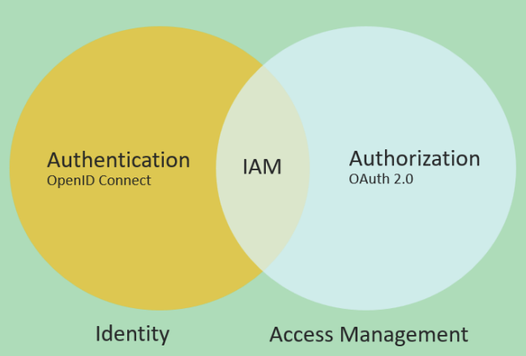

OpenID Connect add below details to OAuth 2.0:
1. OIDC standardizes the scopes to openid, profile, email, and address
2. ID Token using JWT standard.
3. OIDC exposes the standardized "/userinfo" endpoint.

- Products built based upon the OpenID and OAuth2 standards.
  - Free: Keycloak
  - Commercial: Okta, Amazon Cognito (AWS), FusionAuth, ForgeRock

To build your own authorization server, recently Spring team also developed a new project with the name Spring Authorization.

# Client Credentials Grant Type Flow In OAuth2.

1. Client to Auth Server: I want to access protected resources. Here are my credentials. No user involved in this. There is no UI application involved.
    - Where client is making a request to Auth Server endpoint, have to send the below important details:
      - client_id & client_secret: the credentials of the client to authenticate itself.
      - scope: similar to authorities. Specifies level of access that client is requesting like EMAIL, PROFILE...
      - grant_type: with the value 'client_credentials' which indicates that we want to follow a client credentials grant type.
        - This is the most simplest grant type flow in OAuth2.
        - We use this authentication flow only if there is no user and UI involved. Like in the scenarios where 2 different applications want to share data between them using backend APIs.

2. Auth Server to Client: Hey Client, The credentials provided are correct. Here is the ACCESS TOKEN to access the protected resources.
3. Client to Resource Server: Hey Resource Server, I want to access a protected resources. Here is the access token issued by Auth server
4. Resource Server to Client: Hey Client, Your token is validated successfully. Here are the resources you requested

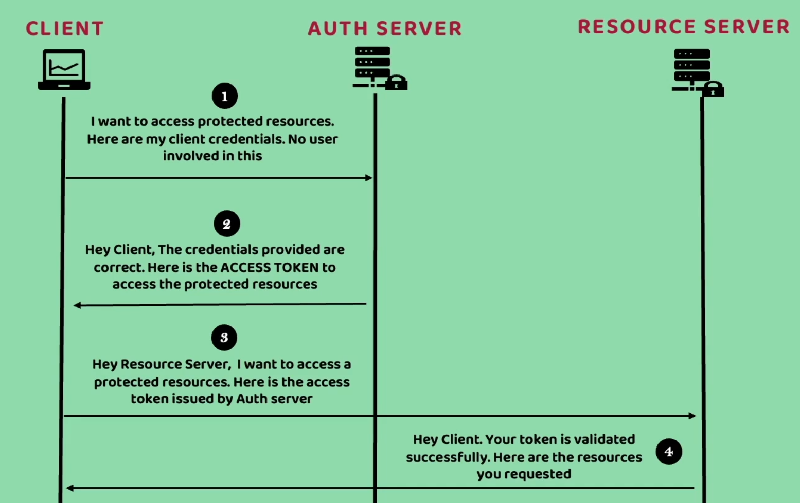

# SECURING GATEWAY USING CLIENT CREDENTIALS GRANT TYPE FLOW IN OAUTH2

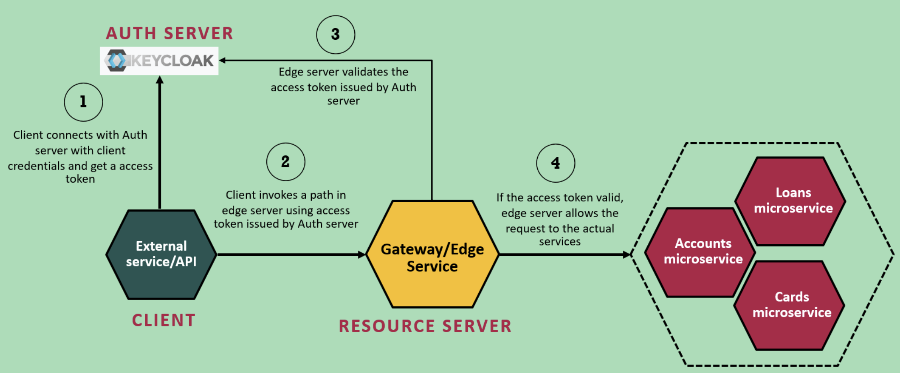

Unsecured services deployed behind the docker network or Kubernetes firewall network. So can't be accessed directly.

*Note:* When ever an external system trying to communicate with Spring Cloud Gateway where there is no end user involved, then we need to use the OAuth2 Client Credentials grant flow for Authentication & Authorization.


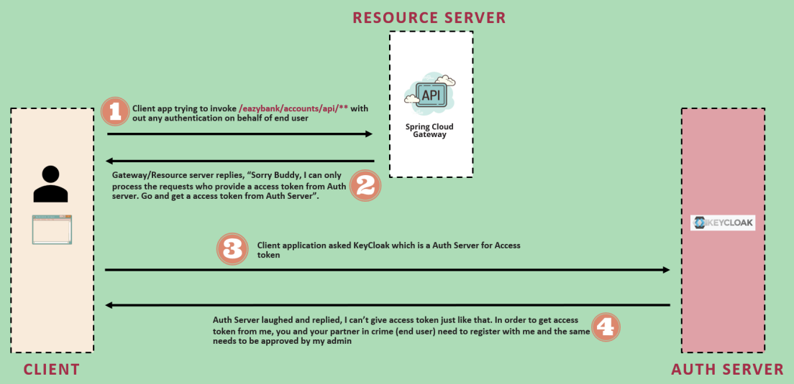

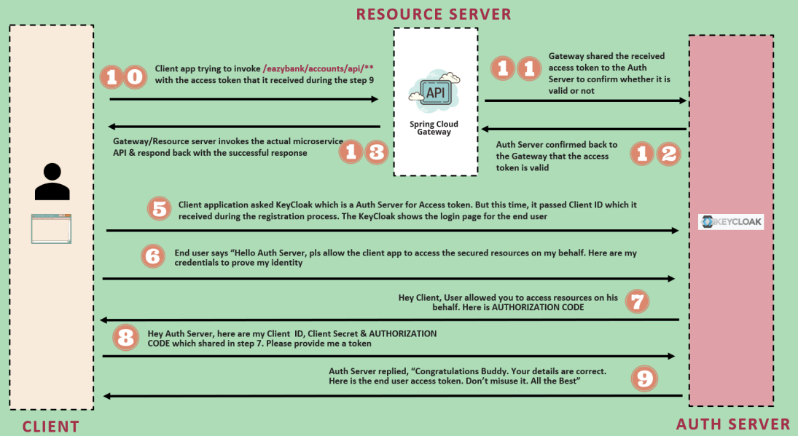

Official Documentation: https://www.keycloak.org/

```terminal
docker run -d -p 7080:8080 -e KC_BOOTSTRAP_ADMIN_USERNAME=admin -e KC_BOOTSTRAP_ADMIN_PASSWORD=admin quay.io/keycloak/keycloak:26.0.8 start-dev
```
d : detached mode
e : environment variable
KC_BOOTSTRAP_ADMIN_USERNAME: the username that we want to set for our keycloak auth server
KC_BOOTSTRAP_ADMIN_PASSWORD: the password that we want to set for our keycloak auth server
quay.io/keycloak/keycloak:26.0.8: the docker image name
start-dev: run the keycloak in dev mode

with dev mode, the keycloack is going to have some internal database using that we can store all the user credentials and the client credentials.
But in production environments, we should have some dedicated database configured for their keycloak auth server.

Realm in KEYCLOAK:
- You can create multiple realms in Keycloak like dev, qa, prod...
- We can't force our team qa to use the same credentials like we have inside the production. That's why we create multiple realms.

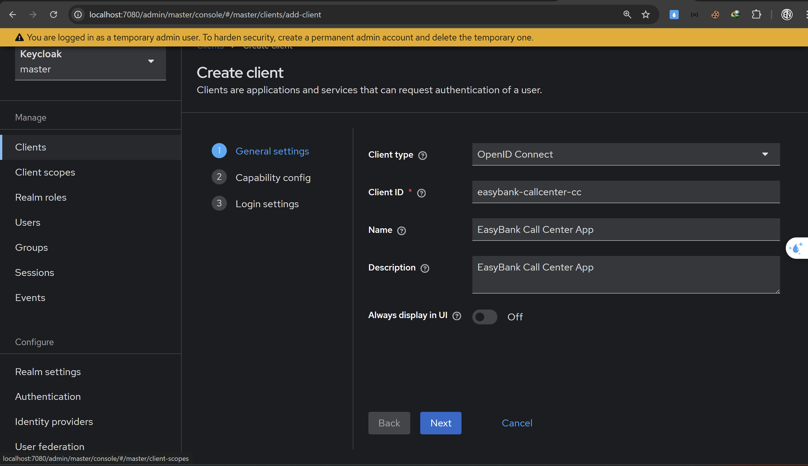

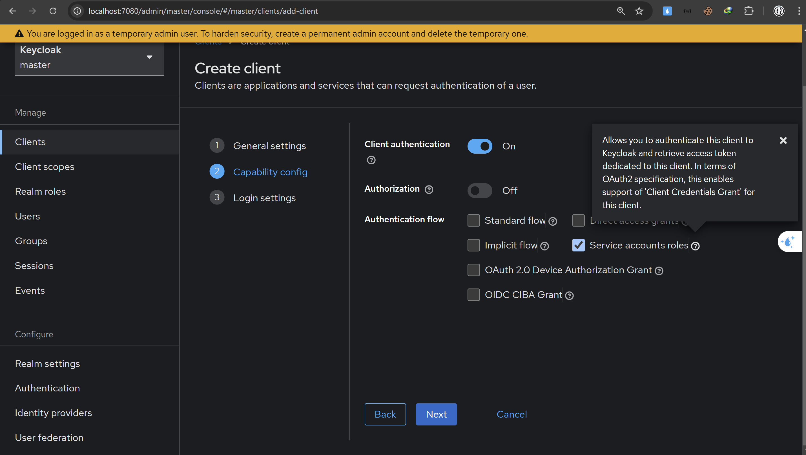

jwt.io

View all endpoints:
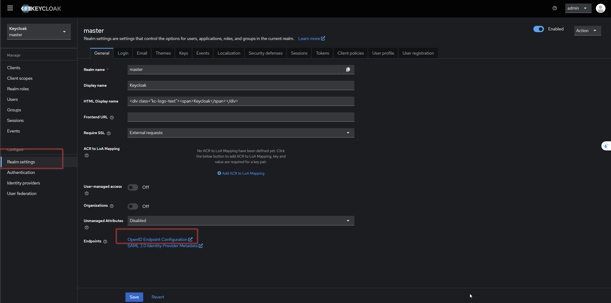

Assign roles to a client for using SecurityWebFilterChain:

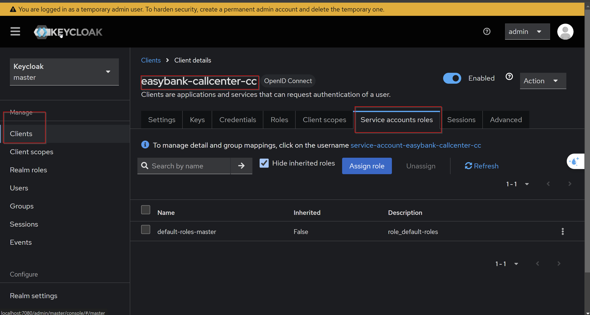

If you don't see the necessary roles, create the necessary roles:

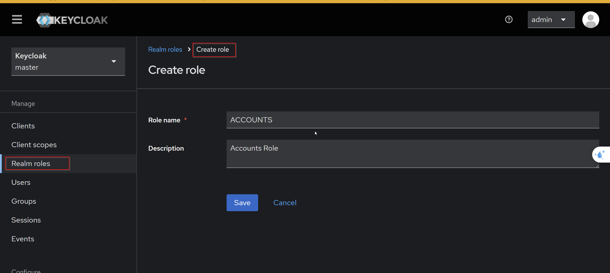

# AUTHORIZATION CODE GRANT TYPE FLOW IN OAUTH2

1. User to Client: I want to access my resources.
2. Client to User: The client will redirect the user to the login page of the auth server
3. User to Auth Server: Hello Auth Server, pls allow the client to access my resources. Here are my credentials to prove my identity.
4. Auth Server to Client: Hey Client, User allowed you to access his resources. Here is AUTHORIZATION CODE.
5. Client to Auth Server: Here are my client credentials, AUTHORIZATION CODE. The Auth Server will validate if the authorization code is valid, it is also going to validate the client credentials whether the client ID and client secret are valid or not. Please provide me an access token.
6. Auth Server to Client: Here is the access token from Auth Server.
7. Client to Resource Server: Hey Resource Server, I want to access the user resources. Here is the access token from Auth Server.
8. Resource Server To Client: Hey Client, Your token is validated successfully (by the Auth Server). Here are the resources you requested.

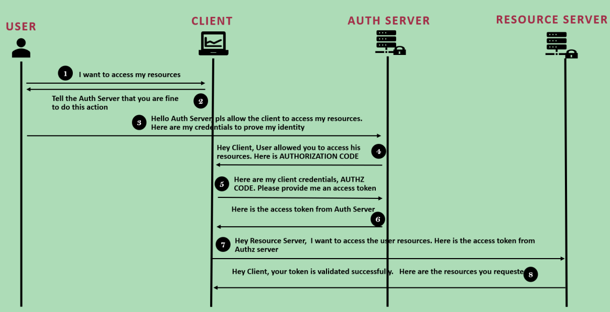

In the steps 2 & 3, where client making request to Auth Server endpoint have to send the below important details,
- client_id: the id which identifies the client application by the Auth Server. This will be granted when the client registers first time with the Auth server.
- redirect_uri: the URI value which the Auth server needs to redirect post successful authentication. If a default value is provided during the registration, then this value is optional.
- scope: similar to authorities. Specifies level of acess that client is requesting like READ.
- state: CSRF token value to protect from CSRF attacks.
- response_type: with the value 'code' which indicates that we want to follow authorization code grant.

In step 5 where the client after received a authorization code from Auth server, it will again make a request to Auth server for a token with the below values:
- code: the authorization code received from the above steps.
- client_id & client_secret: the client credentials which are registered with the auth server. Please note that these are not user credentials.\
- grant_type: with the value 'authorization_code' which identifies the kind of grant type is used.
- redirect_uri.

# AUTHORIZATION CODE GRANT TYPE FLOW DETAILS

1. Register a Client: Before you can begin the flow, you'll need to register a client and create a user.
   Registration will give you a client ID and a secret your application will use during the OAuth flow.
  Typically, this involves setting up a developer account at the service, then answering some questions about your application, uploading a logo...
2. Build the authorization URL and redirect the user to the authorization server. Before authorization begins, it first generates a random string to use for the *state* parameter. The client will need to store this to be used in the next step.
    ```text
    https://authorization-server.com/authorize?
      response_type=code
      &client_id=dxLD5LqqXKo5yRDP9j22lPHd
      &redirect_uri=https://www.oauth.com/playground/authorization-code.html
      &scope=photo+offline_access
      &state=bYy0EWkdEde0dxPm
    ```
3. After the user is redirected back to the client, verify the *state* matches
   The user was redirected back to the client, and you'll notice a few additional query parameters in the URL:
    ```text
    ?state=ytNfF-5e0Ul2dKXA&code=02hzXJx2IwbRx7RKYavzxgeSp2-rab-2s54qJfws73o
    ```
   You need to first verify that the state parameter matches the value stored in this user's session so that you protect against CSRF attacks.
4. Exchange the Authorization Code: Now you're ready to exchange the authorization code for an access token.
   The client builds a POST request to the token endpoint with the following parameters:
    ```text
    POST https://authorization-server.com/token
    grant_type=authorization_code
    &client_id=dxLD5LqqXKo5yRDP9j22lPHd
    &client_secret=y4VYrx7Vt5OqMry_PCHd0vJSMjV1hHjKq0VGfIbDb3ceoayX
    &redirect_uri=https://www.oauth.com/playground/authorization-code.html
    &code=02hzXJx2IwbRx7RKYavzxgeSp2-rab-2s54qJfws73odzVfL
    ```
   Note that the client's credentials are included in the POST body in this example. Other authorization servers may require that the credentials are sent as a HTTP Basic Authentication header.
5. Exchange the Access Token: Now you're ready to exchange the access token for a refresh token and ID token.
6. Token Endpoint Response: The response includes the access token and refresh token.
    ```text
    {
    "token_type": "Bearer",
    "expires_in": 86400,
    "access_token": "k6nyjOGsj33WzyxhJhznM0BIndIBEGr-7PpSZIsaBuHu6PiND3kD5kIyTCFT17YRsOGsJ8bc",
    "scope": "photo offline_access",
    "refresh_token": "2BgLWAu851PS6Nkhthio_G_v"
    }
    ```
   
*Reference:* https://www.oauth.com/playground

### Why in the Authorization Code grant type client is making request 2 times to Auth server for authorization code and access token.

- In the first step, authorization server will make sure that user directly interacted with it along with the credentials. If the details are correct, auth server sends the authorization code to the client.
- Once it receives the authorization code, in this step, the client has to prove its identity along with the authorization code & client credentials to get the access token.

### Why can't Auth server directly club both the steps together and provide the token in a single step?
The answer is that we used to have that grant type as well which is called as 'Implicit Grant Type'. But this grant type is deprecated as it is less secure.

# Register client & end user inside KeyCloak for Authorization code grant flow.

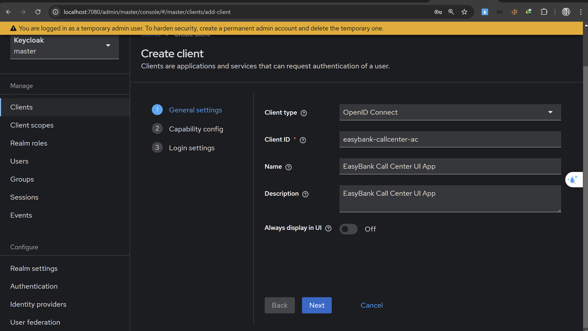
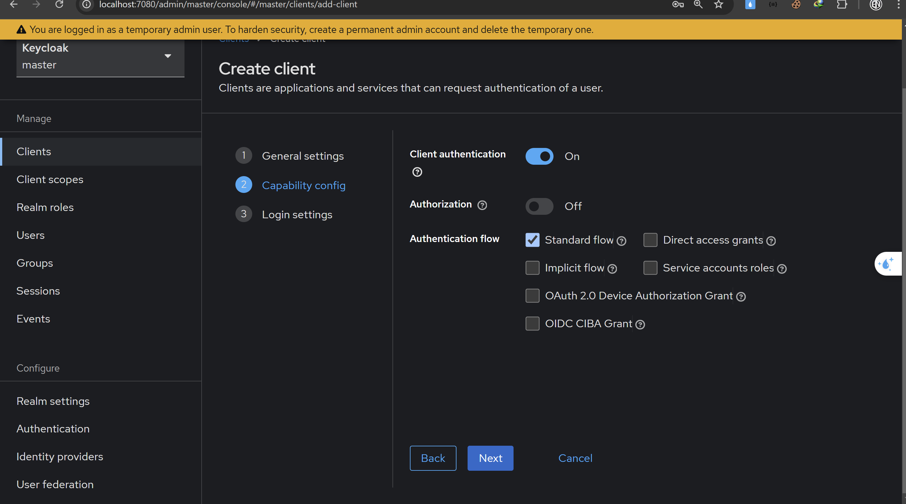


Create end user details inside the keycloak auth server (using UI):


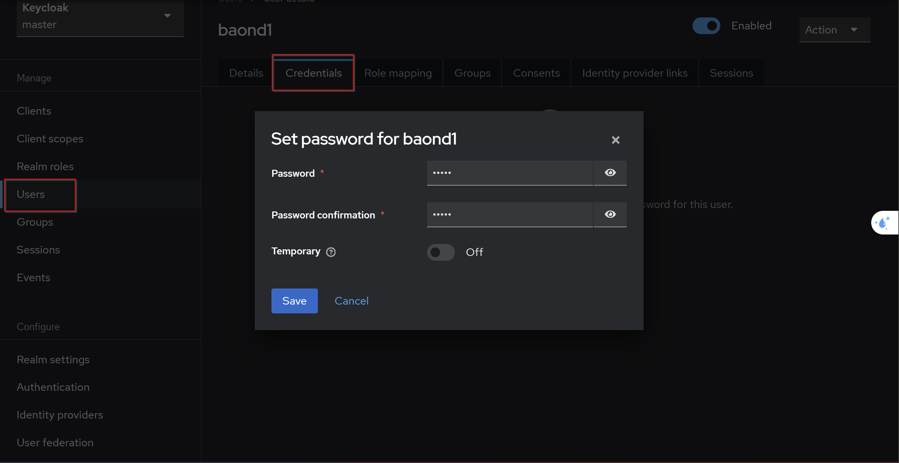

Keycloak exposes a lot of REST APIs using these REST APIs any properly authenticated application, they can connect with the Keycloak auth server, and they can create users by invoking these REST APIs.
All the actions that an admin can do with the help of UI, all these actions are supported by REST API as well.
Official documents:  https://www.keycloak.org/docs-api/latest/rest-api/index.html

Using PostMan to test Authorization Code grant type: 

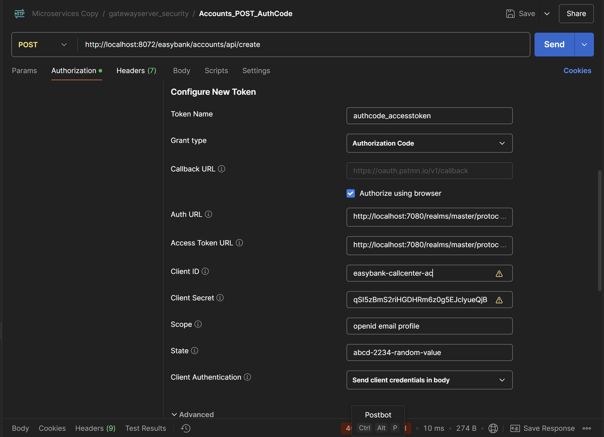
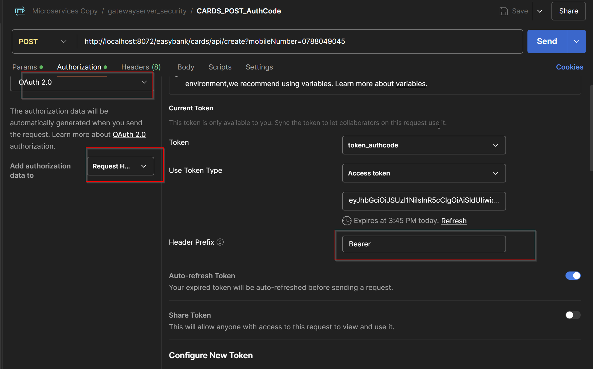

*NOTE* When we want to assign roles for an application, we need to go to the service roles. We did the same when we tried to assign roles for the client credentials application.
With User Details Role (End User Account) we need to go to the *Role mapping*


# BUILDING EVENT-DRIVEN MICROSERVICES

Inside the synchronous communication, there are two approaches majorly used by everyone:
1. imperative approach: whenever a microservice1 is trying to invoke the microservice2. There will be a thread dedicated assigned to this communication, and the thread is blocked for this operation is going to wait continuously for the response to come from microservice2
2. reactive approach: there won't be any threads blocked on the microservice1 to wait for the response from the microservice2. Instead, there will be a thread while invoking the microservice2. After the invocation the thread will go back to the thread pool and it will try to pick up the next that are coming towards the microservice. When the response from the microservice2 is received by the microservice1, then only a thread from the thread pool is going to be assigned.

Avoiding temporal coupling whenever possible:
- Temporal coupling occurs when a caller service expects an immediate response from a called service before continuing its processing.
- If the called service experiences any delay in responding, it negatively impacts the overall response time of the caller.
- This scenario commonly arises in synchronous communication between services.
- How we can prevent temporal coupling and mitigate?
- For example: You have a microserviceA and a microserviceB. The microserviceA is dependent on microservice B.
Whenever microserviceA is trying to invoke the microserviceB, the microserviceA is going to continuously wait till it is going to get a response from the microserviceB.
In this scenario, the microserviceA has a temporal coupling with the microserviceB.
Any slow behavior of microserviceB is going to have an impact on the microserviceA.


Using asynchronous communication:
- Synchronous communication between services is not always necessary. 
- In many real-world scenarios, asynchronous communication can fulfill the requirements effectively.

Building Event driven microservice:
- An event, as an incident that happens inside your microservices, such as a state transition or update your system.
- When an event takes place, we need to alert the concerned parties.

Event-driven microservices can be built using Event-driven architecture, producing and consuming events using Async communication, event brokers, Spring Cloud Function, Spring Cloud Stream.

# Event-driven models

Event-driven architectures can be built using two primary models:
1. Publisher/Subscriber (Pub/Sub) model (RabbitMQ):
This model revolves around subscriptions. Producers generate events that are distributed to all subscribers for consumption. Once an event is received, it cannot be replayed, which means new subscribers joining later will not have access to past events.
2. Event Streaming Model (Kafka):
In this model, events are written to a log in a sequential manner. Producers publish events as they occur, and these events are stored in a well-ordered fashion.
Instead of subscribing to events, consumers can read from any part of the event stream.
One advantage of this model is that events can be replayed, allowing clients to join any time and receive all past events.

The pub/sub models are frequently paired with RabbitMQ as a popular option. On the other hand, Apache Kafka is a robust platform widely utilized for event stream processing.


## What are we going to build using a pub/sub model ?

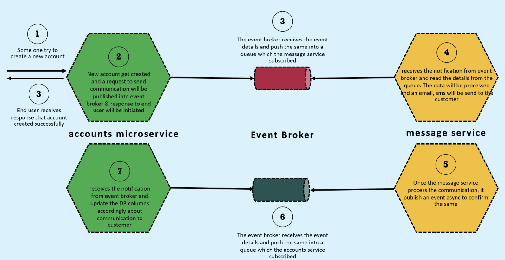


### Using RabbitMQ for publish/subscribe communications:

RabbitMQ, an open-source message broker, is widely recognized for its utilization of AMQP (Advanced Message Queuing Protocol) and its ability to offer flexible asynchronous messaging. distributed deployment, comprehensive monitoring.
Furthermore, recent versions of RabbitMQ have incorporated event streaming functionalities into their feature set.

- Producer: The entity responsible for sending messages (also known as publisher).
- Consumer: The entity tasked with receiving messages (also known as the subscriber).
- Message broker: The middleware that receives messages from producers and directs them to the appropriate consumers.

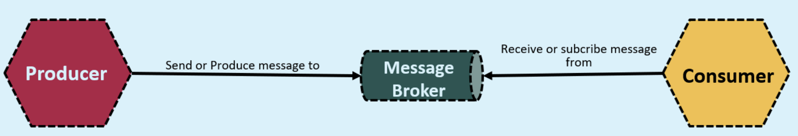

The messaging model of AMQP operates on the principles of exchanges and queses.
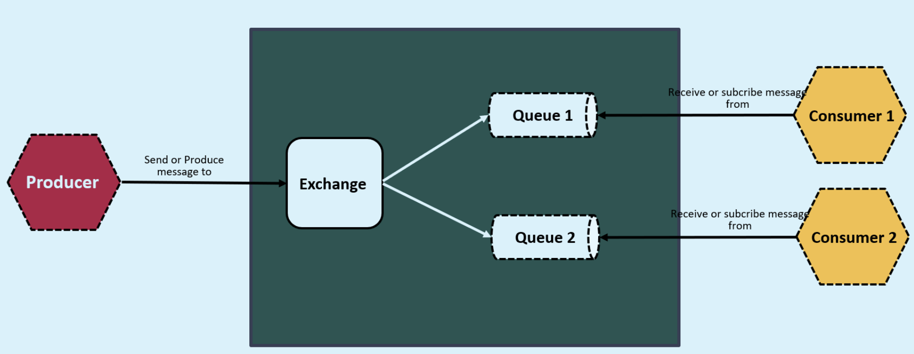

The producer will always send the message to an exchange inside the message broker.
This exchange is going to identify to which queue it has to send the message details.
Inside the message broker, there will have any number of exchanges and queues. These queues the consumers are going to subscribe.
The preducer can send a message to the exchange and based upon the exchange details, the message can go to the Queue1 or Queue2, then the corresponding consumer will be notified about this message.
The message will be deleted from the queue and there is not rule that only one consumer has to be subscribed to a single queue.
Any number of subscribers can be subscribed to a queue.
Very similarly, a consumer can be subscribed to any number of queues.

### Oficial Documentation: https://www.rabbitmq.com/


# Sppring Cloud Function ?

Spring Cloud Function facilitates the development of business logic by using functions that adhere to the standard interfaces introduced in Java 8, namely Supplier, Function and Consumer.
Whatever business logic that the developers want to write, it simply to write the business logic indie the functions and the rest of the infrastructural concerns is going to be taken care by the Spring Cloud Function.

- Supplier: A supplier is a function or lambda expression that produces an output without requiring any input. It can also be referred as a producer, publisher or source.
That means whenever you write your business logic using supplier function interface, then your business logic is never going to expect any input.
It's simply going to produce an event or produce an output. In simple words, your Supplier, function interface there won't be any input, but there will be an output.

- Function: A function accepts input and generates an output. It is commonly referred to as a processor.
It will take an input and it is going to process the input and after processing the input, it is going to generate an output.

- Consumer: A consumer is a funtion that consumes input but does not produce any output. It can also be called a subscriber or sink.

Why to use Spring Cloud Function?

Because developing business logic with the help of spring cloud function is going to be simple and it also provide you a lot of flexibility to expose your business logic using various patterns.
By default, all your logic that you wrote inside your functions will be exposed as a REST API automatically by your spring cloud function.
If needed, you can also integrate these spring cloud functions with event brokers like RabbitMQ, Apache Kafka by adding more project which is Spring Cloud Stream.

Spring Cloud Function features:

- Programming styles: reactive, imperative or hybrid. 
- POJO functions
- Function composition which includes composing imperative functions and reactive.
- REST support to expose functions as HTTP endpoints etc.
- Streaming data (via Apache Kafka, Solace, RabbitMQ and more) to/from functions via a Spring Cloud Stream framework.
- Packaging functions for deployments, specific to the target platform.


The Spring Cloud Function is the best suitable for event driven architecture because these functions give flexibility to use to take our business logic wherever we want.


# Steps to create functions using Spring Cloud Functions:

1. Initialize a spring cloud function project: Start by creating a new Spring Boot project using your preferred IDE or by using Spring Initializer (https://start.spring.io/). 
Include the spring-cloud-function-context maven dependency.
2. Implement the business logic using functions
   - To enable Spring Cloud Function to recognize our functions, we need to register them as beans.
   - Proceed with annotating the MessageFunctions class as @Configuration and the methods email() & sms() as @Bean to achieve this.
3. Composing functions: If our scenario needs multiple functions to be executed, then we need to compose them otherwise we can use them as individual as well. 
   - Composing functions can be achieved by defining a property in application.yml like shown below:
   ```yaml
   spring:
     cloud:
       function:
         definition: email|sms
    ```
   
We can now instruct Spring Cloud Function to use these functions as building blocks and generate a new function derived

## Why to use Spring Cloud Stream?

Spring Cloud Stream is a framework designed for creating scalable, even-driven, and streaming applications.
Its core principle is to allow developers to focus on the business logic while the framework takes care of infrastructure-related tasks, such as integrating with a message broker.

Spring Cloud Stream leverages the native capabilities of each message broker, while also providing an abstract layer to ensure a consistent experience regardless of the underlying middleware.
By just adding a dependency to your project, you can have functions automatically connected to an external message broker.
The beauty of this approach is that you don't need to modify any application code; you simply adjust the configuration in the application.yaml file.

THe framework supports integrations with RabbitMQ, Apache Kafka, Kafka Streams, and Amazon Kinesis.
There are also integrations maintained by partners for Google PubSub, Solace PubSub+, Azure Event Hubs and Apache RocketMQ.


The core building blocks of Spring Cloud Stream are:
1. Destination Binders: Components responsible to provide integration with the external messaging systems.
2. Destination Bindings: Bridge between the external messaging systems and application code (producer/consumer) provided by the end user.
3. Message: The canonical data structure used by producers and consumers to communicate with Destination Binders (and thus other applications via external messaging systems).


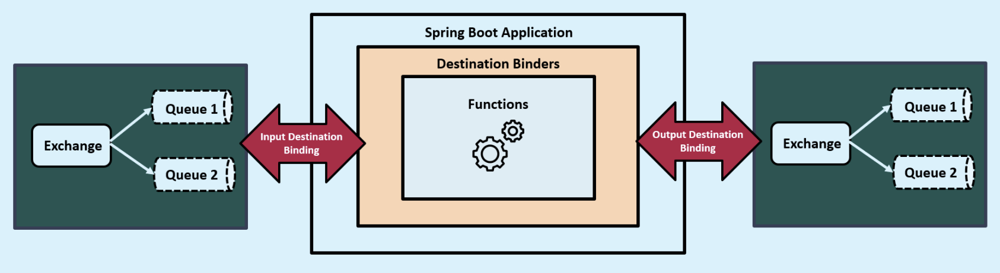

Start RabbitMQ using docker
```terminal
docker run -it --rm --name rabbitmq -p 5672:5672 -p 15672:15672 rabbitmq:4.0-management
```

## Steps to create bindings using Spring Cloud Stream


1. Add the Stream related dependencies: Add the maven dependencies spring cloud-stream, spring-cloud-stream-binder-rabbit inside pom.xml of message service where we defined functions.
2. Add the stream binding and rabbitmq properties inside application.yaml of message service.
   ```yaml
    spring:
    application:
    name: "message"
    cloud:
    function:
      definition: email|sms
    stream:
      bindings:
        email|sms-in-0: #binding name (this is default naming convention if not specified)
          destination: send-communication # queue name = this destination + the group belown
          group: ${spring.application.name} # if I don't mention this group property, then my rabbitmq is going to append some randomly generated value to my destination names to my channel names and queue names.
        email|sms-out-0:
          destination: communication-sent
    rabbitmq:
    host: localhost
    port: 5672
    username: guest
    password: guest
    connection-timeout: 10s
    ```
We need to define input binding for each function accepting input data, and an output binding for each function returning output data.
Each binding can have a logical name following the below convention. Unless you use partitions (for example, with Kafka), the <index> part of the name will always be 0. The <functionname> is computed from the value of the spring.cloud.function.definition property.

Input binding: <functionName> +-in-+<index>
Output binding: <functionName> +-out-+<index>

The binding names exist only in Spring Cloud Stream and RabbitMQ doesn't know about them.
So to map between the Spring Cloud Stream binding and RabbitMQ, we need to define the destination which will be the exchange inside the RabbitMQ.
Group is typically application name, so that all the instance of the application can point to the same exchange and queue.

The queues will be created inside RabbitMQ based on the queue-naming strategy (<destination>.<group>) includes a parameter called consumer group. 

## The steps for event producing and consuming in accounts microservice.

1. Autowire StreamBridge class: StreamBridge is a class inside Spring Cloud Stream which allows user to send data to an output binding.
To produce the event, autowire the StreamBridge class into the class from where you want to produce an event.
2. Use send () of StreamBridge to produce an event like shown below:
    ```java
      @Override
      public void createAccount(CustomerDto customerDto) {
          Customer customer = CustomerMapper.mapToCustomer(customerDto, new Customer());
          Optional<Customer> optionalCustomer = customerRepository.findByMobileNumber(customer.getMobileNumber());
  
          if (optionalCustomer.isPresent()) {
              throw new CustomerAlreadyExistsException("Customer already registered with give mobile number " + customerDto.getMobileNumber());
          }
  
          Customer savedCustomer = customerRepository.save(customer);
          Account savedAccounts = accountsRepository.save(createNewAccount(savedCustomer));
          sendCommunication(savedAccounts, savedCustomer);
      }
  
  
      private void sendCommunication(Account account, Customer customer){
          var accountMsgDto = new AccountsMsgDto(account.getAccountNumber(), customer.getName(), customer.getEmail(), customer.getMobileNumber() );
          log.info("Sending Communication request for the details: {}", accountMsgDto);
          var result = streamBridge.send("sendCommunication-out-0", accountMsgDto);
          log.info("Is the Communication request successfully triggered?: {}", result);
      }
    ```

3. Create a function to accept the event: Inside account microservice, we need to create a function that accepts the event and update the communication status inside the DB. 

    ```java
    @Configuration
    public class AccountsFunctions {
    
        private static final Logger log = LoggerFactory.getLogger(AccountsFunctions.class);
    
        @Bean
        public Consumer<Long> updateCommunication(IAccountService accountService){
            return accountNumber -> {
                log.info("Updating Communication status for the account number: {}", accountNumber.toString());
                accountService.updateCommunicationStatus(accountNumber);
            };
        }
    }

    ```

4. Add the stream binding and rabbitmq properties inside application.yml to account service.

When Account microservice wants to produce an event using StreamBridge, we should have a supporting stream binding and destination.
We need to define input binding for the function *updateCommunication* to accept the event using the destination *communication-sent*.
So when the message service push a event input the exchange of communication-send, the same will be processed by the function updateCommunication.


# Apache Kafka And RabbitMQ

## Differences between Apache Kafka and RabbitMQ

- Design: Kafka is a distributed event streaming platform, while RabbitMQ is a message broker. This means that Kafka is designed to handle large volumes of data, while RabbitMQ is designed to handle smaller volumes of data with more complex routing requirements.
- Data retention: Kafka stores data on disk, while RabbitMQ stores data in memory. This means that Kafka can retain data for longer periods of time, while RabbitMQ is more suitable for applications that require low latency.
- Performance: Kafka is generally faster than RabbitMQ, especially for large volumes of data. However, RabbitMQ can be higher performance for applications with complex routing requirements.
- Scalability: Kafka is highly scalable, while RabbitMQ is more limited in its scalability. This is because Kafka can be scaled horizontally to any extent by adding more brokers to the cluster.

## Introduction to Apache Kafka

- Producers: Producers are responsible for publishing messages to Kafka topics. They write messages to a specific topic, and Kafka appends these messages to the topic's log.
- Topics: Kafka organizes data into topics. A topic is a particular stream of data that can be divided into partitions. Each message within a topic is identified by its offset.
- Brokers: Brokers are the Kafka servers that manage the storage and replication of topics. They are responsible for receiving messages from producers, assigning offsets to messages, and serving messages to consumers.
- Partition: Topics can be divided into multiple partitions, allowing for parallel processing and load balancing. Each partition is ordered, immutable sequence of messages, and each message within a partition has a unique offset.
- Offsets: Offsets are unique identifiers assigned to each message in a partition. They are used to track the progress of consumers. Consumers can control their offsets, enabling them to rewind or skip messages based on their needs.
- Replication: Kafka allows topics to be replicated across multiple brokers to ensure fault tolerance. Replication provides data redundancy, allowing for failover and high availability.
- Consumers: Consumers read messages from Kafka topics. They subscribe to one or more topics and consume messages by reading from specific partitions within those topics. Each consumer maintains its offset to track its progress in topic.
- Consumer Groups: Consumers can be organized into consumer groups. Each message published to a topic is delivered to only one consumer within each group. This enables parallel processing of messages across multiple consumers.
- Streams: Kafka Streams is a client library that enables stream processing within Kafka. It allows you to build applications that consume, transform, and produce data in real-time.

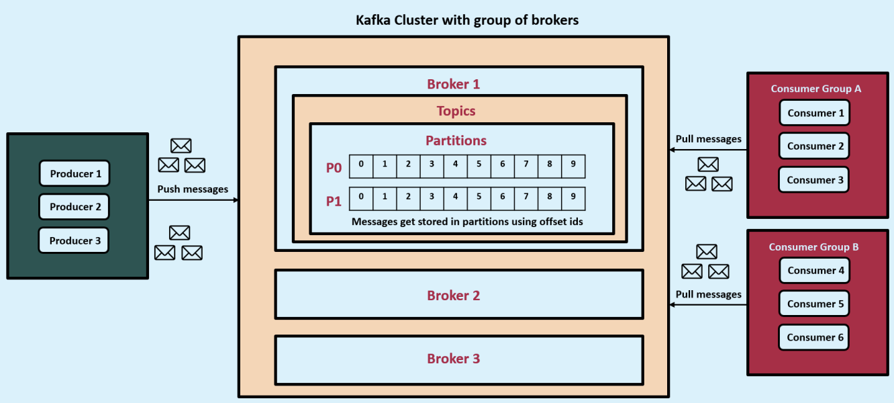

- A Kafka Cluster can have any number of producers, consumers and brokers. For a production setup, at least three brokers are recommended.
- A Kafka broker can have any number of topics. Topic is a category under which producers and write and interested, authorized consumers can read data. For example, we can have topics like sendCommunication, dispatchOrder, purgeData...
- Inside each topic, we can have any number of partitions. Kafka producers can handle enormous amount of data, it is not possible to store in a single server(broker). Therefore, a topic will be partitioned into multiple parts and distributed across multiple brokers.
- Offsets is a sequence id assigned to a messages as they get stores inside a partition. The offset number starts from 0 and follows by 1,2,3... Once offset id is assigned, it will never change. These are similar to sequence ids inside the DB tables.

*Installation tutorial: https://youtu.be/aH3-UjIrnRs?si=z78XX8OFYpS94ldt*


## Step to use Apache Kafka in the place of RabbitMQ:

1. Add maven dependencies: Add the maven dependency spring-cloud-stream-binder-kafka in the place of spring-cloud-stream-binder-rabbitmq dependency.
2. Add Kafka related properties inside the application.yml file of both accounts and message service.
    ```yaml
   spring:
    application:
    name: "accounts"
   cloud:
    function:
      definition: updateCommunication # ; for individual functions, | for combining functions
    stream:
      bindings:
        updateCommunication-in-0:
          destination: accounts-sent # queue name
          group: ${spring.application.name}
        sendCommunication-out-0: #binding name
          destination: send-accounts #exchange name
      kafka:
        binder:
          brokers: # a list of elements under these brokers
          - localhost:9092   
    ```
   
   ```yaml
   spring:
    application:
    name: "message"
    cloud:
    function:
      definition: emailAccount|smsAccount;emailCards|smsCards;emailLoans|smsLoans
    stream:
      bindings:
        emailAccount|smsAccount-in-0: #binding name (this is default naming convention if not specified)
          destination: send-accounts # queue name = this destination + the group belown
          group: ${spring.application.name} # if I don't mention this group property, then my rabbitmq is going to append some randomly generated value to my destination names to my channel names and queue names.
        emailAccount|smsAccount-out-0:
          destination: accounts-sent
        emailCards|smsCards-in-0:
          destination: send-cards
          group: ${spring.application.name}
        emailCards|smsCards-out-0:
          destination: cards-sent
        emailLoans|smsLoans-in-0:
          destination: send-loans
          group: ${spring.application.name}
        emailLoans|smsLoans-out-0:
          destination: loans-sent
      kafka:
        binder:
          brokers: # a list of elements under these brokers
            - localhost:9092
   ```


# CONTAINER ORCHESTRATION

- Automating the deployments, Rollouts & Rollbacks?
- Making our services are self-healing?
- Autoscaling our services?

→ Kubernetes is an open-source container orchestration platform that automates deployment, scaling, and management of containerized applications.
It was originally developed by Google and is now maintained by the Cloud Native Computing Foundation (CNCF).

## WHAT IS KUBERNETES?

- It is going to help you run distributed systems like cloud native applications or microservices.
- Taking care of automated scaling and handling the fail-over for your application.
- Providing deployment patterns that will ensure zero downtime for your applications.
- Kubernetes is also capable of acting as a service discovery agent and provides load balancing.
- With the help of Eureka Server, we are doing client side load balancing. 
- Whereas with the help of Kubernetes, we can get rid of Eureka Server, and we can handle the load balancing to the Kubernetes. With that, we are going to use server side load balancing.
- Kubernetes is also capable of performing container and storage orchestration.
- With the help of Kubernetes, we can control any number of containers along with their storage requirements.
- It is also capable of automated rollouts and rollbacks.
- It also provides self-healing.
- We can also configure properties and secrets that are required for our microservices.

## KUBERNETES INTERNAL ARCHITECTURE:

Inside the cluster will have a set of servers or virtual machines which are going to work together to deliver a desired ouput to the end user.

Whenever you use Docker compose, you are going to deploy all your containers inside a single server. 
But in real production applications, you may have hundreds of microservices.
We cannot deploy all our hundreds of microservices with the help of Docker compose in a single server.
Instead, we want to build a multi-distributed environment where we can deploy our microservices in various servers are nodes inside a cluster.
On top of that, your Docker or Docker compose is not capable of automatic deployments, rollouts, scaling.
Usually a Kubernetes cluster will have multiple nodes. There are two types of nodes: Master Node and Worker Node.
Master Node is responsible for controlling and maintaining your entire Kubernetes cluster.
Worker Nodes are responsible to handle the traffic that we get towards our microservices.
Inside a Master node, there is a great component, which is Kube API server.
This Kube API server is going to expose some APIs using it anyone from outside Kubernetes cluster can interact with the master node.
Using the same API server only the master nodes and worker nodes can communicate with each other.

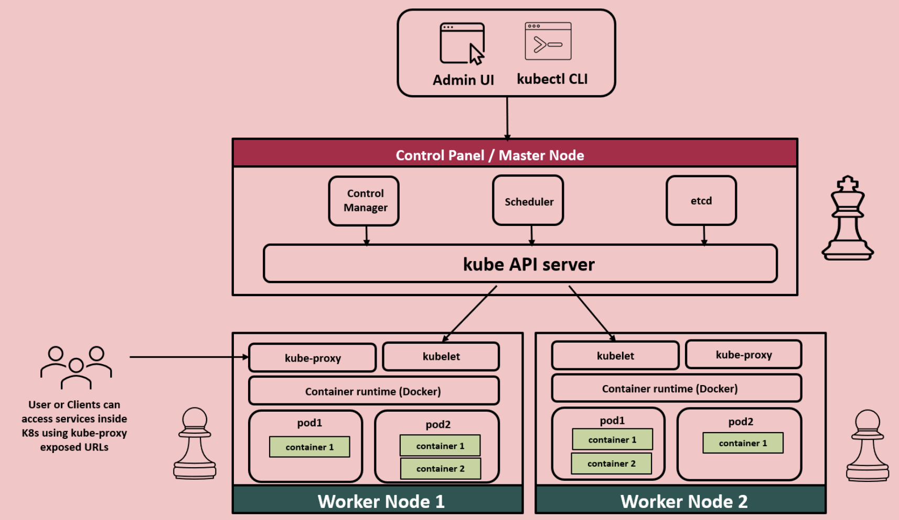

There are two approaches that we can follow whenever we want to interact with the Kubernetes cluster. 
- Using Admin UI of Kubernetes.
- Using the kubectl CLI. From your CLI terminal, you can execute some kubectl commands and these commands will be input the Kube API server.

With the help of YAML configurations, you can always provide some instructions to your Kubernetes. 
All those configurations as an input details inside a YAML configuration to the master node with the help of admin UI or kubectl CLI.
These commands that we can give from outside of the Kubernetes cluster are going to be received by the Kube API server.
Once my Kube API server receives instructions though kubectl CLI or admin UI, it is going to read the instructions. What is the end user is trying to do? Whether he wants to create a deployment or whether he wants to do some autoscaling.
It is going to give those instructions to the scheduler.

*API server*

THe API server is the primary interface for interacting with the Kubernetes cluster. It exposes the Kubernetes API, which allows users and other components to communication with the cluster. 
All administrative operations and control commands are sent to the API server, which then processes and validates them.

*Scheduler*

Scheduler will understand what are the requirements that it received from the Kube API server and based upon the requirements it is going to identify under which worker node it has to do a deployment.
Suppose if my end user gave an instructions to the master node saying that I want to deploy my accounts to microservices.
In this scenario, the Kube API server will give these instructions to the scheduler. The scheduler is a component that is responsible to identify under which worker node, the deployment of accounts microservice has to be done.
Behind the scenes, it will do a lot of calculations like which worker node has bandwidth, which worker node is super busy.
By considering all these calculations, it is going to identify one of the worker nodes present inside the Kubernetes cluster.
There may have any number of worker nodes inside the Kubernetes cluster.
Once my scheduler identifies under which worker node, it has to do the account microservices deployment.
It is going to give the same instructions back to the Kube API server and from Kube API server it will reach to the corresponding worker node about the deployment of the accounts microservice.
→  The scheduler is responsible for placing Pods onto available nodes in the cluster. It takes into account factors like resource requirements and other constraints to make intelligent decisions about which node to assign a Pod to.
→ The scheduler continuously monitors the cluster and ensures that Pods are distributed optimally.

*Control Manager*

Maybe after a few days or maybe after few hourse, your container may have some problems.
So the controller manager is responsibility to track the containers and worker nodes available inside the cluster.
If any of the worker nodes or container is having some health issues, this controller manager is going to make sure it is bringing new worker nodes or new containers in the place of problematic containers or worker nodes.
In simple words, controller manager always have an input value saying that this is the desired state of my Kubernetes cluster.
Inside my Kubernetes cluster, I always want to make sure I have three instances of accounts microservice running always.
So my controller manager regularly keeps health check of these three running instances of accounts microservices.
If any of the worker nodes or container has issues, it is going to match the desired state.
If one of the containers is having some problems, my Control Manager is going to kill the container which has some problems and in the same place it is oging to bring the new instance of accounts microservices.
It will always try to match with the desired state that it received from the end user with the actual state present inside the Kubernetes cluster.
→ The control manager maintains the cluster. It handles node failures, replicates components, maintains the correct number of pods, etc. It constantly tries to keep the system in the desired state by comparing it with the current state of the system.


*Etcd*

The etcd as a brain of our Kubernetes cluster. Because this etcd is going to act as a database or a storage system for your Kubernetes cluster.
Inside this etcd only all the information related to your Kubernetes cluster is going to stored as a key value pair.
For example, if my controller manager at any point has some questions like how many replicas it has to maintain about accounts microservice.
It can always connect with the etcd to understand what is the desired state that we initially received from the end user.
The Kube API server when it receives the instructions from the end user with the help of CLI or admin UI, it is going to make an entry into the etcd.
→ etcd is a distributed key-value store that servers as the cluster's primary data store. It stores the configuration data and the desired state of the system, including information about Pods, Services, ReplicationController, and more. The API server interacts with etcd to read and write cluster data.

## Worker nodes 

*Kubelet*

Kubelet is an agent running inside all your worker nodes. Using these Kubelet Only, my master node is going to connect with the worker node. It is going to provide the instructions with the help of Kube API server.
My master node has to give instructions to the worker node saying that please deploy this account microservice with the replica of three.
All instructions the worker nodes are going to receive with the help of Kubelet.
→ Kubelet is an agent that runs on each worker node and communicates twith the control plan components.
→ It receives instructions from the control plane, such as Pod creation and deletion requests, and ensures that the desired state of Pods is maintained on the node.
→ Kubelet is responsible for starting, stopping and monitoring containers based on Pod specifications.

Since we are going to deploy all our microservices in the form of containers, we need to make sure that there is some container runtime installed inside the worker node.
When you try to set up Kubernetes cluster, all your worker nodes they are going to have that Docker installed inside them.

Pod is the smallest deployment unit inside the Kubernetes.
We cannot deploy our containers directly into the worker nodes. Inside this pod only the actual containers of the microservices are going to be deployed.
Suppose if you are trying to deploy multiple microservices into your same worker node to provide that isolation from other microservices, we are going to have a concept of pods.
Inside these parts only the containers will be deployed.
Usually most of the time a pod will have a single container.
SUppose you are trying to deploy your accounts microservice and cards microservice and loans microservice.
All these microservices are going to be deployed independently in different parts.
Multiple microservices will never be deployed inside a single pod. 
Inside a pod, only a specific microservice or a specific application only allowed.
However, sometimes you may deploy multiple containers inside a pod is that your container (loans, cards, accounts) may need some helper container, or it may need some utility container to perform its job.
Such helper containers we can deploy inside the same pod where we have the main container.
This kind of deploying a helper container along with the main container inside a pod is called sidecar pattern.

To expose your container to the outside world or to the other containers inside the same cluster, Kubernetes is going to use a component called kube-proxy.
With the help of kube-proxy, all the containers are available inside the worker nodes.
They are going to expose themselves to the outside world.
Or they can also restrict themselves that the communication they are going to accept only within the cluster.

You can have any number of master nodes and any number of worker nodes. 
A single master node cannot handle any number of worker nodes.
If you have large number of worker nodes, then obviously, we need more number of master nodes.


# Setup a local Kubernetes cluster using Docker Desktop

https://docs.docker.com/desktop/features/kubernetes/

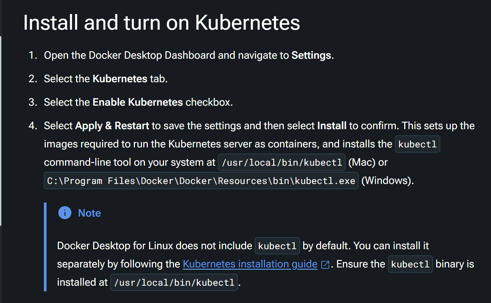

The Kubernetes server runs as a single-node cluster within a Docker container. (a Node is a node master and it is also a node worker)

Kubernetes integration automatically installs the Kubernetes CLI command at /usr/local/bin/kubectl on Mac and at C:\Program Files\Docker\Docker\Resources\bin\kubectl.exe on Windows. This location may not be in your shell's PATH variable, so you may need to type the full path of the command or add it to the PATH.

To deploy the Dashboard UI : https://kubernetes.io/docs/tasks/access-application-cluster/web-ui-dashboard/

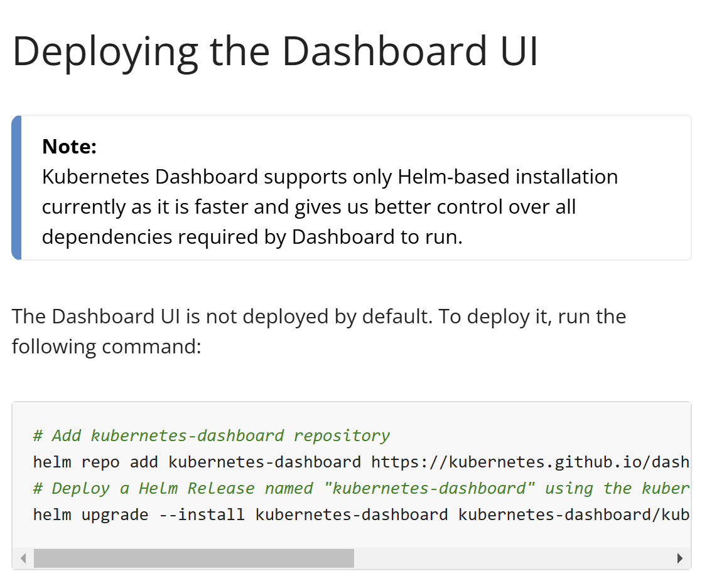

In order to execute these commands first we need to make sure we installed the helm inside our local system

In order to install the help, install the Chocolatey package manager for Windows: https://chocolatey.org/install
```cmd
Set-ExecutionPolicy Bypass -Scope Process -Force; [System.Net.ServicePointManager]::SecurityProtocol = [System.Net.ServicePointManager]::SecurityProtocol -bor 3072; iex ((New-Object System.Net.WebClient).DownloadString('https://community.chocolatey.org/install.ps1'))
```


This command will install Kubernetes Dashboard inside my local Kubetnetes cluster.
```cmd
helm upgrade --install kubernetes-dashboard kubernetes-dashboard/kubernetes-dashboard --create-namespace --namespace kubernetes-dashboard
```
To access Dashboard run:
```cmd
kubectl -n kubernetes-dashboard port-forward svc/kubernetes-dashboard-kong-proxy 8443:443
```

When access the Dashboard UI, you will need a Bearer token
https://localhost:8443

To get Bearer token:
1. https://kubernetes.io/docs/tasks/access-application-cluster/web-ui-dashboard/
2. https://github.com/kubernetes/dashboard/blob/master/docs/user/access-control/creating-sample-user.md

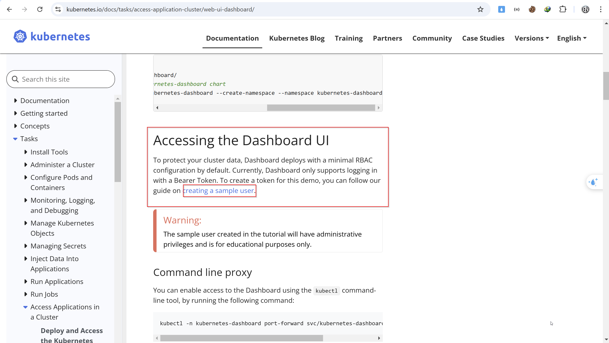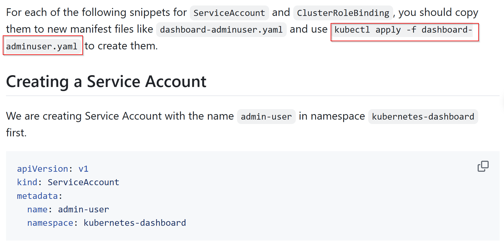

```yaml
apiVersion: v1 # use the version one of API to create a service account.
kind: ServiceAccount # a predefined object. The Kubernates is going to create a ServiceAccount.
metadata:
  name: admin-user # name of the service account. This is very similar to your username.
  namespace: kubernetes-dashboard # It is a kind of boundary or an isolated area inside the cluster. By default, if you don't mention the namespace where the ServiceAccount has to be created. The Kubernetes cluster is going to create it inside the default namespace.
```

Provide these configurations to the Kubernetes cluster.
```cmd
kubectl apply -f dashboard-adminuser.yaml
```

We need to provide privileges to this account with the help of this cluster role binding.

```yaml
apiVersion: rbac.authorization.k8s.io/v1
kind: ClusterRoleBinding
metadata:
  name: admin-user # the name of this cluster role binding
roleRef: # a cluster role that you want to bind
  apiGroup: rbac.authorization.k8s.io
  kind: ClusterRole # inside the Kubernetes clusters, all roles we should call it as a cluster role. That means we're trying to assign a role cluster-admin
  name: cluster-admin # the name of the cluster role
subjects: # which user or which service account to want to bind. We can define any number of ServiceAccount or we can define any number of user details.
  - kind: ServiceAccount
    name: admin-user
    namespace: kubernetes-dashboard
#  - kind: ServiceAccount1
#    name: admin-user1
#    namespace: kubernetes-dashboard1
```

Provide the above configurations to the Kubernetes cluster.
```cmd
kubectl apply -f dashboard-rolebinding.yaml
```

Run this command to get a token for the admin-user
```cmd
kubectl -n kubernetes-dashboard create token admin-user
```
-n: is the namespace where we have a ServiceAccount is kubernetes-dashboard.


Getting a long-lived Bearer Token for ServiceAccount
```yaml
apiVersion: v1
kind: Secret
metadata:
  name: admin-user
  namespace: kubernetes-dashboard
  annotations:
    kubernetes.io/service-account.name: "admin-user" # Crete a secret for the admin user that we have created in dashboard-adminuser.yaml
type: kubernetes.io/service-account-token
```

Provide the above configurations to the Kubernetes cluster.
```cmd
kubectl apply -f secret.yaml
```

After Secret is created, we can execute the following command to get the token which is saved in the Secret:
```cmd
kubectl get secret admin-user -n kubernetes-dashboard -o jsonpath="{.data.token}" | base64 -d
```

Show all the deployments inside the Kubernetes cluster
```cmd
kubectl get deployments
```
Show all the services inside the Kubernetes cluster
```cmd
kubectl get services
```

Show all the replicaset inside the Kubernetes cluster
```cmd
kubectl get replicaset
```

Deploy the ConfigServer with the manifest file that we have created.

```cmd
kubectl apply -f kubernetes/configserver.yaml
```

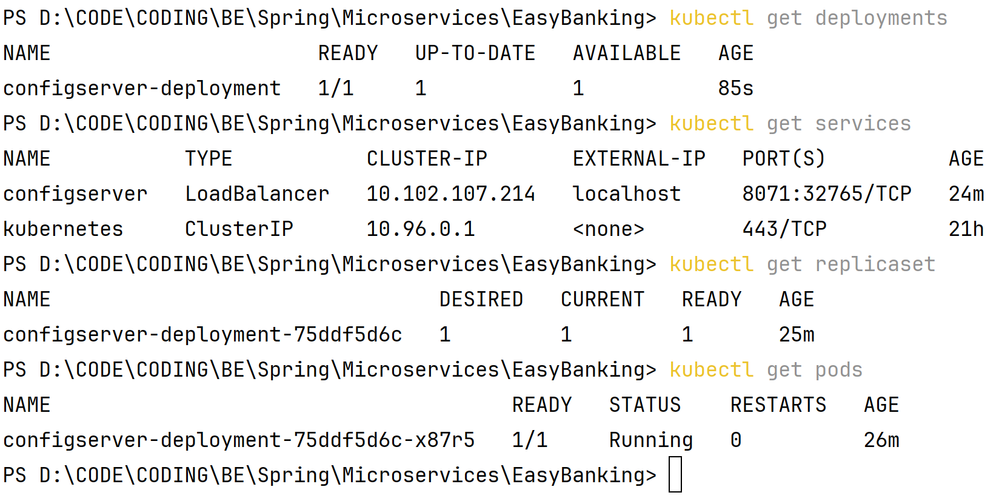

## How to create the same kind of environment variables inside the Kubernetes cluster?

1. A ConfigMap is an API object used to store non-confidential data in key-value pairs.
2. Secret is an object that contains a small amount of sensitive data such as a password, a token, or a key.

Create an object of configmap inside Kubernetes.
```yaml
apiVersion: v1
kind: ConfigMap
metadata:
  name: easybank-configmap
data: # at this data element, we can provide any number of environment properties with a key and value.
  SPRING_PROFILES_ACTIVE: "prod"
  SPRING_CONFIG_IMPORT: "optional:configserver:http://configserver:8071/"
  ACCOUNTS_DATASOURCE_URL: "jdbc:mysql://accountsdb:3306/accountsdb"
  LOANS_DATASOURCE_URL: "jdbc:mysql://loansdb:3306/loansdb"
  CARDS_DATASOURCE_URL: "jdbc:mysql://cardsdb:3306/cardsdb"
  EUREKA_CLIENT_SERVICEURL_DEFAULTZONE: "http://eurekaserver:8070/eureka"
  CONFIGSERVER_APPLICATION_NAME: "configserver"
  EUREKA_APPLICATION_NAME: "eurekaserver"
  ACCOUNTS_APPLICATION_NAME: "accounts"
  LOANS_APPLICATION_NAME: "loans"
  CARDS_APPLICATION_NAME: "cards"
  GATEWAY_APPLICATION_NAME: "gatewayserver"
  KC_BOOTSTRAP_ADMIN_USERNAME: "admin"
  KC_BOOTSTRAP_ADMIN_PASSWORD: "admin"
  SPRING_SECURITY_OAUTH2_RESOURCESERVER_JWT_JWK-SET-URI: "http://keycloak:7080/realms/master/protocol/openid-connect/certs"
  SPRING_DATASOURCE_USERNAME: "root"
  SPRING_DATASOURCE_PASSWORD: "root"
```

Feed this file to the Kubernetes cluster.
```cmd
kubectl apply -f kubernetes/configmaps.yaml
```

## Kubernetes manifest file to create ConfigMap.

A Kubernetes ConfigMap is an essential Kubernetes resource used to store configuration data separately from the application code.

The *apiVersion* and *kind* fields are required for all Kubernetes objects. When creating a configmap inside K8s, the kind should be "ConfigMap."

The metadata field contains the name of ConfigMap and other metadata about the object.

The data field is where the key-value pairs are stored. The keys can be any alphanumeric string, and the values can be strings, numbers, or binary data.

## Kubernetes manifest file to deploy a Container

```yaml
apiVersion: apps/v1
kind: Deployment
metadata:
  name: accounts-deployment
  labels:
    app: accounts
spec:
  replicas: 2
  selector:
    matchLabels:
      app: accounts
  template:
    metadata:
      labels:
        app: accounts
    spec:
      containers:
        - name: accounts
          image: baotuyloan1/accounts:h2sql
          ports:
            - containerPort: 8080
          env:
            - name: SPRING_APPLICATION_NAME
              valueFrom:
                configMapKeyRef:
                  name: easybank-configmap
                  key: ACCOUNTS_APPLICATION_NAME
            - name: SPRING_PROFILES_ACTIVE
              valueFrom:
                configMapKeyRef:
                  name: easybank-configmap
                  key: SPRING_PROFILES_ACTIVE
            - name: EUREKA_CLIENT_SERVICEURL_DEFAULTZONE
              valueFrom:
                configMapKeyRef:
                  name: easybank-configmap
                  key: EUREKA_CLIENT_SERVICEURL_DEFAULTZONE
            - name: SPRING_CONFIG_IMPORT
              valueFrom:
                configMapKeyRef:
                  name: easybank-configmap
                  key: SPRING_CONFIG_IMPORT
```

In Kubernetes, a Deployment is a high-lavel resource used to manage the deployment and scaling of containerized applications. It provides a declarative way to define and maintain the desired state of your application.
When you create a Deployment, Kubernetes ensures that the specified number of replicas of your application are running automatically handles scaling, rolling updates, and rollbacks.

The *apiVersion* and *kind* fields are required for all Kubernetes objects. For deployment manifest file, the kind should be "Deployment".

*metadata*: The metadata section contains information about the Deployment, such as its name and labels.

*spec*: The spec section defines the desired state of the Deployment.

*replicas*: The replicas field is the number of replicas containers should be running at any give time.

*selector*: The selector field is used to select the pods controlled by this Deployment. In this case, it's using the label "app:accounts" to identify the pods.

*template*: the template section specifies the pod template that will be used to create pods for this Deployment.

*metadata*: The metadata section inside the template defines the labels for the pods. The pod will have the label "app:accounts".

*spec*: This section inside the template specifies the details of the pod's specification.

*ports*: The ports section exposes port of the container.

## Kubernetes manifest file to create a service.

In Kubernetes, a Service is an essential resource that provides network connectivity to a set of pods. It acts as a stable endpoint for acessing and load balancing traffic across multiple replicas of a pod.

```yaml
apiVersion: v1
kind: Service
metadata:
  name: accounts-service
  labels:
    app: accounts
spec:
  selector:
    app: accounts
  type: ClusterIP
  ports:
    - protocol: TCP
      port: 8080
      targetPort: 8080
```

*selector*: The selector field is used to select the pods that the Service will route traffic to. In this case, it uses the label "app:accounts" to select the pods controlled by the Deployment with the same label.

*Type*: The type field specifies the type of Service. In this case, it is set to "ClusterIP", which means that the Service will be accessible only from within the cluster.

*Ports*: The ports section defines the ports that the Service should listen and forward traffic to.

*protocol*: The protocol field specifies the protocol used for the service port.

*port*: The Service will listen for incoming traffic.

*targetPort*: The port number on the pods which the incoming traffic will be forwarded.

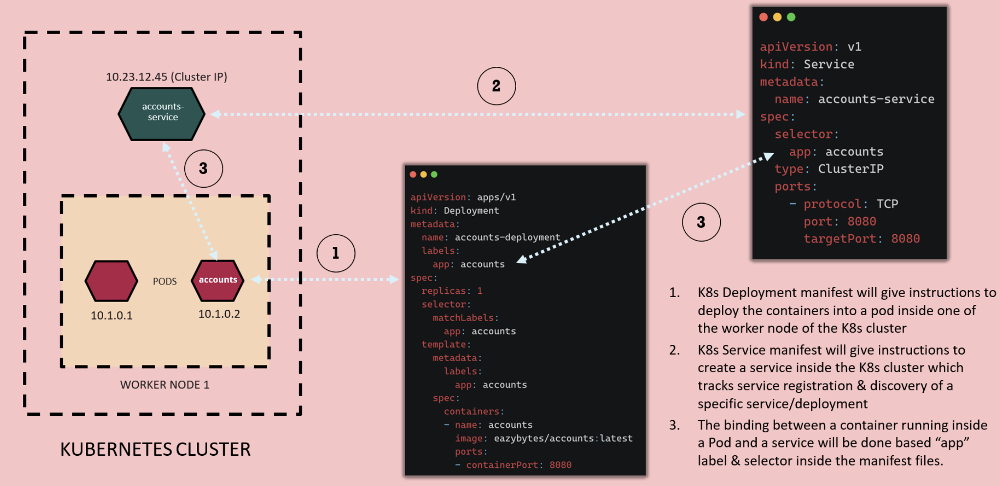

# Automatic Self healing inside Kubernetes cluster.

The Kubernetes always putting the efforts to match the desired state with the current state.
We can't achieve this self-healing capability with Docker or Docker compose.
The container orchestration product Kubernetes will always keep an eye on the running containers.
If any of the containers has some health issues, they're always going to take an action to make the desired state and current state matches with each other.

To delete the specific pod:
```cmd
kubectl delete pod accounts-deployment-8bbc77bf4-xbhzt
```

To get all the events happened behind the scenes inside the Kubernetes cluster by sorting all of them based upon the Create timestamp.

```cmd
kubectl get events --sort-by=.metadata.creationTimestamp
```

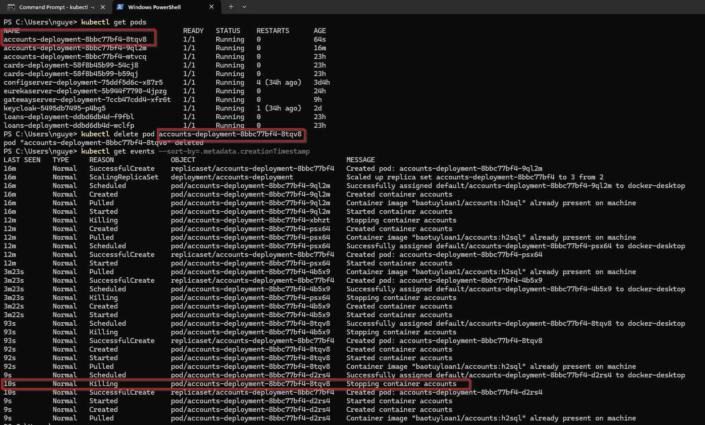

## Automatic Rollout and Rollback inside Kubernetes cluster.

To scale my accounts-deployment to 1 (using CMD):
```cmd
kubectl scale deployment accounts-deployment --replicas=1
```

To get the details of the pod
```cmd
kubectl describe pod gatewayserver-deployment-7ccb47cdd4
```
To change image of the pod
```cmd
kubectl set image deployment gatewayserver-deployment gatewayserver=baotuyloan1/gatewayserver:nosecurity --record
```
gatewayserver: the name of the container in the deployment.
gatewayserver-deployment: the name of the deployment.
record: record the reason on why we are changing the new image.

Or update the 8.gateway.yaml and use the apply command.

The Kubernetes cluster did not disturb the other running pod. Because first the Kubernetes want to validate whether it is able to set up with the new image that we have provided.
After validation, if my pod is successfully set up then it is going to terminate the old pod. 
If you have three different gateway server containers, it is not going to kill all of them at once.
If you have 50 different instances of the gateway server container. The Kubernetes cluster is going to deploy new changes in an incremental fashion, so that customers will not have any downtime.
The Kubernetes is only going to kill the old pod when the new pod is successfully set up.

*NOTE*: When apply new image by using the cmd command or the apply command, it is going to do automatically.

## Roll back the previous version of the image.

This cmd shows the history of the gatewayserver-deployment with having --record argument.
```cmd
kubectl rollout history deployment gatewayserver-deployment
```
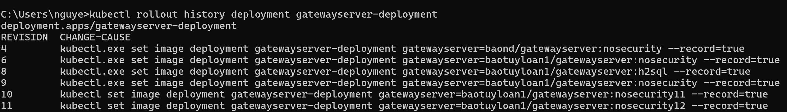

Any of the commands kubectl set image deployment ... --record will have when using the above command.

```terminal
kubectl rollout undo deployment gatewayserver-deployment --to-revision=8
```
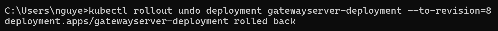

You can configure the maxSurge and maxUnavailable parameters in the Deployment to control how many Pods are created or terminated at the same time.

```yaml
strategy:
  rollingUpdate:
    maxSurge: 1        # Create 1 extra Pod temporarily during rollout
    maxUnavailable: 1  # Allow 1 unavailable Pod during the update
```

# Horizontal Pod Autoscaling: https://kubernetes.io/docs/tasks/run-application/horizontal-pod-autoscale/

This is a crucial feature. It is going to automatically scale up and scale down the pods based upon the traffic that is coming towards your microservice.
You can define the requirements that you want to auto-scale your pods based upon some memory or CPU utilization of the pod.

**Conclustion:** 
1. First, we'll give all our instructions or specifications with the help of deployment object.
2. Second, the deployment object will create the replicaset based upon the number of replicas that we have mentioned. So if I try to mention replicas as 2 or 5, my replicaset will create so many pods behind the scenes. 
If my replicaset has value as 2, it is going to create 2 pods.
3. Third, inside these two pods, the actual containers will be deployed.


# Kubernetes service type

Three major types of Kubernetes services:

* ClusterIP
* NodePort
* LoadBalancer

# K8s Cluster IP Service:

If you don't mention the service type inside your Kubernetes manifest file, then this is that default.

ClusterIP service creates an internal IP address for use within K8s cluster.

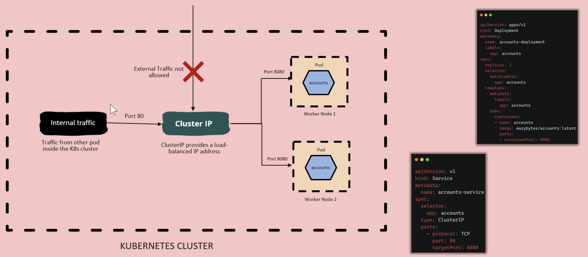

# K8s NODEPORT service:

Services of type NodePort build on top of ClusterIP type services by exposing the ClusterIP service outside the cluster on high ports (default 30000-32767). 
If no port number is specified, then the Kubernetes automatically selects a free port. The local kube-proxy is responsible for listening to the port on the node and forwarding client traffic on the NodePort to the ClusterIP.

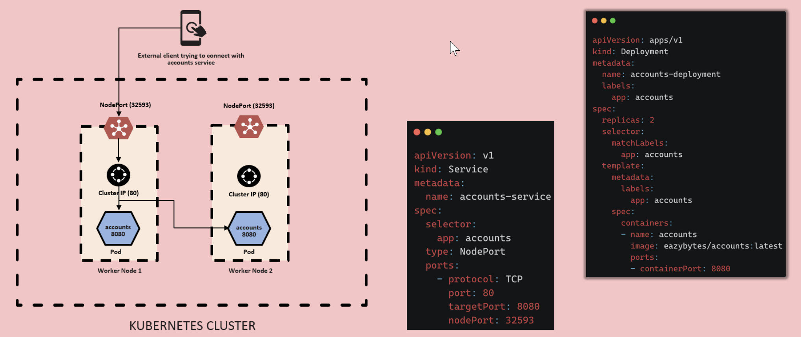

Drawback of NodePort:
- The external client applications have to know the IP address of the worker node.
If one of the worker nodes has some issues, the Kubernetes automatically kills the worker node and it will bring a new worker node.
That means it is going to get a new IP address.
→ The client applications should always update their worker node IP address.

That's why most of the people, they don't use NodePort service type. Instead they will go to the LoadBalancer service.

# K8s LOADBALANCER service:

This is very similar to the NodePort service. But on top of the NodePort service, the Kubernetes provides a load balancer.

This load balancer will have a public IP address, which is never going to change until unless the Kubernetes admin changes the IP address.

This public address can be mapped to a DNS name or to your domain name.

To this domain name or to this public IP address, the client applications, they can send the traffic.

Whenever the LoadBalancer is receiving the traffic, it will identify to which worker node it has to send the request.

For example, the request will be forwarded to the NodePort. From the NodePort, the traffic will go to the ClusterIP.
From the ClusterIP, the traffic will go to the actual microservice container.\

**Advantages:**
- The LoadBalancer is always going to be static with the IP address at the domain name that you have mapped.
- It is always going to track what is happening inside the Kubernetes cluster.
- If I try to increase the replicas to three, it may deploy it into another worker node. All those details will be tracked by this LoadBalancer and the request accordingly will be distributed.
- Regardless of how many worker nodes you are trying to create inside the Kubernetes cluster, or how many worker nodes you are trying to delete them. Regardless of whatever is happening inside the Kubernetes cluster, it is not going to impact your client application in any way. Because the IP address of the LoadBalancer will not change.

Restart Kong
```cmd
kubectl -n kubernetes-dashboard rollout restart deployment kubernetes-dashboard-kong
```

To show exposed ports inside the Kubernetes cluster, using this command:
```cmd
kubectl get services
```

NodePort configuration
```yaml
spec:
  selector:
    app: accounts
  type: NodePort
  ports:
    - protocol: TCP
      port: 8080
      targetPort: 8080
```

ClusterIP configuration
```yaml
spec:
  selector:
    app: accounts
  type: ClusterIP
  ports:
    - protocol: TCP
      port: 8080
      targetPort: 8080
```

LoadBalancer configuration
```yaml
spec:
  selector:
    app: accounts
  type: LoadBalancer
  ports:
    - protocol: TCP
      port: 8080
      targetPort: 8080
```

For 2 reasons, we should avoid exposing our microservices with the help of LoadBalancer.
1. We need to secure our microservices so that no external clients can directly communicate with a microservice. They have to always come through the API gateway(edge server).
2. Public IP addresses usually attract some cloud bills that we need to avoid.
If we have hundereds of microservices, and if you try to expose them with a LoadBalancer type, your cloud provider will create difference 100 of LoadBalancers with a public IP address, which is going to attract a lot of bill.


To delete the Deployment:
```cmd
kubectl delete -f kubernetes/8_gateway.yaml
```

**Conclusion:**
- Managing all the manifest files inside the Kubernetes cluster is a nightmare when the Kubernetes cluster has a lot of microservices.
- Creating these manifest files is make a lot of work for you.
- Then run the cmd for applying is going to take a lot of time. Because we have to execute the apply command for every manifest file.
- If you have 100 of microservices, you have 3 environments, you have to create 300 manifest files and run the apply command for 300 times.


# Introduction to Helm

Helm is a package manager for Kubernetes. The main objective of Helm is to help developers and DevOps team members to manage Kubernetes projects and deployments by offering a more efficient approach to handling the Kubernetes manifest files.

The helm is going to follow a packaging format called Chart. 
Chart is a collection of files that describes a related set of Kubernetes resources.
Suppose, if you have 50 microservices, you can club all these 50 microservices related manifest files into a single component called Chart inside Helm.
Using the same single chart, we can deploy a simple application or any kind of complex application
With that; the maintenance of your Kubernetes deployments is going to be super easy.
A chart can have a child charts or dependent charts as well.

## Problems that Helm solves

Without Helm, we need to maintain the separate YAMl files/manifest of K8s for all microserivces inside a project.
The majority content inside them looks similar except a few dynamic values.


With Helm, we can create a single template YAML file. Only the dynamic values will be injected during K8s services setup based upon the values mentioned inside the values.yaml present inside each service/chart.
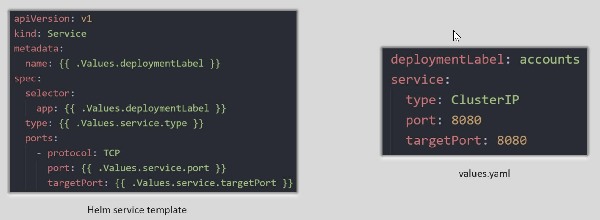

The value that we have defined inside the values.yaml is going to be applied to the service template file at runtime and behind the scenes helm is going to automatically create the account microservice-specific service manifest file.
Developers or DevOps team members should only provide the values.yaml file for each microservice. Behind based on these values, the Helm is going to generate the Kubernetes manifest files at runtime for all your microservices. 
On top of that, we don't have to execute these Kubernetes manifest files manually.
We can deploy all the microservices with a single command by helping Helm.

**Advantages of Helm**:
1. Helm supports packaging of YAML files into a single helm chart.
2. THe helm chart can be distributed into a public repository or a private repository you can share with your team members.
3. You can always deploy or upgrade or rollback or uninstall your entire microservice application into your Kubernetes cluster with a single command. No need to run any manual commands with the help of Kubectl.
4. Helm supports release/version management. You can roll back your entire Kubernetes cluster not only a single manifest file.

## Installing Helm: https://helm.sh/docs/intro/install/

1. Prerequisites: 
- A Kubernetes cluster.
- Deciding what security configurations to apply to your installation, if any.
- Installing and configuring Helm.

List all the installation charts that we have done into the Kubernetes cluster.
```cmd
helm ls
```
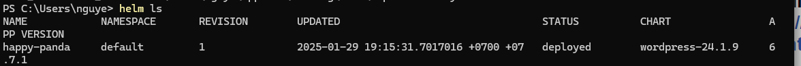

In the local, The Helm connects to the Kubernetes cluster by looking the Kubernetes cluster connection details by.
Leverage this config details:

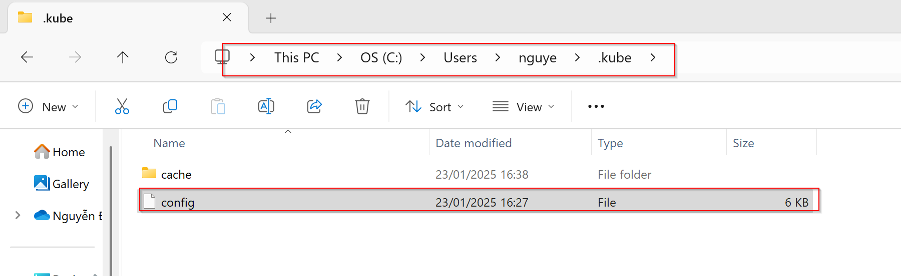
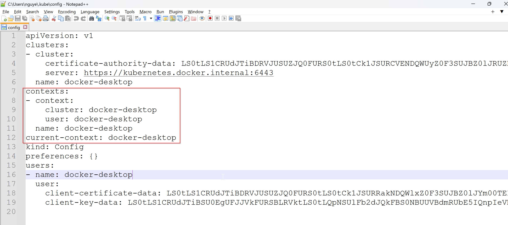

The same connection details, Helm also is going to leverage whenever it wants to interact with a Kubernetes cluster.

To search the charts available inside the public repository, we can use this cmd:
```cmd
helm search hub wordpress
```
The above command searches all WordPress charts on Artifact Hub.
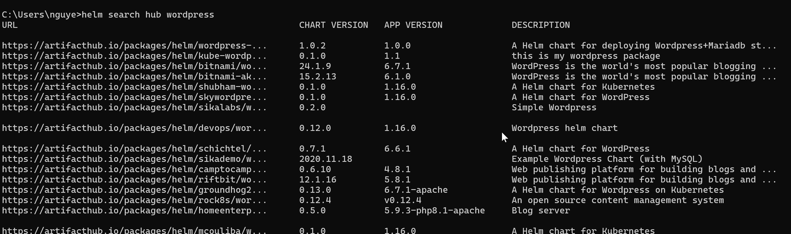

We need to choose one of the repositories to install the WordPress helm chart.

Before installing a Package, we need to make sure that we have added the Bitnami repo details inside our local system.
Add the Bitnami repo to the local
```cmd
helm repo add bitnami https://charts.bitnami.com/bitnami
```
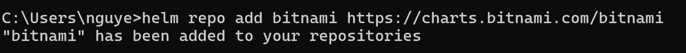

To install a Package
```cmd
helm install happy-panda bitnami/wordpress
```
happy-panda: is going to be the name of the release. This name can be any thing.
This command will install the chart available inside the Bitnami repo.

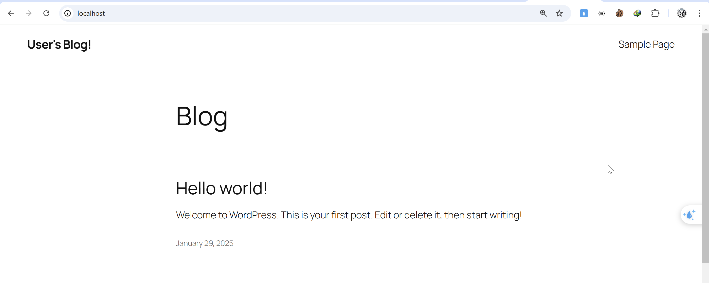

Focus on this folder to understand the structure of the Helm chart structure.
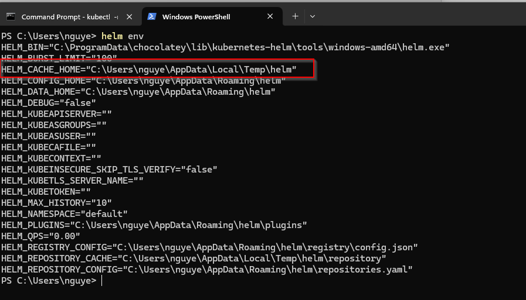

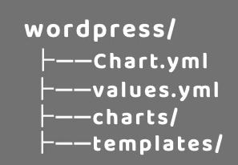
Inside this parent folder WordPress, we have two YAML files and two subfolders.

This chart.yaml file is going to have meta-information about the helm chart. Like chart version, author, etc.

Inside the values.yaml, we need to maintain all the dynamic values that we want to inject at runtime into the template files.

Inside this charts folder, we have other helm charts which my current chart is dependent on.

In the templates folder, we are going to maintain all the required Kubernetes manifest template YAML files

At run time my helm chart is going to inject all the dynamic values that we have mentioned inside the values.yaml

To unistall the chart with the help of Helm:
```cmd
helm uninstall happy-panda
```