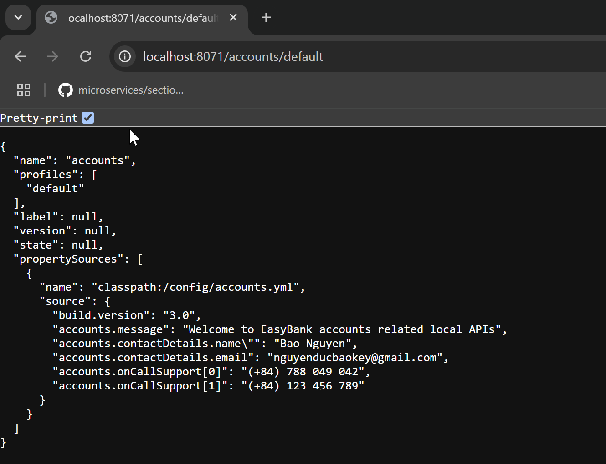
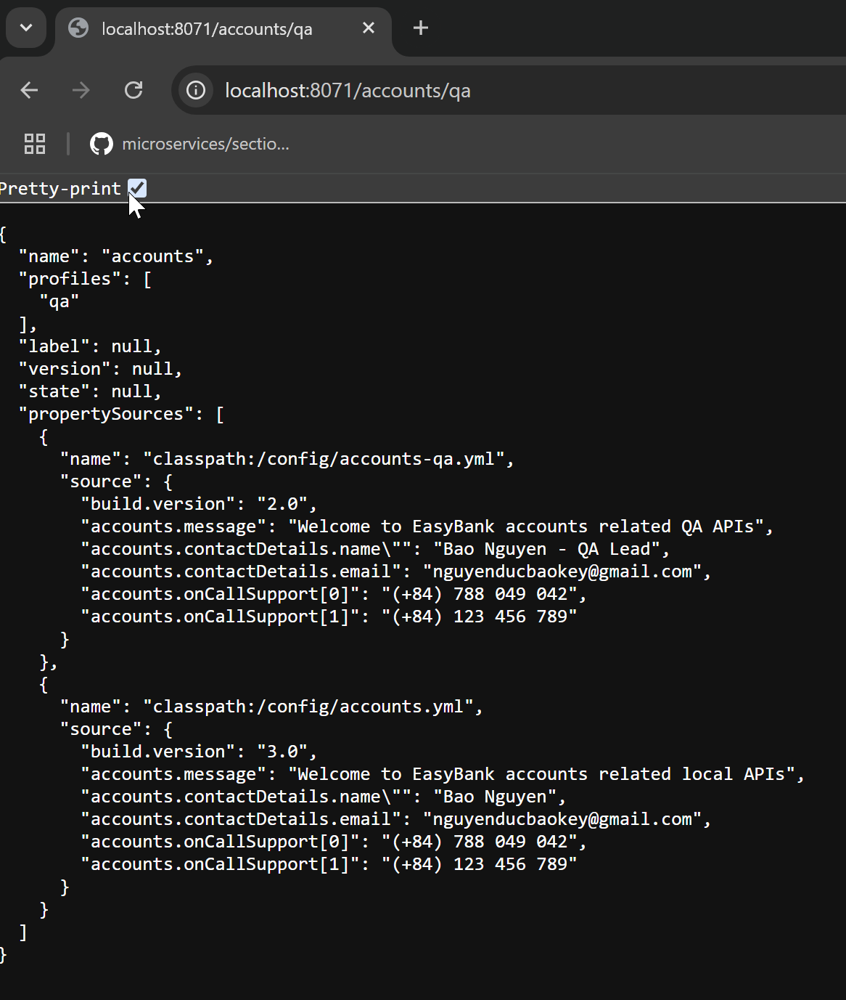

```text
http://localhost:8071/accounts/default
```

```text
http://localhost:8071/accounts/prod
```

```text
http://localhost:8071/accounts/qa
```



to encrypt a value from plain text to encrypted text.
use the post man to convert plain text to encrypted text.


Make sure use: {cipher}


When it is trying to send these properties to the actual microservice, it is going to decrypt and send the values in a plain text value.

Test decrypted:
